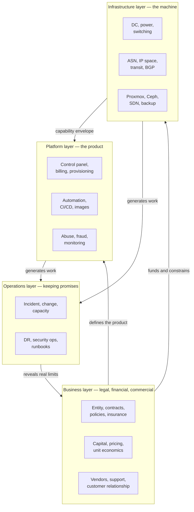
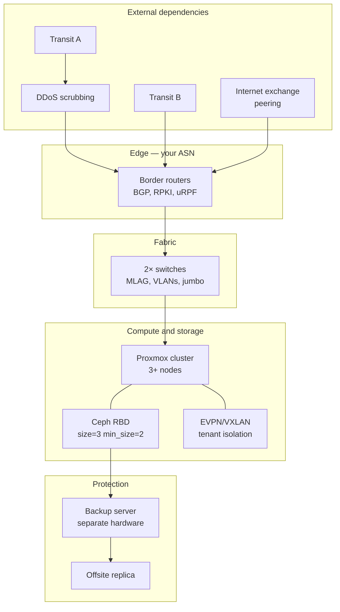
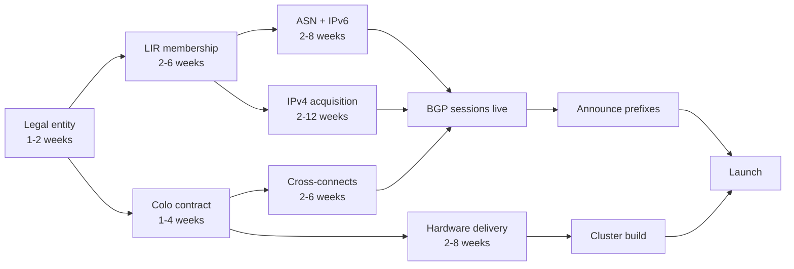
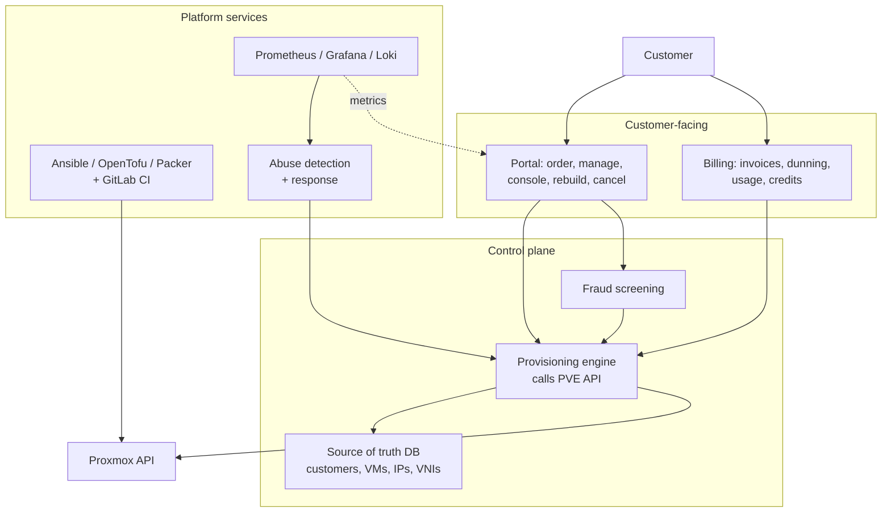
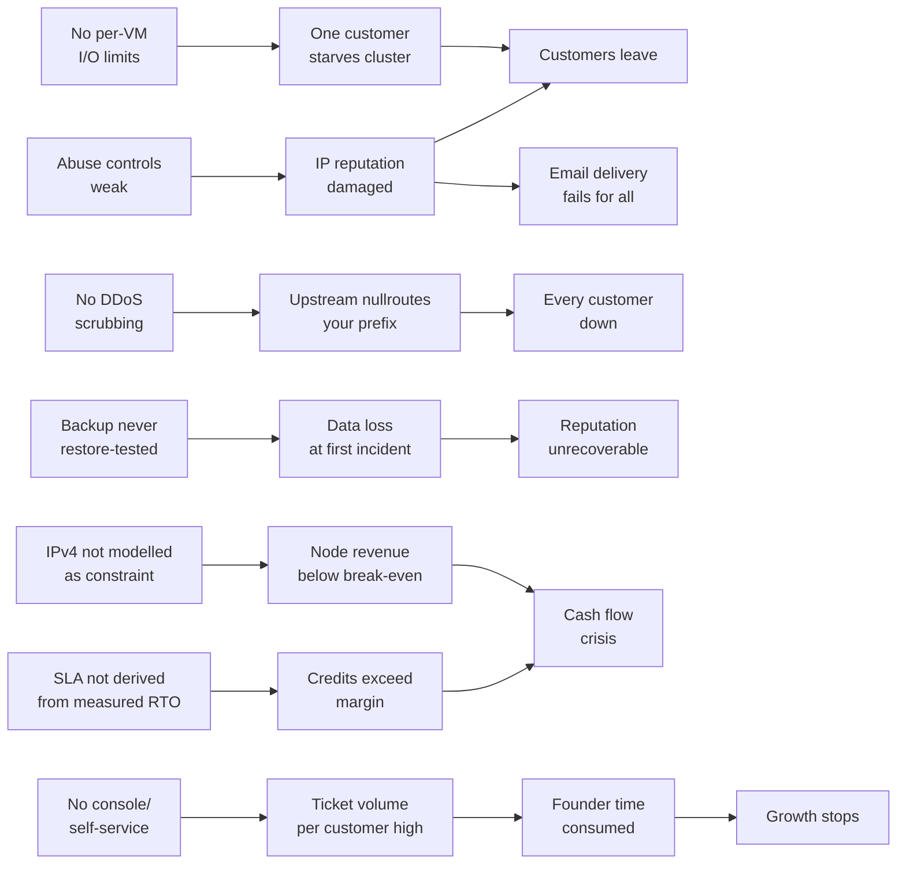

# 01 — Executive Architecture

## How to read this document

Four layers. Each depends on the one below it, and each has a failure mode that can end the company independently of the others. The most common founder error is spending 90% of effort on the Infrastructure layer, which is the most fun, and 10% on the Business and Operations layers, which is where hosting companies actually die.

A hard-won ranking of what kills young VPS providers, most common first:

1. **Abuse and IP reputation damage** — your address space gets blocklisted, deliverability dies, customers leave. Business/Platform layer problem.
2. **Cash flow** — hardware bought upfront, revenue arriving monthly, break-even further out than modelled. Business layer.
3. **An untested backup** — discovered at the worst possible moment. Operations layer.
4. **Selling availability you cannot deliver** — SLA written by marketing, not measured by engineering. Business/Operations boundary.
5. **Infrastructure failure** — genuinely the least likely of the five if you follow Phase 3 (docs 05-08).

---

## 1.1 The four layers

The feedback edge from Operations back to Business is the one people leave out. Your measured recovery times, your real ticket volume per customer, and your actual abuse rate must flow back into your SLA, your pricing, and your hiring plan. If they do not, you will sell promises your operation cannot keep.

---

## 1.2 Business layer

### Company structure

A limited-liability entity, always. You are selling infrastructure that customers will use to run businesses; the liability surface (data loss, downtime, a customer's own illegal activity) is not something to hold personally. Specific form depends entirely on jurisdiction — LLC, Ltd, GmbH, Sdn Bhd, Pte Ltd all serve the purpose.

Three structural decisions that matter more than the form:

- **Jurisdiction of incorporation vs jurisdiction of infrastructure.** These can differ, and customers will care about both. A German customer buying EU data residency wants the servers in the EU; a privacy-focused customer may care where the company can be legally compelled.
- **Whether to separate the operating company from an asset-holding company.** Servers and IP space in a holding entity, operations in a trading entity. This protects the hardware and — critically — the IP allocation if the trading entity fails. Adds accounting complexity; worth discussing with an accountant once you exceed roughly one rack.
- **Who holds the RIR membership.** The LIR account and its allocations are a real asset. Make sure the entity that holds it is the one you intend to keep.

### Legal requirements

| Item | Why it exists | Consequence of getting it wrong |
|---|---|---|
| Acceptable Use Policy (AUP) | The contractual basis for suspending a customer | Without it, suspending an abuser is a breach of contract |
| Terms of Service | Payment terms, liability cap, termination rights | Unlimited liability exposure; unenforceable collections |
| SLA | What availability you promise and what you pay when you miss | An SLA copied from a hyperscaler commits you to credits you cannot afford |
| Privacy policy / data processing terms | Legally required in most jurisdictions; GDPR if you touch EU data | Fines, and enterprise customers cannot buy from you |
| DMCA / takedown procedure | Safe-harbour protection in some jurisdictions | You become liable for customer content |
| Law-enforcement request procedure | Consistency and defensibility | Ad-hoc responses create legal and reputational risk |
| Data-processing agreement (DPA) template | GDPR Art. 28 requirement for B2B | Blocks all EU business customers |

I am not a lawyer, and none of this is legal advice. The specific requirements vary enormously by jurisdiction and change over time. Get a lawyer who has worked with hosting or telecoms to review the set — this is a few thousand dollars that prevents a category of problem you cannot fix retroactively.

**The single most important legal-commercial link:** your SLA number must be derived from your measured failure-test results, not chosen for marketing appeal. See `docs/19-financial-model.md` for why SLA credits are a real line item.

### Financial planning

Four things to model before spending money on hardware. I am not a licensed financial advisor; the workbook accompanying this roadmap gives you the structure and formulas so you can put your own numbers in and make your own decision.

1. **Capex vs opex split.** Buying servers is capex with a 3–5 year depreciation life; leasing dedicated servers from another provider is pure opex. A hybrid — start on leased hardware, move to owned once you have proven demand — trades margin for reduced risk and is often the right first move.
2. **Runway.** Hardware, colo deposits, and IP acquisition are front-loaded. Revenue accrues monthly. Model 18 months of runway at your expected ramp, not 6.
3. **Unit economics per node.** How many VMs must a node hold, at your prices, to cover its amortisation plus its share of colo, transit, IP, licences, and support labour? This number is usually higher than founders expect. If it exceeds ~60% of the node's sellable capacity, your pricing is wrong.
4. **The IPv4 constraint.** For most VPS providers IPv4 is the binding constraint on revenue per node, not CPU or RAM. Model it explicitly.

### Risk management

| Risk | Likelihood | Impact | Mitigation |
|---|---|---|---|
| IP space blocklisted due to abuse | High | Severe, slow to reverse | Aggressive abuse controls from day one (Phase 6) |
| Payment processor freezes account | Medium | Severe, immediate | Second processor onboarded before launch; crypto option |
| Key-person dependency (you) | High | Existential | Documented runbooks, credential escrow, a second person with access |
| Hardware failure beyond spares | Medium | Moderate | Spares on site, vendor RMA terms, N+1 capacity |
| DDoS attack on a customer taking out your prefix | High | Severe | Scrubbing before launch, not after the first attack |
| Customer data loss | Low | Existential (reputation) | Tested restores, monthly, forever |
| Under-priced SLA credits | Medium | Moderate to severe | SLA derived from measured RTO |
| Legal action from customer content | Low | Severe | AUP, DMCA process, insurance |

Insurance worth pricing: general liability, professional indemnity / errors and omissions, and cyber liability. Cyber policies often exclude the things you most want covered — read the exclusions, not the summary.

### Vendor management

You will depend on roughly a dozen external parties. Each needs a named contact, a documented escalation path, and a contract you have actually read.

| Vendor class | What to negotiate | What to verify before signing |
|---|---|---|
| Datacenter / colo | Power redundancy (A+B), remote hands rate and SLA, cross-connect costs, expansion path | Physically visit. Check the actual power feeds and the actual remote-hands desk |
| IP transit (×2) | Commit level, burst pricing, DDoS handling, BGP community support for nullrouting | Whether they nullroute you or scrub for you, and at what threshold |
| DDoS scrubbing | Always-on vs on-demand, clean-bandwidth capacity, activation time | Test it. Ask for a trial attack window |
| Hardware vendor | RMA turnaround, advance replacement, firmware support lifetime | Whether NVMe drives are truly PLP-equipped |
| Proxmox GmbH | Subscription tier, ticket response | Whether your tier includes ticket support at all |
| Payment processor | Chargeback terms, reserve requirements, hosting-industry acceptance | Their written policy on hosting; many are hostile to it |
| RIR / LIR sponsor | Fee schedule, allocation policy | Whether allocations transfer if you change sponsor |
| Registrar / DNS | Registry lock, DNSSEC, API | Domain hijacking protections |

**The clause people miss:** what happens to your IP allocations, cross-connects, and hardware if you exit the datacenter. Negotiate an exit before you need one.

### Customer support

Support is a product feature, not a cost centre, and for a small provider it is your main defensible differentiator against Hetzner and DigitalOcean. It is also the thing that will consume your time most unpredictably.

The structural decisions:

- **Channels.** Email/ticket only at launch. Live chat and phone are commitments you cannot staff as one person; offering and then failing them is worse than not offering.
- **Response targets by tier**, published and conservative. A promised 15-minute response you miss damages more than a promised 4-hour response you beat.
- **Self-service is the real lever.** Console access, reinstall, password reset, IP management, and bandwidth visibility in the panel each remove a whole ticket category. Every hour spent on panel self-service saves many hours of support.
- **Target metric: tickets per customer per month.** Above ~0.5 means your product is confusing and you should fix the product, not hire support.

---

## 1.3 Infrastructure layer

Phase 3 and Phase 4 detail is in docs 05–11. This section covers the layer's shape and the parts outside their scope.

### The dependency chain that sets your timeline

Everything on the left is slow, external, and cannot be compressed by working harder. **Start the LIR application and the colo conversation in week 1**, before you have chosen a CPU. The most common scheduling error is spending two months on hardware selection and then discovering the ASN takes six weeks.

### Datacenter

Evaluation criteria, roughly in order of how much they will matter later:

1. **Available transit carriers on site** — determines whether you can get two real, diverse upstreams
2. **Remote hands cost and quality** — you will rely on this at 3am
3. **Power redundancy and how it is actually billed** — per-circuit, per-kW committed, or metered; this differs by 2× in cost
4. **Expansion path** — can you get the adjacent rack in 18 months
5. **Cross-connect pricing** — recurring, and adds up
6. **Physical access process** — how fast can you get in, and who can authorise
7. **Latency to your target market** — matters for the customers you intend to win

Start with a quarter or half rack. A full rack you cannot fill is dead capital, and colo providers are generally willing to let you grow.

### Networking, transit, BGP, ASN, IPv4, IPv6

Covered in detail in `docs/03-phase1-network-addressing.md`. The architectural summary:

- **Your own ASN** with **two transit providers** is the minimum for credible independence. One transit provider means you are reselling their reliability and their reputation.
- **RPKI ROAs** on every prefix you announce. Increasingly, networks drop RPKI-invalid routes, which means a missing ROA is now a connectivity problem, not just a hygiene issue.
- **uRPF and BCP38** at the edge. This is what stops your network being used for spoofed reflection attacks. It is also what upstreams will ask about when you get an abuse complaint.
- **IPv6 from day one.** You will get a large allocation essentially free; give every VM a `/64`. This is also increasingly a competitive requirement.
- **IPv4 is your revenue constraint.** Price it as an add-on and model it explicitly.

### Proxmox, Ceph, backup

See Phase 3 and 4 (docs 05-11). Three architectural facts that constrain the business layer:

- A **3-node Ceph cluster tolerates a node loss but cannot self-heal** — there is no fourth host to rebuild the third replica onto. Your SLA and marketing must reflect this.
- **Backup must live on separate physical hardware** with offsite replication. A backup inside the cluster is not a backup.
- **Per-VM I/O limits are mandatory**, not optional tuning. Without them one customer starves the cluster.

---

## 1.4 Platform layer

This is your actual product. Proxmox is an engine; the platform layer is the car.

Two design rules that matter enormously:

**The panel's database is the source of truth for customer resources — not Proxmox, and not OpenTofu.** IP allocations, VNI assignments, plan limits, and bandwidth counters live there. Proxmox is the executor. Reconcile continuously and alert on divergence.

**Never expose the Proxmox UI or API to customers.** The panel holds a scoped API token; customers get a console proxy. One panel compromise should not become every customer's compromise.

### Abuse management is a platform feature

It is listed under Platform, not Operations, deliberately. Abuse handling that depends on a human reading email does not scale past a few dozen customers. What you need in the platform:

- Automated outbound traffic anomaly detection with per-VM thresholds
- A suspension mechanism callable by the system, not just by a human
- An abuse case object with state, deadline, and audit trail
- Customer notification templates wired to the case state machine

---

## 1.5 Operations layer

### Incident management

Minimum viable structure for a one-person operation:

- **Severity definitions**, written down. Sev1 = multiple customers down or data at risk. Sev2 = one customer down or degraded platform. Sev3 = single-customer non-urgent.
- **One alerting path that reaches a phone.** Alerts that only reach email are decoration.
- **A public status page**, updated during incidents. Customers forgive downtime; they do not forgive silence.
- **Post-incident review for every Sev1 and Sev2**, written, however brief. Two questions: what happened, and what change prevents a recurrence.
- **Runbook per known failure mode**, written during failure testing while calm.

### Change management

The lightweight version that actually gets followed:

- All infrastructure change through Git and merge request. The `tofu plan` diff is the review.
- **Apply is a manual gate**, never automatic on merge. A Friday-night merge should not change production.
- Maintenance windows published in advance; emergency changes documented after the fact.
- A rollback path identified *before* applying. If there isn't one, that is the finding.

### Capacity planning

Track four numbers weekly and set trigger thresholds:

| Metric | Trigger | Action |
|---|---|---|
| Ceph raw utilisation | 55% on 3 nodes | Order the next node now |
| RAM committed / installed | 75% | Order node, or stop selling large plans |
| IPv4 pool free | 20% remaining | Acquire more addresses (long lead time) |
| Peak 95th-percentile transit | 60% of commit | Renegotiate or add capacity |

Whichever hits first drives the purchase. In practice it is usually IPv4 or RAM, not disk.

### Disaster recovery

Define these explicitly and test them; they belong in the SLA conversation:

- **RTO** — how long to restore service. Derived from your measured full-power-loss recovery test.
- **RPO** — how much data can be lost. Derived from your backup interval. Daily backups mean a 24-hour RPO, and customers should be told.
- **Scenario coverage** — node loss, cluster loss, datacenter loss, control-plane loss, credential loss. The last two are the ones people forget.

**Credential loss is a real DR scenario.** If you are the only person with the age keys, the PVE root password, and the registrar login, your company has a single point of failure that is not a server. Escrow them.

### Security operations

- Management plane reachable only via VPN, MFA everywhere
- Scoped API tokens with expiry, monitored for expiry
- Audit logs shipped off-node
- Patch cadence: security patches promptly, PVE/Ceph major upgrades scheduled with a tested rollback
- Quarterly review of who has access to what, and removal of what is no longer needed

---

## 1.6 Relationship map — what breaks what

The value of this map is in tracing consequences before they happen.

Seven chains. Only one of them (`NOCAP`) is primarily an infrastructure problem. That distribution is the point of this whole document.

---

## 1.7 What each layer owes the others

| Layer | Owes upward | Owes downward |
|---|---|---|
| Business | Capital, a product definition, prices that clear costs | Honest constraints — what you can promise |
| Infrastructure | A capability envelope, measured not assumed | Cost visibility, capacity signals |
| Platform | A product customers can self-serve | Load characteristics, abuse signals |
| Operations | Real reliability numbers, real ticket volumes | Runbooks, change discipline, escalation |

If any of these flows is missing, the failure shows up somewhere other than where it originated — which is why infrastructure engineers so often diagnose a business problem as a hardware problem.
