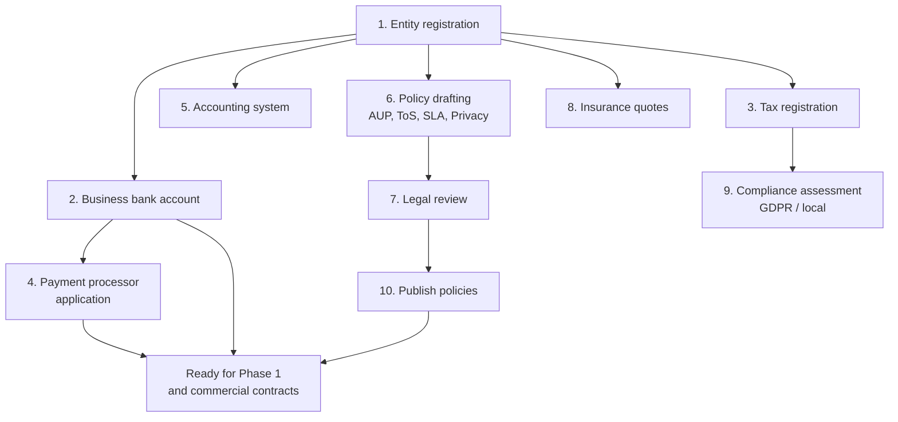

# 02 — Phase 0: Business Foundation

**Duration:** 3–6 weeks, overlapping Phase 1
**Cost range:** see the workbook; typically the second-largest pre-launch line after hardware
**Blocking:** Phase 1 (LIR membership requires a legal entity)

I am not a lawyer or an accountant, and none of this is legal, tax, or financial advice. What follows is the sequence and the reasoning so you can brief professionals efficiently and know what to ask. Requirements vary enormously by jurisdiction and change over time.

---

## Why Phase 0 comes first, and why founders skip it

Two reasons it is genuinely first, not just administratively first:

1. **The RIR will not give you an ASN or IP space without a legal entity.** LIR membership requires a registered organisation with a verifiable address and, in most regions, proof of incorporation. This puts Phase 0 on the critical path of the longest-lead-time item in the whole build.
2. **Your payment processor, your colo provider, and your transit providers all require a business entity and often a credit check.** Every commercial relationship downstream depends on this.

Founders skip it because it is not fun and produces nothing you can log into. The cost of skipping is discovering in week 6 that your ASN application is blocked on a document you could have had in week 1.

---

## Order of execution

The dependencies matter: bank account requires entity, processor requires bank account, and processor approval is the item most likely to take longer than expected in this phase.

---

## Step 0.1 — Entity registration

### What to do

Register a limited-liability entity in your chosen jurisdiction. Decide three things at the same time:

1. **Jurisdiction of incorporation.** Usually where you live and will pay tax. Exotic jurisdictions create banking and payment-processing friction that outweighs any tax benefit at this scale.
2. **Jurisdiction of infrastructure.** Can differ from incorporation. Customers will ask about both, and EU customers specifically will ask about data residency.
3. **Whether to separate asset-holding from operating.** Hardware and IP allocations in one entity, trading in another. Worth discussing with an accountant, primarily because the IP allocation is a genuinely valuable transferable asset you do not want tangled in an operating company's liabilities.

### Why it matters

You are selling infrastructure that customers will use to run their own businesses. The liability surface includes their downtime, their data loss, and their own illegal activity conducted on your servers. Personal liability for any of those is not a risk worth taking to save an incorporation fee.

### Common mistakes

- **Trading before incorporating.** Any revenue taken personally creates a tax and liability mess that is tedious to unwind.
- **Choosing a jurisdiction for tax reasons without checking banking.** Many offshore structures cannot get a payment processor that accepts hosting.
- **Putting the RIR membership in the wrong entity.** Moving an LIR account between organisations is possible but slow and paperwork-heavy.
- **A company name that limits you.** "BudgetVPS Ltd" is hard to grow into a managed-services business.

### Deliverables
Certificate of incorporation · registered address · director/shareholder register · company number

### Success criteria
You can produce, on request, a document proving the entity exists, at the address you will give the RIR.

---

## Step 0.2 — Business banking

### What to do

Open a business account in the entity's name. Apply to more than one bank in parallel; hosting is sometimes flagged as higher-risk and applications get declined without explanation.

### Why it matters

Every vendor contract, the RIR, and your payment processor need to pay or be paid by the entity, not you. Commingling personal and business funds also destroys the liability separation you incorporated for.

### Common mistakes

- **Applying to one bank and waiting.** Apply to two or three simultaneously.
- **Describing the business vaguely.** "Internet services" invites suspicion; "we provide virtual server hosting to business customers on a monthly subscription" is clear and boring, which is what you want.
- **No separate account for customer funds if you take prepayments.** Some jurisdictions have rules; check.

### Deliverables
Business current account · a second account for reserves · a corporate card for vendor billing

### Success criteria
You can pay a vendor invoice from the entity and receive a customer payment into it.

---

## Step 0.3 — Tax registration

### What to do

Register for the taxes your jurisdiction requires: corporate income tax, and VAT/GST/sales tax if applicable. Then determine your **cross-border indirect tax obligations**, which is the part hosting founders consistently get wrong.

### Why it matters

Digital services sold to consumers in other jurisdictions frequently create a tax obligation *in the customer's jurisdiction*, regardless of where you are. The EU's VAT rules for digitally supplied services are the best-known example: selling to an EU consumer generally requires charging VAT at their country's rate. B2B sales are often reverse-charged instead. Other regions have analogous rules with different thresholds.

The practical consequence: **your billing system must be able to determine customer location, validate business tax IDs, apply the right rate, and produce compliant invoices.** This is a control-plane requirement that comes from Phase 0, and it is a major factor in the buy-vs-build decision in Phase 5. Established billing platforms handle it; a custom panel means you build it.

### Common mistakes

- **Assuming your own jurisdiction's rules are the only ones that apply.** They are not, once you sell internationally.
- **Not validating business tax IDs** (e.g. EU VAT numbers), so you charge VAT where reverse-charge applies and cannot easily correct it.
- **Not keeping evidence of customer location.** Tax authorities expect two independent pieces of evidence in some regimes.
- **Treating this as a launch+6 problem.** Back-correcting tax on hundreds of invoices is genuinely awful.

### Deliverables
Tax registration numbers · a written determination of which regimes you fall under · invoice template meeting local requirements

### Success criteria
An accountant has confirmed your indirect tax approach in writing before you take the first payment.

---

## Step 0.4 — Payment processing

### What to do

Apply to a primary processor and onboard a backup **before launch**. Add a cryptocurrency option if it fits your market.

### Why it matters and the specific risk

Hosting is a chargeback-prone, fraud-attractive industry. Processors know this. Two distinct failure modes:

1. **Application declined** at signup because of the industry code.
2. **Account frozen post-launch** because of chargeback ratio, or because a customer used your service for something the processor's policy prohibits. This is the one that will hurt: your revenue stops while your costs continue.

Mitigation is structural, not clever: have a second processor already onboarded and tested, keep your chargeback ratio low through fraud screening (Phase 6), and read the processor's hosting policy before signing rather than after.

### Common mistakes

- **One processor only.** The single most consequential mistake in this step.
- **Not reading the reserve terms.** Some processors hold a rolling reserve, which materially changes your cash flow.
- **Storing card data yourself.** Do not. Use the processor's hosted fields or tokenisation, keeping you out of PCI-DSS scope beyond the simplest self-assessment.
- **No dunning process.** Failed recurring payments need automated retry and notification, or you will silently lose revenue.

### Deliverables
Primary processor live · secondary onboarded and test-transacted · documented chargeback response process · dunning workflow

### Success criteria
You can process a real payment, issue a real refund, and switch to the backup processor in under an hour.

---

## Step 0.5 — Accounting

### What to do

Set up accounting software from day one, with a chart of accounts that reflects the business model:

- **Revenue** split by plan tier and by add-on (extra IPv4, backups, bandwidth overage) so you can see which products actually earn
- **COGS**: colo, power, transit, IP leases, scrubbing, software licences
- **Capex**: servers, switches, spares — with a depreciation schedule
- **Deferred revenue** for annual prepayments. This is an accounting requirement and also stops you spending money you have not yet earned.

### Why it matters

Beyond compliance: without a chart of accounts that separates COGS from capex, you cannot compute gross margin per node, which means you cannot price correctly or know when to buy the next node.

### Common mistakes

- **Treating annual prepayments as current revenue.** Feels great, then you owe eleven months of service with the cash already spent.
- **Not tracking depreciation.** Your P&L looks wonderful for three years and then you need $40k of replacement hardware you did not reserve for.
- **Mixing capex and opex in one bucket.** Destroys margin visibility.

### Deliverables
Accounting system · chart of accounts · depreciation schedule · monthly close process

### Success criteria
You can produce a gross margin per node figure at any time.

---

## Step 0.6 — The policy set

Four documents. Each has a specific job, and the ordering below reflects which one you most need on day one.

### AUP (Acceptable Use Policy) — the most operationally important document you will write

**Why it exists:** it is the contractual authority to suspend or terminate a customer. Without a clear AUP, suspending an abuser is a breach of your own contract, and they can dispute the charge and win.

**What it must cover, specifically:**

- Prohibited content and activity, in enumerated detail — spam, phishing, malware distribution, port scanning, DDoS origination, CSAM, fraud, cryptocurrency mining if you prohibit it (say so explicitly, it is a common dispute)
- **Resource abuse**, defined numerically where you can — sustained CPU, I/O, and bandwidth limits per plan. Vague "excessive use" clauses are hard to enforce.
- **Your right to suspend without prior notice** where there is active harm to your network or third parties
- Outbound email policy, including that port 25 is blocked by default
- Consequences ladder: notice, suspension, termination, and whether data is retained
- Notification and appeal process

**The clause founders forget:** the right to suspend *immediately* for active abuse. If your AUP requires 24 hours' notice, a compromised VM attacking someone else runs for 24 more hours while your upstream nullroutes you.

### Terms of Service

**Why it exists:** payment terms, liability limits, termination rights, and what happens to data.

Key provisions with real consequences:

- **Liability cap**, typically at fees paid over some recent period. Without this your exposure to a customer's consequential losses is unbounded.
- **Payment terms and consequences of non-payment** — suspension timing, grace period, data destruction timing. Be specific; you will rely on this.
- **Data destruction on termination.** State the grace period and that data is irrecoverable after it. This protects you and sets expectations.
- **Backup responsibility.** State clearly whether backups are included, and that customers remain responsible for their own data. Even with backups, say it.
- **Termination for AUP breach**, cross-referencing the AUP.
- **Governing law and dispute resolution.**

### SLA

**Why it exists:** it is the only availability promise that is contractually binding, and it is the document most likely to be copied carelessly from a larger provider.

**The rule: your SLA number must be derived from your measured recovery times, not chosen for marketing appeal.**

Concretely, from the Phase 3 failure-test results:

| Uptime promise | Annual downtime budget | Realistic on 3 nodes? |
|---|---|---|
| 99.99% | 52 minutes | No. One cold-start recovery consumes half the year's budget |
| 99.95% | 4.4 hours | Only with careful maintenance discipline |
| 99.9% | 8.8 hours | Defensible |
| 99.5% | 43.8 hours | Comfortable and honest |

Also define, because these are where disputes happen:

- **What counts as downtime** — total unavailability of the VM, not degraded performance
- **What is excluded** — scheduled maintenance (with notice period defined), customer-caused issues, upstream and DDoS events, force majeure
- **Credit mechanism** — usually a percentage of monthly fee, customer must request within N days, capped at 100% of monthly fee
- **What is explicitly not covered** — data loss (that is the backup product), performance, and third-party network conditions

**The commercial reality:** SLA credits are a real cost line. Model them. A 99.99% promise with 25% credits and one bad month can wipe out a quarter's margin.

### Privacy policy and data protection

**Why it exists:** legally required in most jurisdictions, and a hard gate for business customers.

If you touch EU personal data — which you will, if you have any EU customer — GDPR applies regardless of where you are incorporated. Practical requirements:

- Privacy policy stating what you collect, why, retention, and rights
- **A DPA (data processing agreement) template.** You are a processor for your customers' data and a controller for their account data. B2B customers will require a signed DPA; not having one loses deals.
- Records of processing activities
- Breach notification capability within the required window (72 hours under GDPR)
- Subprocessor list (your colo, your backup provider, your monitoring SaaS if any)
- A lawful basis for each processing purpose

### Also needed

- **DMCA / takedown procedure** — if you want safe-harbour protection where it exists, you generally must designate an agent and publish the process
- **Law-enforcement request procedure** — what you require (valid legal process), who handles it, what you log, and whether you notify the customer
- **Abuse policy** — public, with the `abuse@` address, so complainants contact you instead of your upstream

---

## Step 0.7 — Compliance assessment

Determine which regimes apply before launch, not after:

| Regime | Triggered by | Practical requirement |
|---|---|---|
| GDPR | Any EU/EEA personal data | Privacy policy, DPA, breach process, records |
| Local data protection law | Your jurisdiction | Varies; usually similar shape to GDPR |
| PCI-DSS | Handling card data | Avoid scope entirely via hosted fields/tokenisation |
| Local telecoms/ISP registration | Some jurisdictions require registration to operate a network | Check — this can be a hard blocker on announcing prefixes |
| Sanctions/export controls | Selling to restricted jurisdictions or persons | Screening at signup |
| Lawful intercept / data retention | Some jurisdictions impose obligations on network operators | Check before launch; can require real capability |

The last three are the ones that surprise people. **Some jurisdictions require formal registration as a telecoms or internet service provider before you can operate a network with your own ASN.** Verify this locally in week 1 — it can be a multi-month process.

---

## Step 0.8 — Insurance

Price these; whether you buy depends on your risk tolerance and customer requirements:

- **General liability** — baseline
- **Professional indemnity / errors and omissions** — covers claims arising from service failures. Business customers sometimes require evidence of this.
- **Cyber liability** — covers breach response, notification costs, and sometimes business interruption. **Read the exclusions carefully**; many policies exclude exactly the scenarios you are worried about, or require security controls you must be able to evidence.

---

## Phase 0 risk analysis

| Risk | Likelihood | Impact | Mitigation |
|---|---|---|---|
| Payment processor declines or freezes | Medium–High | Severe | Two processors onboarded before launch; low chargeback ratio; read policies |
| Local ISP/telecoms registration required | Medium | Severe (blocks Phase 1) | Verify in week 1 |
| Cross-border tax obligations discovered late | High | Moderate–Severe | Accountant sign-off before first payment |
| SLA over-promises vs measured capability | High | Moderate–Severe | Derive from Phase 3 test results, not marketing |
| AUP lacks immediate-suspension right | Medium | Severe operationally | Explicit clause; lawyer review |
| No DPA template | High (if selling B2B in EU) | Moderate | Draft with the policy set |
| Entity structure wrong for holding IP space | Low | Moderate | Discuss with accountant at incorporation |
| Banking application declined | Medium | Moderate | Parallel applications |

---

## Phase 0 deliverables checklist

- [ ] Legal entity registered; documents on file
- [ ] Business bank account operational; second account for reserves
- [ ] Tax registrations complete; cross-border indirect tax approach confirmed in writing by an accountant
- [ ] Primary payment processor live; **secondary onboarded and test-transacted**
- [ ] Dunning and chargeback processes documented
- [ ] Accounting system with chart of accounts separating revenue by product, COGS, and capex
- [ ] Depreciation schedule for planned hardware
- [ ] AUP published, with explicit immediate-suspension right
- [ ] ToS published, with liability cap and data-destruction terms
- [ ] SLA drafted but **not published** — the number comes from Phase 8 test results
- [ ] Privacy policy published; DPA template available
- [ ] DMCA and law-enforcement procedures documented
- [ ] Abuse policy published with `abuse@` address
- [ ] All policies reviewed by a lawyer with hosting or telecoms experience
- [ ] Compliance assessment complete, including local ISP registration requirements
- [ ] Insurance quoted; decisions recorded
- [ ] Unit economics modelled (see the workbook); break-even VM count per node known

## Phase 0 success criteria

You can sign a colo contract, apply for LIR membership, take a payment, refund it, and — if you had a customer abusing your network today — suspend them with clear contractual authority.
