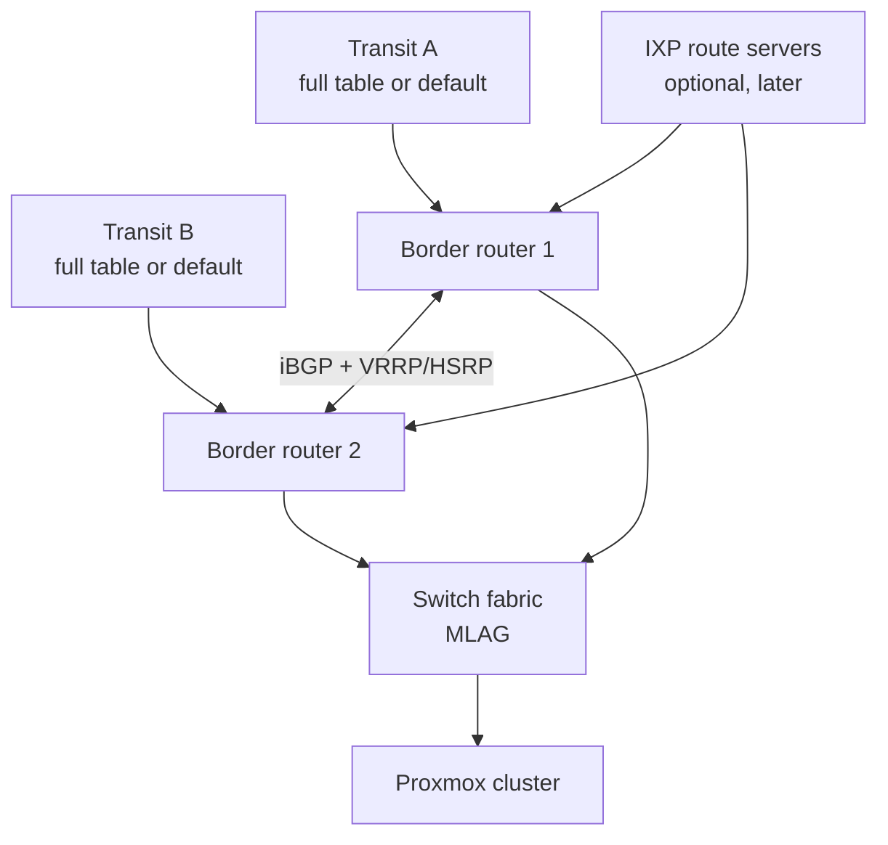

# 03 — Phase 1: Network and Addressing

**Duration:** 4–12 weeks, mostly waiting on external parties
**Blocking:** launch. Everything else can be built in parallel.
**Start:** week 1, immediately after entity registration

This is the longest-lead-time phase in the entire build and the one founders start too late. You cannot compress an RIR application by working harder. Begin the LIR application the day your incorporation certificate arrives.

All fee figures in this document are indicative ranges from my training data (cutoff May 2026), vary by region and by year, and **must be verified against the RIR's current published fee schedule before you budget**. IPv4 market prices in particular move substantially.

---

## 1.0 Why you need your own ASN and address space

You could launch by reselling a provider's IP space. Three reasons not to:

1. **Portability.** Announcements tied to your own ASN and your own prefixes mean you can change transit providers or datacenters without renumbering every customer. Renumbering is a customer-visible event that generates churn.
2. **Reputation ownership.** With borrowed space, your customers inherit whatever reputation that block already has — and you inherit the consequences of other tenants' abuse. With your own space, reputation is an asset you control and build.
3. **Credibility and multihoming.** Two transit providers with independent announcements is real redundancy. Single-homed on a provider's space, you are reselling their reliability.

The counter-argument is real: it is slower and costs more upfront. A legitimate staged approach is to launch on leased space with a leased ASN or a provider's announcement, and migrate to your own within 12 months. If you do this, **use IP space you can keep** — lease from a broker who will let you retain the block, not from your transit provider.

---

## 1.1 LIR membership

### What it is

An LIR (Local Internet Registry) is a member organisation of an RIR (Regional Internet Registry) with the right to receive and manage allocations. The five RIRs:

| RIR | Region |
|---|---|
| RIPE NCC | Europe, Middle East, Central Asia |
| ARIN | North America |
| APNIC | Asia Pacific |
| LACNIC | Latin America, Caribbean |
| AFRINIC | Africa |

### Two paths

**Become your own LIR.** Direct membership, direct allocations, full control, annual membership fee. This is the right answer if you intend to stay in business.

**Use a sponsoring LIR.** A third-party LIR sponsors your resources for a fee. Faster and cheaper to start. The catch is dependency: your resources sit under someone else's account, and moving them later is paperwork. **Verify in writing before signing that allocations transfer to you if you change sponsor or become your own LIR.** Some sponsors make this difficult.

### Requirements, typically

- Registered legal entity with verifiable documents
- Verifiable physical address
- Named contacts (admin, technical, abuse)
- Signed membership agreement
- Payment of sign-up and annual fees
- In some regions, a description of your network and intended use

### Indicative cost

| RIR | Typical structure |
|---|---|
| RIPE NCC | One-time sign-up fee plus a flat annual membership fee, historically in the low thousands of euros for the first category |
| ARIN | Annual fee tiered by total resource holdings; smallest categories are the cheapest, plus an initial application fee |
| APNIC | Tiered annual fee by holdings |

**Verify current schedules directly.** These change annually and my figures would be stale.

### Timeline

2–6 weeks typically, driven by document verification. Longer if your entity documents need translation or apostille.

### Common mistakes

- **Starting in week 6 instead of week 1.** The single most common scheduling error in the whole build.
- **Address mismatch** between incorporation documents and the application. Causes a verification loop that adds weeks.
- **Choosing a sponsoring LIR without confirming transferability.** You can end up unable to take your own address space with you.
- **Registering the LIR under a personal name** rather than the entity.

---

## 1.2 ASN acquisition

### What to do

Request an ASN through your LIR account or sponsor. Most regions require a demonstrated intent to multihome — that is, evidence you will peer with more than one network. Have your transit provider names or LOAs ready.

### Why you need it

An ASN is your identity in the global routing table. It is what lets you announce your own prefixes to multiple upstreams and be reachable independently of any one of them.

### Timeline and cost

2–8 weeks. Usually included in or a small addition to LIR fees.

### Common mistakes

- **Applying before you have transit relationships to name.** Have at least letters of intent from two providers.
- **Requesting a 16-bit ASN specifically.** 32-bit ASNs are normal now and work everywhere; insisting on a 16-bit one wastes time.

---

## 1.3 IPv6 allocation

### What to do

Request an IPv6 allocation at the same time as the ASN. Standard allocations are generous — commonly a `/32` (or `/29` in some historical RIPE cases), which is an effectively unlimited number of `/64` customer networks.

### Design decision: what to assign per customer

| Assignment | Networks available to customer | Recommendation |
|---|---|---|
| `/128` (single address) | 1 | **Never.** Breaks SLAAC and container networking |
| `/64` | 1 subnet, effectively unlimited hosts | **Minimum for a VPS.** Free, expected |
| `/56` | 256 subnets | Good for customers running multiple networks |
| `/48` | 65,536 subnets | Generous; reasonable for business plans |

**Give every VPS a `/64` free, minimum.** Marketing IPv6 as an add-on is user-hostile and increasingly a competitive disadvantage — it costs you effectively nothing.

Reserve structure at the start so you never renumber:

```
2001:db8::/32                          your allocation
├── 2001:db8:0000::/48                 infrastructure (loopbacks, mgmt, transit)
├── 2001:db8:0001::/48                 reserved
├── 2001:db8:0010::/44                 site 1 customer assignments
│   └── one /64 per VM, sequential
├── 2001:db8:0020::/44                 site 2 (future)
└── ...
```

### Common mistakes

- **Treating IPv6 as a later project.** It is nearly free and gets harder to retrofit.
- **Assigning `/128`s** to VMs. Guarantees support tickets.
- **No documented allocation plan**, leading to a renumber later.
- **Announcing a longer prefix than `/48`.** Many networks filter longer-than-`/48` IPv6 announcements, so your traffic will be unreachable from parts of the internet.

---

## 1.4 IPv4 acquisition

### The situation

There is no free IPv4 pool of consequence. Your options:

| Option | Cost profile | Speed | Notes |
|---|---|---|---|
| **RIR waiting list** | Cheapest by far | Months to years; may never | Typically a single `/24` maximum. Join it regardless — it is free to wait |
| **Lease from a broker** | Monthly per IP | Days to weeks | Lowest capital outlay, highest long-run cost. Verify the block's reputation |
| **Purchase via transfer market** | One-time per IP, plus broker fee and RIR transfer process | 4–12 weeks | Becomes an asset on your balance sheet; best long-run economics |
| **Transit provider assignment** | Usually free or bundled | Days | **Not portable.** Renumber when you leave. Acceptable only as a bridge |

Indicative market pricing from my training data: leasing has run in the region of **$0.50–$1.00 per IPv4 address per month**, and purchase in the region of **$30–$60 per address**, both varying by block size and market conditions. **These figures move significantly — get live quotes from two or three brokers before budgeting.** A `/24` is 256 addresses, of which you will lose a handful to network, broadcast, and gateway.

### The decision that matters most: lease vs buy

Run the arithmetic in the workbook, but the shape of it:

- Purchase pays back against leasing in roughly 3–5 years at typical rates, and leaves you owning an appreciating asset
- Leasing preserves capital when capital is your binding constraint pre-launch
- A common pragmatic path: **lease a `/24` to launch, purchase once revenue is proven**

### Reputation due diligence before you acquire any block

This is non-negotiable and frequently skipped. Before signing for a block, check it against:

- Spamhaus (SBL, CSS, DROP lists)
- Other major DNSBLs
- Project Honey Pot and similar
- Google Postmaster / Microsoft SNDS reputation where you can
- Historical routing (was it hijacked, is it in bogon lists)
- Whether it appears in commonly-used commercial IP-reputation feeds as "hosting/VPN/proxy" with a negative score

**A cheap block is cheap for a reason.** Inheriting a blocklisted `/24` means every customer's outbound email fails, some websites block them entirely, and cleaning it takes months of delisting requests. Pay more for clean space. Get the seller to warrant its status in the contract if you can.

### Capacity planning

IPv4 is usually your **binding revenue constraint per node**, not CPU or RAM. Model it:

```
Sellable VMs per /24  ≈  250 usable addresses  ÷  addresses per VM
```

With one IPv4 per VM, a `/24` supports about 250 VMs. Whether that is one node's worth or four nodes' worth depends on your plan sizes — which means **your plan mix determines your IP requirement**, and you should decide plans before buying addresses.

Ways to stretch IPv4, in order of customer acceptability:

1. **Charge for additional addresses.** Normal, expected, and improves your economics.
2. **IPv6-only plans at a discount.** A real market exists among developers and CI users; be honest about the limitations.
3. **Shared IPv4 with port mapping / NAT gateway** for IPv6-only plans needing occasional IPv4 egress.
4. **CGNAT for inbound-free workloads.** Acceptable for some use cases, but be explicit — many customers will consider it disqualifying.

---

## 1.5 RPKI

### What it is and why it is now mandatory

RPKI (Resource Public Key Infrastructure) lets you cryptographically sign a statement — a **ROA (Route Origin Authorisation)** — declaring which ASN is authorised to originate your prefixes. Networks that validate RPKI will drop announcements that are RPKI-**invalid**.

This has crossed from hygiene to necessity. A growing number of large networks and IXPs drop invalid routes. The consequences:

- **No ROA at all** = your routes are "NotFound" — still accepted, but you have no hijack protection
- **A ROA that does not match your actual announcement** = "Invalid" = **your prefix is unreachable from a meaningful and growing fraction of the internet**

The second case is the dangerous one, and it is self-inflicted. The most common cause is a ROA with a `maxLength` that does not permit the prefix length you actually announce.

### What to do

1. Create ROAs in your RIR portal for every prefix
2. Set `maxLength` deliberately:
   - If you announce exactly a `/24`, set origin ASN with `maxLength = 24`
   - If you might announce sub-prefixes (e.g. for traffic engineering or DDoS mitigation), set `maxLength` to permit them — but no looser than necessary, because a loose `maxLength` re-opens hijack exposure for the more specific prefixes
3. **Validate from outside** before and after you announce
4. Deploy an RPKI validator on your own routers so you also drop invalids inbound

### Validation

Check your own state from external tools — RIPE's RPKI validator views, Cloudflare's `isbgpsafeyet.com`, the routinator/rpki-client public views, and looking-glass servers on multiple networks.

```
# Confirm your announcement is seen and valid from several vantage points
# using public looking glasses and RIPE RIS / RouteViews data
```

### Common mistakes

- **maxLength too restrictive**, so a `/25` announcement during a DDoS event goes invalid exactly when you need it
- **maxLength wide open** (`/24` ROA with `maxLength 32`), which permits an attacker to hijack more specifics
- **Creating the ROA after announcing**, causing a period of invalidity
- **Forgetting to update ROAs when changing transit or ASN**
- **Only checking from one vantage point**

---

## 1.6 IRR objects

### What to do

Publish route objects (`route:` for IPv4, `route6:` for IPv6) in an IRR database — your RIR's, or a major one such as RADB — declaring your prefix and origin ASN. Also publish an `as-set` if you will have downstream customers announcing to you.

### Why

Many transit providers build their inbound prefix filters from IRR data. **Without a matching IRR object, your transit provider may simply not accept your announcement**, and the troubleshooting loop wastes days. Some providers accept RPKI in place of IRR; many still require both.

### Common mistakes

- Assuming RPKI replaces IRR. It does not, yet, for most transit providers.
- Stale objects after renumbering or changing ASN.
- Objects in a database your provider does not consult.

---

## 1.7 BGP design

### Minimum viable design



### Design decisions

**Full table vs default route.** Accepting the full table (~1M IPv4 routes and growing) requires routers with enough RAM/TCAM and gives you real path selection. Accepting only a default route from each upstream is far cheaper on hardware and adequate for a small provider. A pragmatic middle: default routes plus each upstream's customer routes.

If you accept full tables, **check the current global table size against your hardware's FIB capacity, with headroom for growth.** Routers running out of TCAM is a well-known and ugly failure mode.

**Router hardware.** Options in rough order of cost:
- Software routing on commodity x86 with FRR or VyOS — cheapest, adequate at 1–10 Gbps, requires you to be competent at it
- Used enterprise routers — cheap, but check FIB capacity and support lifetime
- Modern hardware routers — expensive, and probably overkill at launch

**Route policy — configure all of these before your first announcement:**

| Policy | Purpose |
|---|---|
| Prefix filter outbound | Announce **only** your own prefixes. A leak of the full table is a resume-generating event |
| Prefix filter inbound | Drop bogons, drop your own prefixes coming back at you, drop default unless intended |
| Max-prefix limit per session | Automatically tear down a session that starts sending millions of routes |
| RPKI validation inbound | Drop invalids |
| AS-path filter | Drop announcements with private ASNs in path, and paths containing your own ASN |
| Communities for traffic engineering | Blackhole community support from your upstreams — critical for DDoS response |
| uRPF on customer-facing interfaces | BCP38 anti-spoofing |

**The blackhole community is the one to confirm explicitly.** Each transit provider publishes a BGP community that, when tagged on a `/32` announcement, causes them to drop traffic to that address at their edge. This is your fastest DDoS response for a single targeted customer IP. Get the community values, document them, and **test them before you need them.**

### Common mistakes

- **No max-prefix limit.** A misconfigured upstream or your own error can blow up your routers.
- **No outbound prefix filter.** Route leaks make the industry news and damage relationships permanently.
- **Not testing the blackhole community.** You discover it does not work during your first attack.
- **Single border router.** A software crash takes you fully offline.
- **Announcing before RPKI and IRR are in place.** Causes an unreachability window and confusing debugging.

---

## 1.8 Transit providers

### How many and how to choose

**Two minimum, from different networks with genuinely different upstream paths.** Two providers who both buy transit from the same tier-1 give you contractual redundancy without topological redundancy.

Selection criteria in order of practical importance:

1. **DDoS handling.** Ask directly: *at what traffic level do you nullroute my prefix, and do you offer scrubbing?* A provider who nullroutes your entire `/24` at 1 Gbps of attack traffic will take all your customers offline regularly. This is the single most important question.
2. **Blackhole community support** and its documented behaviour
3. **Price structure** — commit level, overage rate, 95th-percentile vs average billing
4. **Actual network quality to your target markets** — ask for a looking glass and test latency to where your customers are
5. **Presence in your datacenter** — otherwise you pay for a long cross-connect or a wave
6. **Contract length and exit terms**

### Indicative cost

Transit is usually sold as a committed bandwidth level with 95th-percentile billing. Rates vary by an order of magnitude between well-connected markets and remote ones. Indicative from my training data: **low-single-digit dollars per Mbps per month at small commits in well-connected markets, considerably more in remote regions**, with per-port fees and cross-connect costs on top. Get real quotes; this is not a number to estimate.

### Internet exchange peering

Joining an IXP gives you direct paths to networks present there, usually reducing both cost and latency. Consider it once your traffic justifies the port fee. Benefits and caveats:

- **Benefit:** cheaper bits, lower latency to peers, better resilience
- **Caveat:** peering is not transit. You still need transit for everything not on the exchange.
- **Caveat:** route server sessions plus the ability to filter them properly is a real operational skill
- **Caveat:** a port and cross-connect have fixed monthly cost regardless of traffic

Not a launch requirement. A good month-6-to-12 optimisation.

---

## 1.9 DDoS mitigation — the decision that cannot wait

I am placing this in Phase 1 rather than Phase 6 because **it is a transit and topology decision, not a software decision**, and retrofitting it is expensive.

Hetzner and DigitalOcean absorb attacks silently as a bundled feature. Your customers will assume the same. Without mitigation, one customer's game server gets attacked, your upstream nullroutes your prefix, and **every** customer is offline.

Options:

| Approach | How it works | Trade-off |
|---|---|---|
| Transit with scrubbing included | Provider scrubs before delivering to you | Simplest; verify the clean-bandwidth capacity and activation time |
| Dedicated scrubbing service (always-on) | Your traffic routes through the scrubber continuously | Adds latency; highest protection; monthly cost |
| On-demand / BGP-triggered scrubbing | You divert traffic when attacked | Cheaper; activation delay means an initial outage |
| Blackhole community only | Drop traffic to the targeted IP | Free; the attacked customer is offline, but everyone else survives |
| Nothing | — | **Not viable.** Your prefix gets nullrouted and all customers go down |

**Minimum viable position: blackhole community from both transits, tested, plus a documented escalation path.** This means an attacked customer goes offline but the rest of your platform survives — an acceptable launch posture that you must disclose in your SLA exclusions.

Budget for real scrubbing before you accept any customer likely to attract attacks (game servers, IRC, anything adversarial).

---

## Procurement checklist

- [ ] Verify whether local ISP/telecoms registration is required to operate a network — **do this first**, it can be a hard blocker
- [ ] LIR membership application submitted (week 1)
- [ ] Sponsoring LIR alternative evaluated; transferability confirmed in writing if used
- [ ] ASN requested; letters of intent from two transit providers ready
- [ ] IPv6 allocation requested
- [ ] IPv6 addressing plan documented before first assignment
- [ ] Joined the RIR IPv4 waiting list (free)
- [ ] IPv4 quotes obtained from **two or more** brokers, lease and purchase
- [ ] **IPv4 reputation due diligence completed** on the specific block, before signing
- [ ] Seller warranty on block reputation negotiated where possible
- [ ] Datacenter selected and visited in person
- [ ] Colo contract signed, including documented exit terms
- [ ] Cross-connects ordered
- [ ] Two transit providers contracted, from topologically diverse networks
- [ ] **DDoS handling confirmed in writing** — nullroute threshold and scrubbing availability
- [ ] Blackhole community values documented for both providers
- [ ] Border router hardware acquired; FIB capacity verified against current global table size
- [ ] Second border router for redundancy
- [ ] Switches ordered (see Phase 2)

## Validation checklist

- [ ] ASN visible in RIR whois and in public routing databases
- [ ] IPv6 allocation visible in whois
- [ ] IPv4 block registered to your organisation
- [ ] ROAs created for every prefix, with deliberate `maxLength`
- [ ] **RPKI status confirmed VALID from at least three external vantage points**
- [ ] IRR route/route6 objects published and matching announcements
- [ ] Both BGP sessions established
- [ ] Outbound prefix filter verified — attempt to announce a test prefix you do not own and confirm it is blocked
- [ ] Max-prefix limits configured and confirmed on both sessions
- [ ] Inbound RPKI validation active; confirmed dropping a known-invalid
- [ ] uRPF active on customer-facing interfaces; spoofed packet from a test VM confirmed dropped
- [ ] **Blackhole community tested end to end** with both providers
- [ ] Failover tested: shut down transit A, confirm traffic continues via B with acceptable latency change
- [ ] Reverse DNS delegation working for your IPv4 and IPv6 blocks
- [ ] Latency measured from your target markets and recorded
- [ ] `abuse@` address registered in the RIR object and monitored

**Reverse DNS deserves emphasis:** customers running mail servers require the ability to set PTR records for their IPs. This must be a self-service function in your panel. Missing rDNS is a common and completely avoidable source of complaints.

---

## Risk analysis

| Risk | Likelihood | Impact | Mitigation |
|---|---|---|---|
| LIR application started late, blocking launch | **High** | Severe (schedule) | Submit week 1 |
| Local ISP registration required and unknown | Medium | Severe | Verify week 1 |
| Acquired IPv4 block has poor reputation | **High if unchecked** | Severe, slow to fix | Due diligence; pay for clean space; contractual warranty |
| RPKI ROA misconfigured (`maxLength`) | Medium | Severe (partial unreachability) | Validate from multiple external vantage points |
| Transit provider nullroutes your whole prefix under attack | **High** | Severe | Confirm policy in writing; blackhole community; scrubbing |
| Blackhole community untested | High | Severe during first attack | Test before launch |
| Route leak from missing outbound filter | Medium | Severe reputational | Prefix filters, max-prefix, test |
| Single border router | Medium | Severe | Two routers |
| IPv4 exhausted before next block acquired | Medium | Moderate (blocks sales) | Alert at 20% remaining; long lead time |
| Both transits share the same upstream | Medium | Moderate | Check AS paths, not just brand names |
| No rDNS self-service | High | Moderate (support load) | Build into the panel |

---

## Phase 1 success criteria

Your prefixes are announced from your own ASN via two topologically diverse transit providers, RPKI-valid from multiple external vantage points, with IRR objects matching, uRPF active, blackhole communities tested, reverse DNS delegated and self-serviceable, and a written DDoS position you can defend in your SLA.
