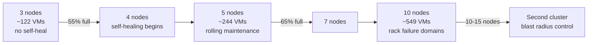

# 04 — Phase 2: Hardware

**Duration:** 2–8 weeks lead time; order early
**Depends on:** colo contract (for power/space limits), plan definitions (for sizing)
**Blocks:** Phase 3

All prices in this document are **indicative ranges from my training data (cutoff May 2026)**, vary enormously by region, vendor, new-vs-refurbished, and market conditions. Use them to understand relative magnitude and build the model; get real quotes before committing. The workbook lets you substitute your own figures.

---

## 2.0 Size from the plan mix, not from the spec sheet

The correct order is: decide what you will sell → compute what that requires → buy that. Most founders do it backwards, buy an impressive node, and discover the resource that runs out first is not the one they optimised.

Define a plan mix first. An illustrative starting catalogue:

| Plan | vCPU | RAM | Disk | Transfer | IPv4 | Indicative price/mo |
|---|---|---|---|---|---|---|
| S1 | 1 | 2 GB | 40 GB | 2 TB | 1 | $6–10 |
| S2 | 2 | 4 GB | 80 GB | 4 TB | 1 | $12–18 |
| S4 | 4 | 8 GB | 160 GB | 8 TB | 1 | $24–35 |
| S8 | 8 | 16 GB | 320 GB | 16 TB | 1 | $48–70 |
| S16 | 16 | 32 GB | 640 GB | 20 TB | 1 | $95–140 |

Then compute which resource binds first. Assume a plan mix weighted toward the middle (say 20% S1, 35% S2, 25% S4, 15% S8, 5% S16). Average per VM: ~3.3 vCPU, ~7.6 GB RAM, ~152 GB disk, 1 IPv4.

Now for a single node with 1× EPYC (64 cores / 128 threads), 512 GB RAM, and 46 TB raw NVMe in a 3-node `size=3` Ceph cluster:

```
vCPU capacity     = 128 threads × 3.5 overcommit                = 448 vCPU
                  → 448 / 3.3  ≈ 135 VMs

RAM capacity      = 512 GB − 48 GB reserved (OSDs, ARC, host)   = 464 GB
                  → 464 / 7.6  ≈  61 VMs        ← BINDS FIRST

Disk capacity     = (46 TB × 3 nodes / 3 replicas) × 0.60 usable = 27.6 TB
                  → 27,600 / 152 ≈ 181 VMs (cluster-wide, ~60/node)

IPv4 capacity     = 250 usable per /24 ÷ 1 per VM               = 250 VMs
                  → across the whole cluster
```

**RAM binds first at ~61 VMs per node.** That is the number that goes into your financial model, not the vCPU figure. It also tells you the lever: if you want more VMs per node, buy RAM, not cores.

Run this calculation for your own plan mix before ordering. It changes the answer.

---

## 2.1 Capacity planning formulas

Keep these in the workbook so they recalculate when you change assumptions.

### RAM (usually binding)

```
reserved_per_node = (ceph_osd_count × osd_memory_target)
                  + zfs_arc_max
                  + host_overhead

sellable_ram      = installed_ram − reserved_per_node
vms_by_ram        = sellable_ram / avg_ram_per_vm
```

Worked: 6 OSDs × 6 GB = 36 GB, + 4 GB ARC, + 8 GB host = **48 GB reserved**. On 512 GB installed, 464 GB sellable.

**Do not overcommit RAM.** Ballooning under memory pressure produces worse customer-visible symptoms — swapping, stalls, OOM kills inside guests — than refusing the sale. This is the one resource where you should stay honest.

### vCPU

```
vms_by_cpu = (threads × overcommit_ratio) / avg_vcpu_per_vm
```

Overcommit guidance:

| Ratio | Suitability |
|---|---|
| 2:1 | Premium/dedicated-core tier |
| 3:1 to 4:1 | Standard shared tier. Sensible default |
| 6:1+ | Budget tier only; expect steal-time complaints |

**Monitor CPU steal time as your overcommit health signal.** Sustained steal above ~5% means customers are feeling contention; above 10% they will complain. Alert on it.

### Ceph usable capacity

```
usable_raw   = total_raw / replica_size
safe_usable  = usable_raw × safety_factor

safety_factor: 0.60 on 3 nodes   (cannot self-heal; need rebalance headroom)
               0.70 on 4-5 nodes
               0.75 on 6+ nodes
```

Worked, 3 nodes × 6 × 7.68 TB = 138 TB raw ÷ 3 = 46 TB ÷ 0.60 safety → **27.6 TB safely sellable**.

Thin provisioning lets you *sell* more than that — customers rarely fill their disks — but you must monitor actual consumption and alert well before real usage approaches the limit. A ratio of 1.5–2× sold-to-actual is common; anything higher is gambling.

### IPv4

```
vms_by_ipv4 = usable_addresses_per_block / addresses_per_vm
```

### Node count required

```
target_vms      = revenue_target / avg_revenue_per_vm
vms_per_node    = MIN(vms_by_ram, vms_by_cpu, vms_by_disk_per_node)
nodes_needed    = CEILING(target_vms / vms_per_node) + 1
```

**The `+1` is not optional.** You need one node's worth of spare capacity at all times, for maintenance, for failover, and because Ceph rebalancing needs somewhere to put data. A cluster running at 100% of its nodes has no maintenance window.

### Bandwidth

```
committed_mbps = (total_vms × avg_transfer_gb_per_month × 8 × 1000)
                 / (30 × 86400)
                 × peak_to_average_ratio
```

Peak-to-average for mixed VPS workloads typically runs 2–4×. With 95th-percentile billing you are charged near the peak, so this matters. Most VPS customers use a small fraction of their included transfer — measure your actual ratio after launch and renegotiate your commit.

---

## 2.2 CPU selection

### The decision framework

| Consideration | Guidance |
|---|---|
| Core count vs clock | For shared VPS, cores win — you are selling density. For a premium single-thread tier, clock matters |
| Single vs dual socket | **Single socket preferred.** No NUMA complexity, lower licensing (Proxmox is per-socket), simpler capacity model, and modern single sockets have plenty of cores |
| AMD EPYC vs Intel Xeon | EPYC has generally led on core count and PCIe lanes per socket, which suits NVMe-dense Ceph nodes. Verify current generation pricing both ways |
| PCIe lanes | Critical. 6–8 NVMe drives plus 2× 25 GbE needs real lane count. This is where EPYC's lane advantage matters |
| Generation | One generation behind current often gives 60–70% of the performance at 40% of the cost. Strong value play for a startup |

### Why single socket matters more than it sounds

Proxmox subscriptions are priced **per socket per node**. A dual-socket node doubles that line item. Combined with NUMA-related performance unpredictability for VMs that straddle sockets, and the fact that a single modern EPYC provides more cores than you can sell against your RAM constraint anyway, single socket is the clear default.

### Indicative cost

Single-socket EPYC platform, 512 GB RAM, 6× enterprise NVMe, 2× 25 GbE, redundant PSU: **roughly $10,000–18,000 new**, or **$5,000–9,000** for a prior-generation or refurbished equivalent. Verify with real quotes; component pricing (especially RAM) is volatile.

---

## 2.3 RAM planning

```
installed_ram = (avg_ram_per_vm × target_vms_per_node) + reserved_per_node
```

Practical guidance:

- **512 GB is the sensible starting point** for a node in this class. 256 GB makes RAM bind uncomfortably early; 1 TB is capital you may not need yet.
- **Populate all memory channels.** Half-populated channels cost you significant memory bandwidth, which matters for Ceph and for many VM workloads. Check your platform's channel count and buy modules accordingly.
- **Leave DIMM slots free for expansion** where the channel rules allow it, but not at the cost of running unbalanced.
- **ECC registered, on the vendor's qualified list.** Not optional.

---

## 2.4 Storage planning and Ceph hardware requirements

### The single most expensive mistake available to you

**Enterprise NVMe with power-loss protection (PLP) is mandatory.** A drive without PLP cannot trust its own DRAM write cache, so every Ceph journal sync must reach NAND. Real-world consequence: **5–20× lower sync-write IOPS** and endurance consumed in months rather than years.

Verify PLP in the datasheet, by name. Marketing terms vary ("enhanced power loss data protection", "PLI"). If the datasheet does not state it, assume it is absent.

### Drive selection

| Attribute | Guidance |
|---|---|
| Interface | NVMe U.2/U.3. SATA SSDs are a false economy for Ceph |
| PLP | **Required** |
| Endurance | 1–3 DWPD (mixed-use). Read-intensive (<1 DWPD) wears out under Ceph write amplification |
| Capacity per drive | 3.84–7.68 TB is the value sweet spot. Larger drives mean longer rebuild times |
| Count per node | 6–8. More drives = finer failure granularity and faster recovery |
| Boot drives | 2× separate SATA/NVMe SSDs, ZFS mirror. **Never share with OSDs** |

### Why drive count matters

With 6 drives per node, losing one loses 1/6 of that node's capacity and Ceph rebuilds a manageable amount. With 2 huge drives per node, losing one is a much larger rebuild, taking longer and degrading customer I/O for that whole window.

### Write amplification budget

Ceph at `size=3` writes every byte three times. Plus BlueStore metadata, plus deep scrubs reading everything periodically. Budget endurance accordingly:

```
drive_writes_per_day_needed ≈ (customer_write_gb_per_day × 3) / (drive_count × drive_tb) / 1000
```

Then add margin. This is why read-intensive drives fail early in Ceph clusters.

### Indicative cost

Enterprise NVMe with PLP, 7.68 TB: roughly **$700–1,400 each** depending on endurance class and market. Six per node is therefore a substantial fraction of node cost — and the place where the temptation to buy consumer drives is strongest and most damaging.

---

## 2.5 Switch selection

### Requirements

| Requirement | Why |
|---|---|
| 2 switches minimum | A single switch is a single point of failure for the entire cluster |
| MLAG / VLAG / stacking | So LACP bonds can span both switches |
| 48× 25 GbE + uplinks (or 24× for a small start) | Ceph and tenant traffic |
| **Jumbo frame support (9216 MTU)** | Required for Ceph and VXLAN underlay |
| VLAN support, obviously | Segmentation |
| Sufficient buffer | Ceph produces bursty many-to-one traffic (incast); shallow-buffer switches drop and degrade badly |
| Separate 1 GbE switch or ports | Management + Corosync ring 0 |

### The buffer point deserves attention

Ceph replication creates **incast** patterns — many OSDs replying to one client simultaneously. Cheap switches with small shared buffers drop packets under incast, TCP backs off, and you see mysterious latency spikes that look like a disk problem. When comparing switches, look at buffer size per port, not just port count and speed.

### Critical physical requirement

**Corosync ring 0 and ring 1 must traverse different switches.** This is a cabling requirement, and it is the thing most commonly got wrong. Both rings patched into the same switch means a switch reboot takes your cluster read-only — exactly the failure the dual ring exists to prevent. Document the cable map and verify it physically before you trust it.

### Indicative cost

48-port 25 GbE with 100 GbE uplinks: **$8,000–15,000 new**, **$2,000–5,000** for prior-generation refurbished. Two required. Refurbished datacenter switches are a well-established market and a reasonable place to save money, provided you can get firmware updates.

---

## 2.6 Spare parts strategy

### What to keep on site from day one

| Part | Quantity | Reasoning |
|---|---|---|
| NVMe drive (same model) | 1–2 | Highest failure rate component; you will use these |
| SFP28 transceivers / DAC cables | 2 | Cheap, and a failed optic looks like a mysterious network problem |
| Power supply (same model) | 1 | Redundant PSUs mean a failure is not urgent — but replacing it should not take weeks |
| Boot SSD | 1 | Cheap insurance |
| Fan / fan tray | 1 | Thermal shutdown is a hard outage |
| Console cable + USB serial adapter | 1 | For when the network is the problem |
| RAM module (same model) | 1 | Only if lead time on your specific DIMM is long |

### Why on-site rather than RMA-only

RMA turnaround is measured in days to weeks. A degraded Ceph cluster waiting a week for a drive is a week of elevated risk and reduced performance. The cost of a spare drive is trivial next to that.

### Also part of the strategy

- **Vendor RMA terms negotiated** — advance replacement if you can get it
- **Remote hands relationship tested** with a trivial request before you need it for something urgent
- **Firmware baselines documented** so a replacement part gets brought to the same level
- **N+1 at the node level**, not just the component level. Keep one node's worth of capacity free.

---

## 2.7 Growth models

### Model A — 3 nodes (launch)

```
3 compute nodes + 1 backup server + 2 switches + 2 border routers
```

| Aspect | Value |
|---|---|
| Ceph | `size=3`, tolerates 1 node loss, **cannot self-heal** |
| Safe raw utilisation | 60% |
| Sellable VMs (RAM-bound, example mix) | ~61/node × 3 = **~183**, minus one node's reserve = **~122 sellable** |
| Maintenance | Requires accepting degraded state during any node work |
| Realistic SLA | 99.5–99.9% |

**The `+1` reserve is why you sell ~122 and not ~183.** If you sell to full capacity, you have no failover headroom and no maintenance window.

### Model B — 5 nodes (first growth step)

| Aspect | Value |
|---|---|
| Ceph | **Self-heals** after a node loss — the qualitative change |
| Safe raw utilisation | 70% |
| Sellable VMs | ~61 × 5 = 305, minus reserve = **~244** |
| Maintenance | Genuinely non-disruptive rolling maintenance possible |
| Realistic SLA | 99.9–99.95% |

**Going from 3 to 5 nodes is the most valuable capacity investment you will make**, because it changes the availability *category*, not just the capacity number. Node 4 is where self-healing begins; node 5 gives comfortable headroom.

### Model C — 10 nodes (mature single site)

| Aspect | Value |
|---|---|
| Ceph | Consider erasure coding for a secondary/archive tier |
| Safe raw utilisation | 75% |
| Sellable VMs | ~61 × 10 = 610, minus reserve = **~549** |
| Failure domains | Introduce rack-level CRUSH buckets if you span racks |
| Cluster split | At 10–15 nodes, consider a second Ceph cluster rather than one large one — blast radius and upgrade risk |
| Realistic SLA | 99.95% |

### Growth triggers

Order the next node when the **first** of these fires:

| Signal | Threshold |
|---|---|
| Ceph raw utilisation | 55% (3 nodes) / 65% (5+) |
| RAM committed vs sellable | 75% |
| CPU steal time sustained | >5% during business hours |
| IPv4 pool remaining | 20% |
| Transit 95th percentile | 60% of commit |

**Order before you need it.** Hardware lead times are 2–8 weeks and Ceph rebalancing after adding a node takes hours to days. A node ordered when you are full arrives when you are overfull.

### Scaling shape



---

## 2.8 Cost estimates — structure, not gospel

Fill real quotes into the workbook. The structural shape of a 3-node launch:

| Category | Type | Notes |
|---|---|---|
| 3× compute nodes | Capex | Largest single line. Refurb prior-gen halves it |
| 1× backup server + capacity | Capex | Must be separate hardware. Can be cheaper/slower disks |
| 2× switches | Capex | Refurb is a reasonable saving |
| 2× border routers | Capex | Software routing on x86 is the budget option |
| Rack rails, PDUs, cables, optics | Capex | Easy to underestimate; add 10% |
| Spares kit | Capex | Small, high value |
| Colo (quarter/half rack) | Opex/mo | Power often billed separately — check |
| IP transit ×2 | Opex/mo | Includes port fees |
| Cross-connects | Opex/mo | Per connection, recurring |
| IPv4 lease or amortised purchase | Opex/mo | Often larger than expected |
| DDoS scrubbing | Opex/mo | Skippable at launch only with blackhole-only posture |
| Proxmox subscriptions ×3 | Opex/yr | Per socket per node |
| PBS subscription | Opex/yr | |
| LIR annual membership | Opex/yr | |
| Billing platform + Proxmox module | Opex/mo | See Phase 5 |
| Monitoring host | Capex or opex | Must be outside the cluster |
| Accounting, legal, insurance | Opex | Phase 0 |

**Two lines founders consistently underestimate:** cross-connects (recurring, and you need several) and IPv4 (the largest ongoing COGS item for many VPS providers).

---

## Phase 2 validation checklist

- [ ] Plan mix defined; binding resource identified by calculation, not assumption
- [ ] `vms_per_node` computed for your actual mix and recorded in the model
- [ ] Single-socket platform chosen unless there is a specific reason otherwise
- [ ] PCIe lane budget verified against drive count + NIC requirements
- [ ] All memory channels populated
- [ ] **PLP confirmed by name in the NVMe datasheet**
- [ ] Drive endurance (DWPD) checked against write-amplification budget
- [ ] Boot drives separate from OSD drives
- [ ] Two switches with MLAG and 9216 MTU support
- [ ] Switch buffer capacity considered, not just port count
- [ ] **Cable map documented showing Corosync ring 0 and ring 1 on different switches**
- [ ] Two border routers; FIB capacity verified against current global routing table size
- [ ] Redundant PSUs on separate power feeds (A+B)
- [ ] Power draw calculated and within the colo circuit limit, with headroom
- [ ] Spares kit on site
- [ ] Vendor RMA terms documented
- [ ] Remote hands tested with a trivial request
- [ ] Firmware baseline documented
- [ ] Growth triggers written down with owners
- [ ] Real quotes obtained for every capex line; model updated

## Phase 2 success criteria

You know your binding resource, your VMs-per-node figure derived from your own plan mix, your break-even VM count from the model, and the specific threshold that will trigger your next hardware purchase. Hardware is on site, racked, with spares, and the cable map has been physically verified.
