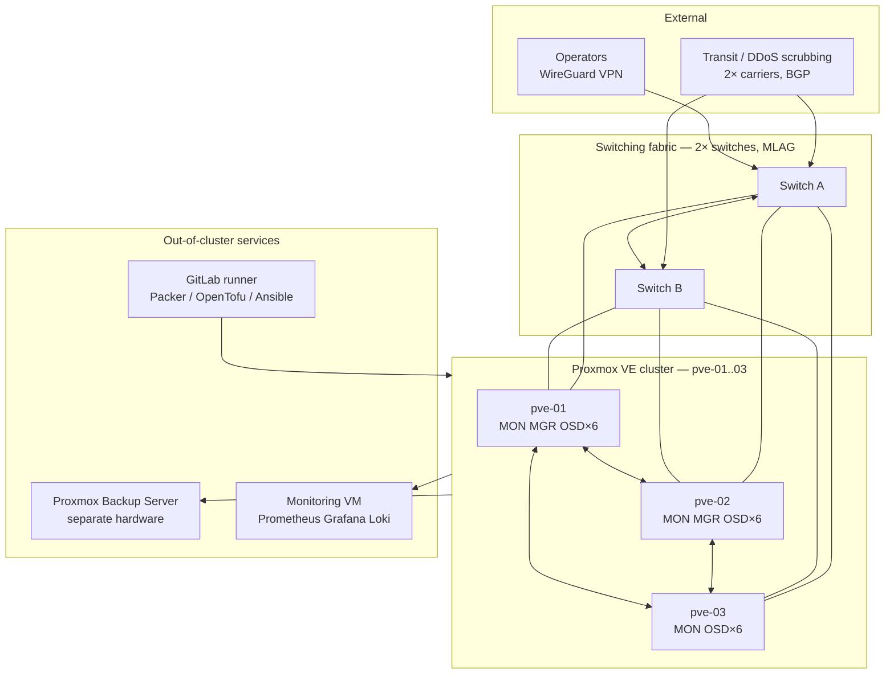
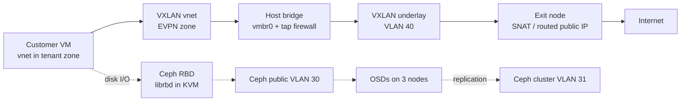

# 01 — Architecture and Network Design

Target build: 3 Proxmox VE nodes, hyperconverged Ceph, 2 switches, 1 backup server, GitLab CI/CD.

---

## 1.1 The honest constraint of a 3-node Ceph cluster

Read this before anything else, because it shapes what you can sell.

With `size=3, min_size=2` and failure domain `host`, each object has one replica per node. If one node dies:

- The pool stays **readable and writable** (2 of 3 replicas survive, meeting `min_size`).
- Ceph **cannot self-heal**, because there is no fourth host to place the third replica on. The cluster sits `HEALTH_WARN / degraded` until the node returns.
- You are now one further failure from data unavailability.

So a 3-node cluster gives you **fault tolerance, not self-healing**. That is fine for launch, but:

- Do not advertise "99.99%" or "self-healing storage" on 3 nodes.
- Plan node 4 before you are 50% full. Node 4 is what turns degraded-until-repaired into heals-automatically.
- Keep raw utilisation below **60%** on 3 nodes. At `size=3`, 60% raw = 20% usable of raw, and leaves headroom to absorb a node's worth of rebalancing later.

Usable capacity math: `usable ≈ raw_total / 3 × 0.60`. Six 7.68 TB NVMe per node × 3 nodes = 138 TB raw → **~27 TB safely sellable**. Sell 40 TB of thin-provisioned VPS disks against that only if you actively monitor real consumption.

---

## 1.2 Physical and logical architecture



The three lines between nodes are logical, not extra cables — Ceph replication and Corosync ride the same physical fabric on separate VLANs.

---

## 1.3 Network segmentation

Six logical networks. Do not collapse them.

| # | Network | VLAN | Subnet | Bearer | Purpose | MTU |
|---|---------|------|--------|--------|---------|-----|
| 1 | Management | 10 | 10.10.10.0/24 | 2× 1/10 GbE LACP | PVE web UI, SSH, Ansible | 1500 |
| 2 | Corosync ring 0 | 20 | 10.10.20.0/24 | 1 GbE dedicated port | Cluster membership | 1500 |
| 3 | Corosync ring 1 | 21 | 10.10.21.0/24 | shared on mgmt LACP | Backup membership ring | 1500 |
| 4 | Ceph public | 30 | 10.10.30.0/24 | 2× 25 GbE LACP | Client ↔ OSD/MON I/O | 9000 |
| 5 | Ceph cluster | 31 | 10.10.31.0/24 | same 25 GbE LACP | OSD ↔ OSD replication, backfill | 9000 |
| 6 | VXLAN underlay | 40 | 10.10.40.0/24 | same 25 GbE LACP | Tenant overlay transport | 9000 |
| 7 | Public / tenant | — | your assigned IPv4 + IPv6 | 2× 25 GbE LACP | Customer VM traffic | 1500 |
| 8 | IPMI / BMC | 99 | 10.10.99.0/24 | dedicated BMC port | Out-of-band | 1500 |

### Why Corosync gets its own physical port

Corosync tolerates **under 5 ms RTT and very low jitter**. It does not tolerate a Ceph backfill saturating the link. When Corosync packets are delayed past its token timeout, the node is declared dead, HA fencing may reboot it, and you lose a node *because of a disk rebuild*. This is the single most common self-inflicted outage on hyperconverged Proxmox.

Ring 0 on a dedicated 1 GbE port. Ring 1 on the management LACP as a backup path. `knet` handles failover between them.

### Why Ceph public and cluster are separate

Replication traffic is roughly `(size - 1)×` write volume — a 100 MB/s write generates ~200 MB/s of replication. During backfill it saturates whatever it can reach. Separating them means a rebuild degrades rebuild speed, not customer I/O. Same physical LACP is acceptable at 25 GbE; separate VLANs plus QoS. At 10 GbE, use separate physical ports.

### MTU

Jumbo frames (9000) on Ceph and the VXLAN underlay. VXLAN adds 50 bytes of encapsulation, so with a 9000-byte underlay you can safely offer tenants a standard **1500-byte MTU** inside their VMs — this is what customers expect and what avoids a long tail of "my VPN/SSH hangs on large packets" tickets. If your underlay is only 1500, tenant MTU must drop to 1450 and you will get those tickets.

**Verify end to end before trusting it:**
```bash
ping -M do -s 8972 10.10.30.2   # 8972 + 28 bytes header = 9000
```
If this fails, one switch port is missing the jumbo config. Test every path.

---

## 1.4 Traffic flow



Four distinct paths, each on its own VLAN:

1. **Customer north-south** — VM → vnet → VXLAN underlay → exit node → transit.
2. **Customer disk I/O** — KVM `librbd` → Ceph public → OSD.
3. **Ceph replication** — OSD → Ceph cluster VLAN. Never touches customer paths.
4. **Control and cluster** — Corosync on its own rings; management for API, Ansible, monitoring scrape, PBS backup pulls.

---

## 1.5 Per-node hardware layout

```
pve-01 / pve-02 / pve-03 (identical)
├── 2× SATA/NVMe SSD 480 GB      → ZFS mirror, PVE root  (rpool)
├── 6× NVMe U.2 enterprise w/PLP → Ceph OSD, one OSD per device
├── 2× 25 GbE (LACP → MLAG)      → VLANs 30, 31, 40, public
├── 2× 1 GbE  (LACP → MLAG)      → VLANs 10, 21
├── 1× 1 GbE  (dedicated)        → VLAN 20, Corosync ring 0
└── 1× BMC/IPMI port             → VLAN 99, isolated
```

**Non-negotiable on drives:** enterprise NVMe with **power-loss protection (PLP)**. Consumer NVMe without PLP must flush every Ceph journal write to NAND because it cannot trust its DRAM cache. Real-world result is 5–20× lower sync write IOPS and endurance burned in months. This is the most expensive mistake to discover after launch.

Never put OSDs on the same devices as the PVE root.

---

## 1.6 Placement of cluster daemons

| Daemon | Count | Placement | Why |
|--------|-------|-----------|-----|
| Ceph MON | 3 | one per node | Odd number for its own quorum; 3 tolerates 1 loss |
| Ceph MGR | 2 | pve-01, pve-02 | One active, one standby; a third adds nothing |
| Ceph MDS | 0 | — | Only needed for CephFS; RBD-only VPS does not need it |
| Ceph OSD | 18 | 6 per node | One per NVMe device |
| Corosync | 3 | all nodes | Cluster membership |
| PBS | 1 | **separate physical box** | A backup inside the cluster is not a backup |

---

## 1.7 Address plan template

Fill this in and commit it to Git before you touch a switch. Ambiguity here costs days later.

```yaml
# docs/address-plan.yml
mgmt:
  subnet: 10.10.10.0/24
  gateway: 10.10.10.1
  pve-01: 10.10.10.11
  pve-02: 10.10.10.12
  pve-03: 10.10.10.13
  pbs-01: 10.10.10.20
  mon-01: 10.10.10.30

corosync_ring0:   { subnet: 10.10.20.0/24, pve-01: 10.10.20.11, pve-02: 10.10.20.12, pve-03: 10.10.20.13 }
corosync_ring1:   { subnet: 10.10.21.0/24, pve-01: 10.10.21.11, pve-02: 10.10.21.12, pve-03: 10.10.21.13 }
ceph_public:      { subnet: 10.10.30.0/24, pve-01: 10.10.30.11, pve-02: 10.10.30.12, pve-03: 10.10.30.13 }
ceph_cluster:     { subnet: 10.10.31.0/24, pve-01: 10.10.31.11, pve-02: 10.10.31.12, pve-03: 10.10.31.13 }
vxlan_underlay:   { subnet: 10.10.40.0/24, pve-01: 10.10.40.11, pve-02: 10.10.40.12, pve-03: 10.10.40.13 }
ipmi:             { subnet: 10.10.99.0/24, pve-01: 10.10.99.11, pve-02: 10.10.99.12, pve-03: 10.10.99.13 }

public_v4:
  block: "203.0.113.0/24"        # replace with your allocation
  reserved_infra: "203.0.113.0/28"
  customer_pool: "203.0.113.16 - 203.0.113.254"
public_v6:
  block: "2001:db8::/32"          # replace
  per_vm_allocation: "/64"
```

---

## 1.8 Monitoring stack placement

Run Prometheus, Grafana, Loki, and Alertmanager in a VM **outside** the production cluster — a small box or the PBS host. Monitoring that dies with the thing it monitors tells you nothing during the incident you most need it.

Scrape targets:

| Exporter | Where | Key metrics |
|----------|-------|-------------|
| `node_exporter` | all nodes + PBS | CPU steal, load, disk, NIC errors |
| `prometheus-pve-exporter` | one instance, reads PVE API | guest state, node status, storage usage |
| Ceph built-in Prometheus module | MGR (`ceph mgr module enable prometheus`) | PG states, OSD latency, pool usage |
| `pbs-exporter` or PBS metrics | PBS host | backup success, datastore usage |
| BMC via IPMI exporter | management net | fan, PSU, temperature |

Enable Ceph's exporter with:
```bash
ceph mgr module enable prometheus
ceph config set mgr mgr/prometheus/server_port 9283
```

Alert on these, and route them to a phone that actually wakes someone:

- Corosync quorum lost
- `ceph health` != `HEALTH_OK` for more than 15 minutes
- Any OSD down, or PG not `active+clean` for more than 30 minutes
- Any pool above 70% used
- Node CPU steal above 10% sustained for 5 minutes
- SMART pre-fail on any device
- PBS backup job failed, or no successful backup in 36 hours
- Outbound traffic from a single VM above your abuse threshold
