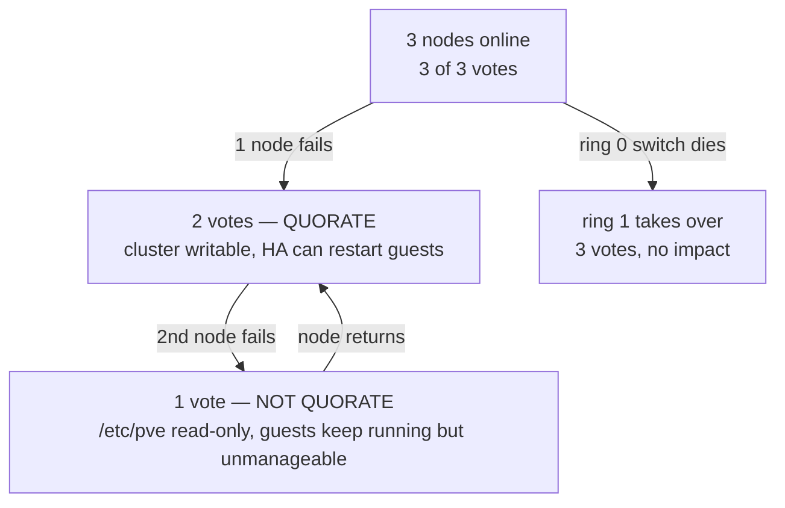

# 02 — Phase 3 Deep Dive: Cluster Build (Steps 15–20)

Baseline assumed: Proxmox VE 9.x (Debian 13 "Trixie" base, Ceph 19.2 "Squid"). Version details move fast — confirm current release notes at `pve.proxmox.com/wiki/Roadmap` before you install, and adjust repo names accordingly.

---

# Step 15 — Install Proxmox VE

## Purpose

Produce three identical, minimal, hardened hypervisor hosts with no configuration drift and no manual steps you cannot reproduce.

## Installation layout

Install from the official ISO on each node. At the disk selection screen:

- Select **both** boot SSDs, set **Filesystem: `zfs (RAID1)`**.
- Open **Advanced options** and set:
  - `ashift = 12` (4K sectors — correct for every modern SSD; 13 for some 8K-page NVMe)
  - `compress = lz4` (on by default; near-free, reduces writes)
  - `checksum = on`
  - `copies = 1` (mirror already gives redundancy)
  - `hdsize` — leave full disk unless you want spare capacity

Do **not** select the NVMe data drives. They stay untouched for Ceph.

Set the management IP to the VLAN 10 address from your address plan. Hostname must be the short name you will use everywhere (`pve-01`), FQDN `pve-01.dc1.example.net`.

## ZFS vs ext4 for boot disks

| | ZFS mirror | ext4 + LVM (`RAID1` via mdadm) |
|---|---|---|
| Boot redundancy | Yes, native, both disks bootable | Yes, but mdadm setup is manual on PVE |
| Root snapshot + rollback before upgrades | **Yes** — the decisive advantage | No |
| Checksumming, silent corruption detection | Yes | No |
| RAM overhead | ARC, must be capped | Negligible |
| Install complexity | One dropdown | Manual |

**Choose ZFS mirror.** The ability to snapshot root before a `pveupgrade` and roll back a broken kernel in one command is worth the RAM overhead on a machine you cannot afford to reinstall remotely.

### Cap the ARC — do this before deploying Ceph

ZFS ARC will otherwise compete with Ceph OSD memory and VM memory, and the failure mode is OOM-killed OSDs under load.

```bash
# 4 GiB is plenty for a root-only pool
echo "options zfs zfs_arc_max=4294967296" > /etc/modprobe.d/zfs.conf
echo "options zfs zfs_arc_min=1073741824" >> /etc/modprobe.d/zfs.conf
update-initramfs -u -k all
reboot
```

Verify after reboot:
```bash
arc_summary | grep -A2 "ARC size"
cat /sys/module/zfs/parameters/zfs_arc_max
```

## Repository setup

Proxmox VE 9 moved to deb822-style sources. Both formats may exist; handle both.

```bash
# Remove the no-subscription and test repos if present
rm -f /etc/apt/sources.list.d/pve-no-subscription.list
rm -f /etc/apt/sources.list.d/pve-no-subscription.sources
rm -f /etc/apt/sources.list.d/ceph-no-subscription.list

# Enterprise PVE repo (deb822 form)
cat > /etc/apt/sources.list.d/pve-enterprise.sources <<'EOF'
Types: deb
URIs: https://enterprise.proxmox.com/debian/pve
Suites: trixie
Components: pve-enterprise
Signed-By: /usr/share/keyrings/proxmox-archive-keyring.gpg
EOF

# Enterprise Ceph repo — match the Ceph release you will deploy
cat > /etc/apt/sources.list.d/ceph.sources <<'EOF'
Types: deb
URIs: https://enterprise.proxmox.com/debian/ceph-squid
Suites: trixie
Components: enterprise
Signed-By: /usr/share/keyrings/proxmox-archive-keyring.gpg
EOF

apt update && apt full-upgrade -y
```

If `apt update` returns 401, the subscription key is not yet applied on that node.

## Subscription requirements

You need one **Proxmox VE subscription per socket, per node**. For a VPS business this is not optional, for three reasons:

1. The enterprise repo receives packages after additional testing. `pve-no-subscription` is where regressions are found — by users. You do not want your customers to be that test population.
2. Support tickets with Proxmox GmbH when Ceph or Corosync misbehaves in a way you cannot diagnose.
3. Ceph enterprise repo access.

Community tier is the usual starting point; Basic or Standard if you want ticket support. Apply the key per node:

```bash
pvesubscription set "pveXX-XXXXXXXXXX"
pvesubscription update
pvesubscription get
```

## Initial hardening

Run this on all three nodes before they are reachable from anything but your VPN.

```bash
# 1. SSH: keys only, no root password, no password auth at all
install -d -m 700 /root/.ssh
cat >> /root/.ssh/authorized_keys <<'EOF'
ssh-ed25519 AAAA... ops@yourcompany
EOF
chmod 600 /root/.ssh/authorized_keys

cat > /etc/ssh/sshd_config.d/99-hardening.conf <<'EOF'
PermitRootLogin prohibit-password
PasswordAuthentication no
KbdInteractiveAuthentication no
ChallengeResponseAuthentication no
PubkeyAuthentication yes
X11Forwarding no
AllowTcpForwarding no
MaxAuthTries 3
LoginGraceTime 30
ClientAliveInterval 300
ClientAliveCountMax 2
KexAlgorithms curve25519-sha256,curve25519-sha256@libssh.org
Ciphers chacha20-poly1305@openssh.com,aes256-gcm@openssh.com
MACs hmac-sha2-512-etm@openssh.com,hmac-sha2-256-etm@openssh.com
EOF
systemctl reload ssh
```

```bash
# 2. Datacenter firewall — management access only from VPN and cluster peers
# /etc/pve/firewall/cluster.fw
[OPTIONS]
enable: 1
policy_in: DROP
policy_out: ACCEPT

[ALIASES]
vpn_net 10.99.0.0/24
mgmt_net 10.10.10.0/24

[RULES]
IN ACCEPT -source +vpn_net -p tcp -dport 8006 -log nolog   # PVE web UI
IN ACCEPT -source +vpn_net -p tcp -dport 22 -log nolog     # SSH
IN ACCEPT -source +mgmt_net -p tcp -dport 22 -log nolog
IN ACCEPT -source +mgmt_net -p tcp -dport 8006 -log nolog
IN ACCEPT -source +mgmt_net -p tcp -dport 5900:5999 -log nolog  # VNC
IN ACCEPT -source +mgmt_net -p udp -dport 5405:5412 -log nolog  # Corosync
IN ACCEPT -source +mgmt_net -p tcp -dport 9100 -log nolog       # node_exporter
```

Enable the firewall at datacenter level in the UI, or set `enable: 1` as above, then `systemctl restart pve-firewall`.

```bash
# 3. Mandatory TOTP for all PVE UI users
# Datacenter → Permissions → Two Factor → require TOTP for realm pam
# Or: pveum realm modify pam --tfa type=totp

# 4. Unattended security updates only, never full-upgrade
apt install -y unattended-upgrades
# Restrict to security origins; PVE upgrades stay manual and scheduled.

# 5. Disable the RPC/portmapper and anything you do not use
systemctl disable --now rpcbind rpcbind.socket 2>/dev/null || true

# 6. Kernel hardening for a hypervisor
cat > /etc/sysctl.d/99-pve-hardening.conf <<'EOF'
net.ipv4.conf.all.rp_filter = 1
net.ipv4.conf.all.accept_redirects = 0
net.ipv4.conf.all.send_redirects = 0
net.ipv4.conf.all.accept_source_route = 0
net.ipv4.conf.all.log_martians = 1
net.ipv6.conf.all.accept_redirects = 0
net.ipv6.conf.all.accept_ra = 0
kernel.dmesg_restrict = 1
kernel.kptr_restrict = 2
fs.protected_hardlinks = 1
fs.protected_symlinks = 1
# Raise conntrack for a busy host
net.netfilter.nf_conntrack_max = 1048576
EOF
sysctl --system
```

Note: `rp_filter = 1` must be revisited once EVPN routing is in place — asymmetric paths on exit nodes can be dropped by strict reverse-path filtering. Set `rp_filter = 2` (loose) on the specific interfaces involved if you see unexplained drops.

```bash
# 7. IPMI/BMC — change default credentials, disable IPMI-over-LAN on the data NIC,
#    and confirm the BMC is only reachable from VLAN 99.
```

## Risks

| Risk | Consequence | Mitigation |
|---|---|---|
| ARC not capped | OSDs OOM-killed under load, cluster flaps | Cap before Ceph deploy, verify `arc_summary` |
| PVE UI exposed to internet | Full cluster compromise | Datacenter firewall + VPN only, TOTP |
| No-subscription repo in production | Untested package breaks a node | Enterprise repo, staged upgrades |
| Hostname changed after cluster creation | Cluster config corruption, node unrecoverable | Set the final hostname before `pvecm create` |
| Different kernel/microcode per node | Live migration failures, unpredictable behaviour | Ansible-managed identical package state |

## Validation checklist — Step 15

- [ ] `pveversion -v` output identical on all three nodes
- [ ] `zpool status rpool` shows `ONLINE`, mirror, no errors
- [ ] `cat /sys/module/zfs/parameters/zfs_arc_max` returns your cap, not 0
- [ ] Both boot disks bootable: physically pull one, boot, confirm; reinsert, resilver
- [ ] `apt update` clean, no 401, only enterprise repos in `apt policy`
- [ ] `pvesubscription get` shows `active` on all nodes
- [ ] `ssh root@node` with password fails; with key succeeds
- [ ] PVE UI unreachable from outside the VPN (test from an external host)
- [ ] TOTP enrolment required on login
- [ ] All six VLAN interfaces up with correct addresses; `ping -M do -s 8972` succeeds on VLANs 30/31/40
- [ ] BMC reachable only from VLAN 99, default password changed
- [ ] NVMe data drives untouched: `lsblk` shows them with no partitions

---

# Step 16 — Build Ansible Automation

## Purpose

Every host-level setting lives in Git. Rebuilding a dead node is `ansible-playbook site.yml --limit pve-02`, not a day of remembering what you did.

## Repository structure

See the working scaffold in `ansible/` at the repo root. Layout:

```
ansible/
├── ansible.cfg
├── requirements.yml
├── inventories/
│   └── prod/
│       ├── hosts.yml
│       ├── group_vars/
│       │   ├── all.yml
│       │   ├── all.sops.yml          # encrypted
│       │   ├── pve_nodes.yml
│       │   └── pbs.yml
│       └── host_vars/
│           ├── pve-01.yml
│           ├── pve-02.yml
│           └── pve-03.yml
├── playbooks/
│   ├── site.yml                      # everything
│   ├── bootstrap.yml                 # first-touch on a fresh install
│   ├── cluster.yml                   # corosync / cluster join
│   ├── ceph.yml
│   ├── sdn.yml
│   └── rebuild-node.yml              # single-node disaster recovery
└── roles/
    ├── common/
    ├── ntp/
    ├── ssh_hardening/
    ├── monitoring/
    ├── pve_base/
    ├── pve_cluster/
    ├── pve_ceph/
    └── pve_sdn/
```

## Design rules

1. **Idempotent or it does not ship.** Run every playbook twice; the second run must report zero changed. If it does not, the role is lying about state.
2. **`--check --diff` before every production run.** No exceptions once customers exist.
3. **Destructive operations are gated behind an explicit variable.** `pve_ceph_destroy_osds: false` by default; a typo must not wipe OSDs.
4. **Cluster creation and Ceph bootstrap are one-shot.** Ansible is excellent at converging host config and poor at orchestrating a distributed bootstrap. Use Ansible to prepare all prerequisites, then run `pvecm create` / `pveceph init` once by hand or via a guarded playbook, then let Ansible manage the resulting config files.
5. **No secrets in plaintext, ever.** SOPS + age, covered in Step 24.

Point 4 is the one people get wrong. Do not attempt a fully idempotent Ansible role that creates a Corosync cluster. Prepare, bootstrap once, converge afterwards.

## Inventory example

`inventories/prod/hosts.yml`:

```yaml
all:
  children:
    pve_nodes:
      hosts:
        pve-01:
          ansible_host: 10.10.10.11
          pve_node_id: 1
          corosync_ring0_addr: 10.10.20.11
          corosync_ring1_addr: 10.10.21.11
          ceph_public_addr: 10.10.30.11
          ceph_cluster_addr: 10.10.31.11
          vxlan_underlay_addr: 10.10.40.11
          ceph_mon: true
          ceph_mgr: true
        pve-02:
          ansible_host: 10.10.10.12
          pve_node_id: 2
          corosync_ring0_addr: 10.10.20.12
          corosync_ring1_addr: 10.10.21.12
          ceph_public_addr: 10.10.30.12
          ceph_cluster_addr: 10.10.31.12
          vxlan_underlay_addr: 10.10.40.12
          ceph_mon: true
          ceph_mgr: true
        pve-03:
          ansible_host: 10.10.10.13
          pve_node_id: 3
          corosync_ring0_addr: 10.10.20.13
          corosync_ring1_addr: 10.10.21.13
          ceph_public_addr: 10.10.30.13
          ceph_cluster_addr: 10.10.31.13
          vxlan_underlay_addr: 10.10.40.13
          ceph_mon: true
          ceph_mgr: false
      vars:
        pve_cluster_name: pvps-dc1
    pbs:
      hosts:
        pbs-01:
          ansible_host: 10.10.10.20
```

Full working files are in the `ansible/` directory at the repo root, including roles for NTP, SSH hardening, firewall, monitoring agents, and PVE base configuration.

## Validation checklist — Step 16

- [ ] `ansible-lint` passes with no errors
- [ ] `ansible all -m ping` succeeds on every host
- [ ] `ansible-playbook site.yml --check --diff` runs clean
- [ ] Second consecutive real run reports `changed=0`
- [ ] `rebuild-node.yml` tested against a deliberately wiped node
- [ ] No plaintext secret anywhere: `git grep -iE "password|secret|token" -- '*.yml'` reviewed
- [ ] Repository pushed, GitLab CI lint job green

---

# Step 17 — Create the Cluster

## Purpose

Join three independent hosts into one Corosync cluster with a shared configuration filesystem (`/etc/pve`, backed by `pmxcfs`) and redundant membership paths.

## Prerequisites (all must be true first)

- Final hostnames set — **changing a hostname after joining corrupts cluster state**
- `/etc/hosts` on every node resolves every other node's short name to its **management** IP
- Time synchronised via chrony; drift above a few seconds breaks Corosync
- Corosync VLANs 20 and 21 reachable node-to-node
- No VMs or containers exist on nodes 2 and 3 (joining wipes their config)

## Creation process

On `pve-01` only:

```bash
pvecm create pvps-dc1 \
  --link0 address=10.10.20.11,priority=100 \
  --link1 address=10.10.21.11,priority=50
```

On `pve-02` and `pve-03`:

```bash
pvecm add 10.10.20.11 \
  --link0 address=10.10.20.12,priority=100 \
  --link1 address=10.10.21.12,priority=50
```

Use the **Corosync ring 0 address** as the join target, not the management address.

Verify:
```bash
pvecm status
pvecm nodes
corosync-cfgtool -s      # both links should show "connected"
```

## Corosync design

`/etc/pve/corosync.conf` after a dual-ring setup:

```
totem {
  version: 2
  cluster_name: pvps-dc1
  transport: knet
  crypto_cipher: aes256
  crypto_hash: sha256

  interface {
    linknumber: 0
    knet_link_priority: 100
  }
  interface {
    linknumber: 1
    knet_link_priority: 50
  }
}

nodelist {
  node { name: pve-01  nodeid: 1  quorum_votes: 1
         ring0_addr: 10.10.20.11  ring1_addr: 10.10.21.11 }
  node { name: pve-02  nodeid: 2  quorum_votes: 1
         ring0_addr: 10.10.20.12  ring1_addr: 10.10.21.12 }
  node { name: pve-03  nodeid: 3  quorum_votes: 1
         ring0_addr: 10.10.20.13  ring1_addr: 10.10.21.13 }
}

quorum {
  provider: corosync_votequorum
}
```

**Editing this file:** always increment `config_version` and edit via `/etc/pve/corosync.conf` (the pmxcfs-replicated path), never `/etc/corosync/corosync.conf` directly. A malformed file loses quorum cluster-wide. Take a copy first.

### Single ring vs dual ring

| | Single ring | Dual ring (`knet` multi-link) |
|---|---|---|
| Switch/NIC failure on the ring | Quorum lost, `/etc/pve` read-only, HA may fence nodes | Transparent failover to ring 1 |
| Config complexity | Trivial | One extra address per node |
| Cost | — | One extra port per node |

**Use dual ring.** `knet` with two links and differing priorities gives active/passive failover with sub-second detection. The failure it prevents — a single switch reboot taking your whole cluster read-only — is exactly the kind of avoidable outage that ends a young hosting company's reputation.

## Quorum requirements

Three nodes, one vote each, `expected_votes: 3`. Quorum requires `floor(3/2) + 1 = 2` votes.



Key behaviours to internalise:

- **Losing quorum does not stop running VMs.** They keep executing. What you lose is the ability to change configuration, start/stop guests, or migrate. `/etc/pve` becomes read-only.
- **If HA is configured**, a node that loses quorum and has HA-managed guests will **self-fence (watchdog reboot) after ~60 seconds**. This is correct behaviour — it prevents split-brain — but it means a Corosync network problem becomes a node reboot. Which is why Corosync gets its own port.
- **Do not configure HA groups until Ceph is healthy and you have tested fencing.** HA on an unstable network is worse than no HA.
- A 2-node cluster needs a **QDevice** (external `corosync-qnetd` arbiter) to be safe. With 3 nodes you do not need one. If you ever run 4 nodes, an even count, consider a QDevice again or go straight to 5.

## Failure scenarios

| Scenario | Votes | Result | Recovery |
|---|---|---|---|
| One node powers off | 2/3 | Quorate. HA restarts its guests elsewhere if configured and Ceph is healthy. | Power on; rejoins automatically |
| Ring 0 switch reboots | 3/3 | `knet` fails over to ring 1, logged, no service impact | Switch returns, ring 0 rejoins |
| Both rings partitioned 1 vs 2 | 1 / 2 | Minority node: read-only, self-fences if HA guests present. Majority: operates normally | Fix network; minority rejoins |
| Two nodes off | 1/3 | Not quorate; surviving node read-only. Ceph also below `min_size` on many PGs → I/O stalls | Restore a node. Emergency only: `pvecm expected 1` |
| Corosync config typo | varies | Cluster-wide quorum loss | Restore backup of `corosync.conf`, `systemctl restart corosync` on all nodes |

The `pvecm expected 1` escape hatch forces quorum on a single node. It is a break-glass tool for restoring service when you know the other nodes are truly dead. Using it while other nodes are alive but partitioned creates split-brain and can corrupt data. Document it, restrict who may run it.

## Validation checklist — Step 17

- [ ] `pvecm status` shows `Quorate: Yes`, `Expected votes: 3`, `Total votes: 3`
- [ ] `corosync-cfgtool -s` shows both links `connected` on all nodes
- [ ] `/etc/pve` writable on all nodes (`touch /etc/pve/testfile && rm /etc/pve/testfile`)
- [ ] Config replication verified: create a file on node 1, appears on nodes 2 and 3 within a second
- [ ] Ring failover tested: `ip link set <ring0-if> down` on one node → `corosync-cfgtool -s` shows link 0 down, link 1 carrying, quorum retained
- [ ] Corosync latency measured under load: run `fio` on Ceph while checking `corosync-cfgtool -s` for retransmits — zero retransmits is the target
- [ ] `corosync.conf` committed to Git and backed up outside the cluster
- [ ] One node cleanly rebooted, rejoined without manual intervention
