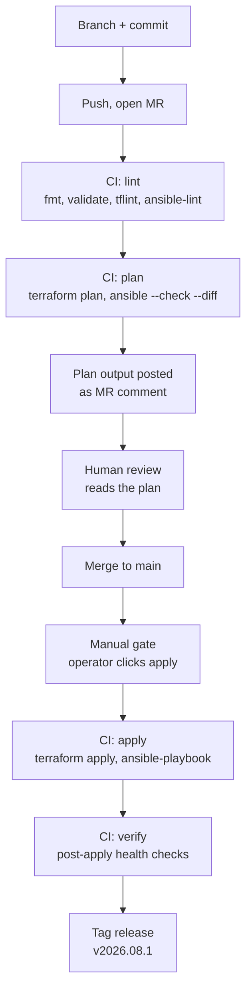

# 05 — Phase 4 Deep Dive: Images and IaC (Steps 21–24)

---

# Step 21 — Packer Templates

## Purpose

Every OS you sell becomes a versioned, reproducible, tested VM template built by CI from a Git commit. No hand-built golden images, ever — a hand-built image is an image nobody can rebuild when the person who made it leaves.

## Repository structure

Working files are in `packer/` at the repo root. Layout:

```
packer/
├── plugins.pkr.hcl              # required_plugins block
├── variables.pkr.hcl            # shared variable declarations
├── common.pkrvars.hcl           # non-secret defaults
├── ubuntu-2404/
│   ├── ubuntu-2404.pkr.hcl
│   └── http/
│       ├── user-data            # autoinstall (cloud-init NoCloud)
│       └── meta-data
├── debian-13/
│   ├── debian-13.pkr.hcl
│   └── preseed.cfg
├── rocky-10/
│   ├── rocky-10.pkr.hcl
│   └── ks.cfg
└── scripts/
    ├── 00-wait-cloud-init.sh
    ├── 10-base-packages.sh
    ├── 20-serial-console.sh
    ├── 30-cloud-init-reset.sh
    ├── 40-harden.sh
    └── 99-cleanup.sh
```

## The four things every template must get right

### 1. cloud-init

This is how the customer's SSH key, hostname, and network config reach the VM at first boot. Without it your panel cannot provision anything.

In the Packer builder:
```hcl
cloud_init              = true
cloud_init_storage_pool = "vm-disks"
```

Inside the guest, cloud-init must be installed and configured for the **NoCloud** datasource so it reads the Proxmox-generated config drive:

```bash
# scripts/30-cloud-init-reset.sh
cat > /etc/cloud/cloud.cfg.d/99-pve.cfg <<'EOF'
datasource_list: [ NoCloud, ConfigDrive, None ]
EOF

# Remove the "disable network config" file some images ship with
rm -f /etc/cloud/cloud.cfg.d/99-disable-network-config.cfg
rm -f /etc/cloud/cloud.cfg.d/subiquity-disable-cloudinit-networking.cfg

# Reset cloud-init so it runs fresh on the customer's first boot
cloud-init clean --logs --seed
rm -rf /var/lib/cloud/instances/*
```

The `cloud-init clean` step is critical and easy to forget. Without it, the template carries the build-time instance ID and cloud-init will not re-run for the customer — they get a VM with your build SSH key and no way in.

### 2. qemu-guest-agent

Enables graceful shutdown, filesystem-consistent snapshots, and IP reporting in the panel.

```hcl
qemu_agent = true
```
```bash
# in the provisioner
apt-get install -y qemu-guest-agent
systemctl enable qemu-guest-agent
```

Without the agent, `qm shutdown` sends ACPI and hopes; `qm snapshot` cannot quiesce the filesystem; and your panel shows no IP for the VM. Customers notice all three.

### 3. Serial console

The single highest-leverage support-cost reduction in this whole document. A customer who misconfigures their firewall and locks themselves out can either open a ticket, or open a serial console and fix it. Configure it and your ticket volume drops noticeably.

```hcl
serials = ["socket"]
```
```bash
# scripts/20-serial-console.sh — Debian/Ubuntu
sed -i 's|^GRUB_CMDLINE_LINUX_DEFAULT=.*|GRUB_CMDLINE_LINUX_DEFAULT="console=tty0 console=ttyS0,115200n8"|' /etc/default/grub
sed -i 's|^GRUB_CMDLINE_LINUX=.*|GRUB_CMDLINE_LINUX=""|' /etc/default/grub
cat >> /etc/default/grub <<'EOF'
GRUB_TERMINAL="console serial"
GRUB_SERIAL_COMMAND="serial --speed=115200 --unit=0 --word=8 --parity=no --stop=1"
EOF
update-grub
systemctl enable serial-getty@ttyS0.service
```

Note `console=tty0 console=ttyS0` in that order — the **last** console listed receives kernel messages, so ttyS0 last means serial gets the output. Getting the order backwards is the usual reason "the serial console shows nothing."

Verify by attaching after build: `qm terminal <vmid>` should give you a login prompt.

### 4. SSH keys

Two distinct key concerns:

- **Build-time key**: Packer needs SSH access during the build. Use a dedicated ephemeral key, and **remove it in cleanup** so it does not ship in the template.
- **Customer key**: injected by cloud-init at first boot. Nothing to bake in.

```bash
# scripts/99-cleanup.sh
rm -f /root/.ssh/authorized_keys
rm -f /home/*/.ssh/authorized_keys
# Regenerate host keys on first boot so every customer VM is unique
rm -f /etc/ssh/ssh_host_*
systemctl enable regenerate-ssh-host-keys 2>/dev/null || \
  cat > /etc/systemd/system/regen-sshd-keys.service <<'EOF'
[Unit]
Description=Regenerate SSH host keys on first boot
ConditionPathExistsGlob=!/etc/ssh/ssh_host_ed25519_key
Before=ssh.service
[Service]
Type=oneshot
ExecStart=/usr/bin/ssh-keygen -A
[Install]
WantedBy=multi-user.target
EOF
systemctl enable regen-sshd-keys.service 2>/dev/null || true

# Clear machine-id so every clone gets a unique one
truncate -s 0 /etc/machine-id
rm -f /var/lib/dbus/machine-id
ln -s /etc/machine-id /var/lib/dbus/machine-id

# Wipe logs, apt cache, bash history, and zero free space
apt-get clean
rm -rf /var/lib/apt/lists/*
find /var/log -type f -exec truncate -s 0 {} \;
rm -f /root/.bash_history
cloud-init clean --logs --seed 2>/dev/null || true
```

**Shipping identical SSH host keys across every customer VM is a real security bug**, not a cosmetic one — it enables trivial MITM between customers. The regeneration service above is mandatory.

## Complete Packer workflow

```bash
cd packer
packer init .
packer fmt -recursive .
packer validate -var-file=common.pkrvars.hcl ubuntu-2404/
PKR_VAR_proxmox_token=$(sops -d --extract '["pve_packer_token"]' secrets.sops.yaml) \
  packer build -var-file=common.pkrvars.hcl ubuntu-2404/
```

Full HCL files are in `packer/` at the repo root for Ubuntu 24.04, Debian 13, and Rocky 10.

## Risks

| Risk | Consequence | Mitigation |
|---|---|---|
| `cloud-init clean` omitted | Customer VMs unreachable; no key injected | Explicit step in cleanup; boot-test every image |
| SSH host keys baked in | Every customer VM shares host keys; MITM possible | Regeneration service, verified by boot test |
| `machine-id` not cleared | DHCP/systemd collisions, duplicate IDs in monitoring | Truncate in cleanup |
| Serial console order wrong | Console shows nothing; support burden | `console=tty0 console=ttyS0` in that order; test with `qm terminal` |
| Build-time key left in image | Every customer VM accessible by your build key | Remove in cleanup; automated grep check in CI |
| Template built by hand | Not reproducible, drifts, unbuildable when author leaves | CI-only builds from Git |
| Images never rebuilt | Customer boots into 300 pending patches | Scheduled monthly rebuild |

## Validation checklist — Step 21

- [ ] `packer validate` passes for every template
- [ ] Each template builds successfully from a clean CI runner
- [ ] Boot test: clone the template, inject a *different* SSH key via cloud-init, log in with it
- [ ] `cat /etc/machine-id` differs between two clones of the same template
- [ ] `ssh-keygen -lf /etc/ssh/ssh_host_ed25519_key.pub` differs between two clones
- [ ] `qm terminal <vmid>` gives a login prompt
- [ ] `qm agent <vmid> ping` succeeds; panel shows the guest IP
- [ ] `grep -r "your-build-key" /` inside a clone returns nothing
- [ ] `cloud-init status` reports `done`, `cloud-init analyze blame` shows no failures
- [ ] Image size reasonable (zeroed free space, cleaned caches)
- [ ] `qm shutdown` completes gracefully via the agent

---

# Step 22 — Image CI/CD

## Purpose

Images rebuild themselves monthly, get tested before publication, and are versioned so you can roll back to last month's image when this month's has a regression.

## Versioning strategy

Template name format: `tpl-<os>-<version>-<YYYYMMDD>-<shortsha>`

Example: `tpl-ubuntu-2404-20260814-a3f9c21`

Rules:
- Immutable. Never rebuild over an existing template name.
- Keep the **last three** builds per OS; prune older ones.
- A pointer in your panel's config maps a customer-facing plan to a specific template name. Promotion is changing that pointer, not rebuilding an image.
- That pointer change is your rollback mechanism: revert it and new provisions use last month's known-good image.

VMID allocation for templates: reserve a range (e.g. 9000–9099) separate from customer VMs (e.g. 100–8999) so template IDs never collide with provisioning.

## GitLab CI pipeline

Full file is in `ci/.gitlab-ci.yml` at the repo root. Structure:

```
lint  →  build  →  validate  →  publish  →  prune
```

- **lint** — `packer fmt -check`, `packer validate`, `ansible-lint`, `terraform validate`, `tflint`
- **build** — `packer build` into a **staging** template name, one job per OS, parallel
- **validate** — clone the staging template into a throwaway VM, boot it, run an automated test suite, destroy it
- **publish** — rename/retag the staging template to its final name, update the manifest
- **prune** — delete templates older than the last three per OS

The validate stage is the one people skip. Do not skip it. It is what stops a broken image from reaching customers.

### The validate stage test suite

`ci/scripts/validate-image.sh`. It clones the template, provisions it with a test cloud-init config, and asserts:

```
✓ VM boots within 90 s
✓ cloud-init status = done, no errors in analyze blame
✓ SSH accessible with the injected test key only
✓ qemu-guest-agent responds to qm agent ping
✓ Serial console produces a login prompt
✓ /etc/machine-id is non-empty and differs from the template's
✓ SSH host key fingerprint differs from a second clone
✓ Package manager works (apt update / dnf check-update)
✓ DNS resolution works
✓ Outbound IPv4 and IPv6 connectivity
✓ Root filesystem auto-grew to the full disk size
✓ Build-time key and build artifacts absent
✓ No listening services beyond the expected set (ss -tlnp)
```

That "root filesystem auto-grew" check catches a very common and very annoying bug: a customer orders 200 GB and gets a 10 GB filesystem because `cloud-initramfs-growroot` / `growpart` was not installed.

## Monthly rebuild strategy

```yaml
# GitLab → CI/CD → Schedules
# Cron: 0 3 1 * *   (03:00 on the 1st of each month)
# Variables: REBUILD_ALL=true
```

Process:

1. Scheduled pipeline builds all OS templates fresh from upstream ISOs.
2. Validate stage gates them.
3. Publish stage creates the new dated templates but does **not** change the panel pointer.
4. You (a human) provision one real VPS from each new template, use it, then flip the pointer.
5. Prune removes builds older than the last three.

Step 4 is deliberate. Automated tests catch functional breakage; a human catches "this feels wrong." Keep a human in the promotion loop until you have a year of clean monthly builds behind you.

## Validation checklist — Step 22

- [ ] Pipeline runs end to end on a merge request
- [ ] Every stage fails the pipeline correctly when it should (test this by deliberately breaking each)
- [ ] Scheduled monthly pipeline created and has run once successfully
- [ ] Validate stage catches a deliberately broken image (remove cloud-init and confirm the pipeline fails)
- [ ] Prune keeps exactly three builds per OS
- [ ] Manifest of published templates committed to Git
- [ ] Rollback tested: flip the panel pointer to last month's template, provision, confirm

---

# Step 23 — Terraform Design

## The core decision: what Terraform should and should not own

### Why cluster resources belong in Terraform

Storage definitions, pools, roles, users, API tokens, and SDN zones are:

- **Few** — dozens, not thousands
- **Slow-changing** — weeks between changes
- **Shared** — a mistake affects everyone, so review matters
- **Reviewable** — a `terraform plan` diff in a merge request is a genuinely useful artifact

Terraform's model — declarative desired state, plan before apply, one shared state file — fits this exactly.

### Why customer VMs must NOT be in Terraform

This is the most important architectural point in Phase 4, and getting it wrong is very hard to undo.

1. **State file contention.** Terraform locks the entire state for every apply. Two customers ordering simultaneously means one waits. At any volume, provisioning serialises and your signup flow times out.
2. **Wrong latency profile.** A customer expects their VPS in 60 seconds. `terraform init` + `plan` + `apply` on a state file with thousands of resources takes minutes and grows linearly.
3. **State file size and blast radius.** Ten thousand VMs in one state file is an unreviewable, slow, fragile object. And a corrupted or lost state file means Terraform no longer knows about your customers' VMs.
4. **Catastrophic failure modes.** A malformed change, a provider upgrade with a schema change, or a `terraform destroy` in the wrong directory can queue destruction of every customer VM. There is no undo. This risk alone should settle the argument.
5. **Lifecycle mismatch.** Customer VMs are created, resized, rebuilt, and destroyed by *customer action*, asynchronously, thousands of times. That is an imperative, event-driven workflow. Terraform models convergence to a declared state, and there is no sensible place to declare "customer 4471 wants 4 GB now."
6. **Drift is normal, not an error.** A customer resizing their disk through your panel is correct behaviour. Terraform would see it as drift and revert it.

**The rule: Terraform manages the platform. Your control panel calls the Proxmox API directly for customer VMs.** The panel owns a database of what it has provisioned; that database is the source of truth for customer resources, not Terraform state.

A useful boundary test: *would a customer's action ever change this resource?* If yes, it does not belong in Terraform.

## Repository structure

```
terraform/
├── modules/
│   ├── pve_storage/          # storage definitions (RBD, PBS, ISO, snippets)
│   ├── pve_pool/             # resource pools
│   ├── pve_api_user/         # roles, users, tokens, ACLs
│   └── pve_sdn/              # zones, vnets, subnets
└── envs/
    └── prod/
        ├── backend.tf        # remote state (GitLab-managed Terraform state)
        ├── providers.tf
        ├── main.tf
        ├── variables.tf
        ├── terraform.tfvars
        └── outputs.tf
```

Environment structure: start with `prod` only. Add `staging` when you have a second cluster — not before, because a fake staging environment that does not match prod gives false confidence. If you do add one, it must be a real (if smaller) Proxmox cluster, not a mocked one.

## Provider setup

```hcl
# envs/prod/providers.tf
terraform {
  required_version = ">= 1.9"
  required_providers {
    proxmox = {
      source  = "bpg/proxmox"
      version = "~> 0.66"     # pin exactly; verify current version before use
    }
  }
}

provider "proxmox" {
  endpoint  = var.pve_endpoint          # https://10.10.10.11:8006/
  api_token = var.pve_api_token         # from SOPS/Vault, never in tfvars
  insecure  = false                     # use a real cert; see note below
  ssh {
    agent    = true
    username = "root"
  }
}
```

Two notes on this provider:

- **Pin the version exactly and read the changelog before bumping.** `bpg/proxmox` is actively developed and has had breaking schema changes between minor versions.
- **Resource coverage varies.** Storage, pools, users, roles, ACLs, and files are well supported. SDN resource support has been added more recently and coverage may be incomplete for EVPN specifics. Before writing SDN Terraform, verify what actually exists:

```bash
terraform providers schema -json | jq -r '.provider_schemas[].resource_schemas | keys[]' | grep -i sdn
```

If the resources you need are missing or immature, manage SDN through Ansible (`pvesh` calls) or the UI instead, and revisit later. Do not fight a provider — the goal is working infrastructure, not Terraform purity.

- `insecure = false` requires a valid certificate on the PVE API. Use your internal CA or Let's Encrypt via the PVE ACME integration. Running with `insecure = true` in production means your Terraform runner accepts any certificate, which defeats the point of TLS on your control path.

Working examples for storage, pools, users, tokens, and SDN are in `terraform/` at the repo root.

## Risks

| Risk | Consequence | Mitigation |
|---|---|---|
| Customer VMs in Terraform state | Possible mass destruction; provisioning serialises | Panel calls the API directly; hard rule |
| State file lost or corrupted | Terraform no longer knows your platform config | Remote state with versioning and locking; back it up |
| Unpinned provider version | Silent breaking change on next CI run | Exact pin, `.terraform.lock.hcl` committed |
| `terraform apply` without review | Unreviewed platform change | CI: plan on MR, apply only on protected branch, manual gate |
| API token with root privileges | Full cluster compromise from a leaked CI variable | Scoped role, minimum privileges, short expiry, rotation |
| `insecure = true` | MITM on the control path | Valid cert via PVE ACME or internal CA |

## Validation checklist — Step 23

- [ ] `terraform fmt -check -recursive` clean
- [ ] `terraform validate` passes
- [ ] `tflint` passes
- [ ] `terraform plan` on a clean checkout shows **no changes** against the live cluster
- [ ] Remote state configured with locking; concurrent apply confirmed to block
- [ ] `.terraform.lock.hcl` committed
- [ ] Provider version pinned exactly
- [ ] API token is scoped, not root; verified it cannot delete a VM
- [ ] No customer VM resource exists anywhere in the configuration
- [ ] Destroy-protection: `prevent_destroy` lifecycle on storage and pool resources
- [ ] Full disaster test: `terraform apply` reproduces platform config on a rebuilt cluster

---

# Step 24 — GitOps and Secrets

## Repository structure

Start with **one repository**. Three repositories for three components you deploy together adds cross-repo version coordination you do not need at this size.

```
infrastructure/
├── README.md
├── docs/                     # this guide, runbooks, address plan, test results
├── ansible/
├── packer/
├── terraform/
├── ci/
│   ├── .gitlab-ci.yml
│   └── scripts/
├── .sops.yaml
└── .gitlab-ci.yml            # includes ci/.gitlab-ci.yml
```

Split into separate repos only when you have separate teams with separate review requirements.

## Branching strategy

**Trunk-based with short-lived branches.** GitFlow's release branches solve a problem you do not have.

```
main (protected)
  ├── feat/add-rocky-template
  ├── fix/ceph-recovery-tuning
  └── chore/bump-provider
```

Rules:
- `main` is protected: no direct push, MR required, one approval, CI must pass.
- Branches live hours to days, not weeks.
- `terraform plan` and `ansible --check --diff` run on every MR and post their output as an MR comment. Reviewing the plan is the review.
- `terraform apply` and real Ansible runs happen **only** from `main`, and only behind a **manual** job. Automated apply-on-merge is a bad idea for infrastructure that customers depend on.
- Tag releases of the platform config: `v2026.08.1`. When something breaks, you can identify exactly what changed.

## Secret management

Two tools, two jobs. Do not pick one and stretch it.

| | SOPS + age | HashiCorp Vault |
|---|---|---|
| **Holds** | Config secrets that live in Git | Dynamic and high-value credentials |
| **Examples** | Proxmox subscription keys, monitoring passwords, static API tokens, Ansible vault vars | PVE API tokens for the panel, database credentials, TLS private keys, SSH CA |
| **Availability dependency** | None — it is a file in Git | Vault must be up and unsealed |
| **Rotation** | Manual, commit a new encrypted value | Automatic, short TTL |
| **Audit trail** | Git history | Vault audit log |
| **Start with** | **Yes, day one** | Add in month 2–3 |

Start with SOPS + age. It has no runtime dependency, which matters enormously during an incident — you can decrypt and act with nothing else running. Add Vault when you need dynamic credentials for the panel, not before.

### SOPS + age setup

```bash
# 1. Generate an age key per operator, and one for CI
age-keygen -o ~/.config/sops/age/keys.txt
# Public key: age1ql3z7hjy54pw3hyww5ayyfg7zqgvc7w3j2elw8zmrj2kg5sfn9aqmcac8p

# 2. .sops.yaml at repo root — path-based rules
cat > .sops.yaml <<'EOF'
creation_rules:
  - path_regex: ansible/.*\.sops\.ya?ml$
    age: >-
      age1ql3z7hjy54pw3hyww5ayyfg7zqgvc7w3j2elw8zmrj2kg5sfn9aqmcac8p,
      age1CIKEYHERE...
    encrypted_regex: '^(.*password.*|.*secret.*|.*token.*|.*key.*)$'
  - path_regex: terraform/.*\.sops\.ya?ml$
    age: >-
      age1ql3z7hjy54pw3hyww5ayyfg7zqgvc7w3j2elw8zmrj2kg5sfn9aqmcac8p,
      age1CIKEYHERE...
EOF

# 3. Create and edit encrypted files
sops ansible/inventories/prod/group_vars/all.sops.yml
```

`encrypted_regex` means keys stay readable in Git while values are encrypted — so a diff shows *which* secret changed without revealing it. Very useful in review.

**Key management rules:**
- One age key per operator, stored in their password manager, never in Git.
- One age key for CI, private half in a GitLab masked+protected CI variable.
- Rotate by adding the new recipient, running `sops updatekeys` on every encrypted file, then removing the old recipient.
- Losing all private keys means losing all secrets. Keep an offline copy of a recovery key in a safe.

### Secret management workflow

```mermaid
%%{init: {"flowchart": {"htmlLabels": true, "wrappingWidth": 400, "subGraphTitleMargin": {"top": 6, "bottom": 14}}}}%%
flowchart LR
    A["Operator edits<br/>sops file"] --> B["Encrypted with<br/>age recipients"]
    B --> C["Commit to Git<br/>ciphertext only"]
    C --> D["MR review<br/>keys visible, values not"]
    D --> E["Merge to main"]
    E --> F["CI decrypts with<br/>CI age key"]
    F --> G["Injected as env var<br/>never written to disk"]
    G --> H["Ansible / Terraform /<br/>Packer consumes"]
```



In CI:
```yaml
before_script:
  - echo "$SOPS_AGE_KEY" > /tmp/age.key
  - export SOPS_AGE_KEY_FILE=/tmp/age.key
script:
  - export PVE_TOKEN=$(sops -d --extract '["pve_api_token"]' terraform/secrets.sops.yaml)
  - terraform plan -var="pve_api_token=$PVE_TOKEN"
after_script:
  - shred -u /tmp/age.key
```

Never `sops -d` a whole file into a plaintext file on disk. Extract individual values into environment variables, and clean up in `after_script` — which runs even when the job fails.

### Vault, when you get there

Use it for the credentials your **panel** needs at runtime, not the ones your CI needs at deploy time:

- PVE API tokens with short TTL, issued per provisioning operation
- Database credentials for the panel, rotated automatically
- An SSH CA for signing short-lived operator certificates instead of distributing static keys
- TLS certificate private keys

Run Vault outside the Proxmox cluster with its own storage backend and a documented unseal procedure. Auto-unseal via cloud KMS if available; otherwise Shamir shares held by different people, and a **tested** unseal drill. A Vault you cannot unseal during an incident is worse than no Vault.

## Infrastructure deployment workflow



The **manual gate** at step H is not bureaucracy. Automated apply-on-merge means a merge at 23:00 on a Friday changes production. Keep a human deciding when.

The **verify** stage at J runs a health check script after apply — `pvecm status`, `ceph -s`, `terraform plan` showing no drift — and fails loudly if the apply left things wrong.

## Risks

| Risk | Consequence | Mitigation |
|---|---|---|
| Secret committed in plaintext | Credential leak, must rotate everything | `gitleaks` in CI pre-commit and pipeline; `.gitignore` decrypted files |
| All age private keys lost | All secrets unrecoverable | Offline recovery key in a physical safe |
| Automated apply on merge | Unintended production change | Manual gate on apply jobs |
| CI runner compromised | Full infrastructure access | Dedicated runner, no shared runners for infra, minimal scope tokens, short TTLs |
| Vault sealed during an incident | Cannot deploy or provision when you most need to | Tested unseal drill; SOPS as the no-dependency fallback |
| No drift detection | Config in Git no longer matches reality | Nightly scheduled `terraform plan` that alerts on non-empty diff |

## Validation checklist — Step 24

- [ ] `gitleaks detect` clean across full history
- [ ] `.gitignore` covers `*.decrypted.*`, `*.tfstate*`, `.terraform/`, age keys
- [ ] `main` branch protected, MR + approval + passing CI required
- [ ] `terraform plan` posts to MR comments
- [ ] Apply jobs are manual, not automatic
- [ ] SOPS decryption works in CI; age key is a masked and protected variable
- [ ] Age key rotation performed once as a drill
- [ ] Offline recovery key stored physically
- [ ] Nightly drift-detection pipeline alerts on unexpected diffs
- [ ] Post-apply verify stage fails the pipeline on an unhealthy cluster
- [ ] Full recovery drill: from a clean laptop with only the repo and an age key, deploy to a rebuilt cluster
