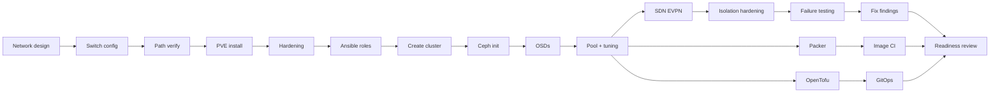

# 06 — Build Order, Milestones, and Critical Path

Assumes one or two engineers working on this. Multiply durations by roughly 1.5 if it is a side project alongside other duties, and add a week if this is your first Ceph deployment.

## Skills legend

| Code | Skill |
|---|---|
| **NET** | Switching, VLANs, LACP/MLAG, BGP basics |
| **LNX** | Debian sysadmin, systemd, sysctl, SSH |
| **PVE** | Proxmox VE operation |
| **CEPH** | Ceph architecture and operations |
| **ANS** | Ansible role authoring |
| **TF** | OpenTofu, HCL, modules, state |
| **PKR** | Packer, cloud-init, autoinstall/preseed/kickstart |
| **CI** | GitLab CI/CD, containers, scripting |
| **SEC** | Secrets management, hardening |

---

## Task table

| # | Task | Duration | Depends on | Skills | Output |
|---|------|----------|------------|--------|--------|
| 1 | Address plan + network design committed to Git | 1 d | — | NET | `docs/address-plan.yml`, network diagram |
| 2 | Switch config: VLANs, MLAG, LACP, jumbo frames | 2 d | 1 | NET | Switch configs in Git, verified |
| 3 | Rack, cable, label nodes; BMC configured | 1 d | 2 | — | Cable map, BMC reachable on VLAN 99 |
| 4 | Verify every path incl. jumbo frames end to end | 0.5 d | 3 | NET | Test results recorded |
| 5 | **Step 15**: install PVE ×3, ZFS mirror, ARC cap | 1 d | 4 | PVE, LNX | 3 identical nodes |
| 6 | Enterprise repos + subscriptions applied | 0.5 d | 5 | PVE | `pvesubscription get` active ×3 |
| 7 | Initial hardening: SSH, firewall, sysctl, TOTP | 1 d | 6 | LNX, SEC | Hardened nodes, mgmt on VPN only |
| 8 | Git repo scaffold + SOPS/age + gitleaks | 1 d | — | SEC, CI | Repo with encrypted secrets working |
| 9 | **Step 16**: Ansible roles (common, ntp, ssh, fw, monitoring, pve_base) | 4 d | 7, 8 | ANS, LNX | Idempotent `site.yml` |
| 10 | Ansible converge all nodes; verify `changed=0` on rerun | 0.5 d | 9 | ANS | Clean second run |
| 11 | **Step 17**: create cluster, dual Corosync rings | 0.5 d | 10 | PVE | Quorate 3-node cluster |
| 12 | Corosync validation: ring failover, latency under load | 0.5 d | 11 | PVE, NET | Ring failover proven |
| 13 | **Step 18**: `pveceph init`, MONs, MGRs | 0.5 d | 12 | CEPH | 3 MON quorum, 2 MGR |
| 14 | Create 18 OSDs | 0.5 d | 13 | CEPH | `ceph osd tree` correct |
| 15 | Pool creation, `size=3 min_size=2`, CRUSH verify, tuning | 1 d | 14 | CEPH | `HEALTH_OK`, recovery tuning applied |
| 16 | Ceph performance baseline (`rados bench`, `fio`, multi-VM) | 1.5 d | 15 | CEPH | Baselines in Git |
| 17 | **Step 19**: EVPN controller, zone, test vnets | 2 d | 15 | NET, PVE | Tenant overlay working |
| 18 | SDN security: macfilter, ipfilter, egress rules, isolation tests | 2 d | 17 | NET, SEC | Isolation proven with nmap/arpspoof |
| 19 | Monitoring stack: Prometheus, Grafana, Loki, Alertmanager | 2 d | 10 | CI, LNX | Dashboards + alerts routing to phone |
| 20 | PBS install, datastore, backup jobs, first restore test | 1.5 d | 15 | PVE | Verified restore |
| 21 | **Step 20**: full failure test matrix T1–T16 | 4 d | 16, 18, 19, 20 | PVE, CEPH, NET | Results table + 16 runbooks |
| 22 | Fix everything the failure tests exposed | 2 d | 21 | varies | Clean re-test |
| 23 | **Step 21**: Packer Ubuntu 24.04 template | 2 d | 15, 8 | PKR | Booting, validated template |
| 24 | Packer Debian 13 template | 1 d | 23 | PKR | Template |
| 25 | Packer Rocky 10 template | 1 d | 23 | PKR | Template |
| 26 | **Step 22**: GitLab CI pipeline: lint/build/validate/publish/prune | 3 d | 23 | CI, PKR | Green pipeline |
| 27 | Image validation test suite | 1.5 d | 26 | CI | Automated image gate |
| 28 | Monthly schedule + rollback drill | 0.5 d | 27 | CI | Scheduled pipeline, rollback proven |
| 29 | **Step 23**: OpenTofu modules (storage, pool, users, tokens) | 2.5 d | 15, 8 | TF | Modules with clean plan |
| 30 | OpenTofu SDN module (verify provider coverage first) | 1.5 d | 17, 29 | TF, NET | SDN in code, or documented fallback |
| 31 | Remote state, locking, `prevent_destroy`, drift detection | 1 d | 29 | TF, CI | Nightly drift alert |
| 32 | **Step 24**: GitOps: branch protection, MR plan comments, manual gates | 1.5 d | 26, 31 | CI, SEC | Full deploy workflow |
| 33 | Scoped API tokens for panel and CI; least-privilege roles | 1 d | 29 | SEC, PVE | Tokens verified unable to over-reach |
| 34 | Disaster recovery drill: rebuild one node from Git only | 1 d | 32 | ANS, PVE | Node rebuilt, timed |
| 35 | Production readiness review + go-live checklist walkthrough | 1 d | all | all | Signed-off checklists |

**Total: ~52 working days ≈ 10–11 weeks** for one engineer. Roughly 7 weeks with two engineers working the parallel tracks below.

---

## Week-by-week plan

### Week 1 — Foundations
Tasks 1–7. Network design, switch config, racking, PVE installs, hardening.
**Exit criteria:** three hardened nodes, all VLANs verified including jumbo frames, management reachable only via VPN.

### Week 2 — Automation baseline
Tasks 8–10. Git repo, SOPS, Ansible roles, first full converge.
**Exit criteria:** `ansible-playbook site.yml` runs twice with `changed=0` on the second pass.

### Week 3 — Cluster and Ceph
Tasks 11–15. Corosync cluster with dual rings, Ceph deployed, pool configured and tuned.
**Exit criteria:** `pvecm status` quorate, `ceph -s` `HEALTH_OK`, ring failover tested.

### Week 4 — Performance and overlay
Tasks 16–17. Ceph baselines, EVPN SDN stood up.
**Exit criteria:** documented `fio` baselines with single-queue latency under 3 ms; two VMs on different nodes communicating over a vnet.

### Week 5 — Security and observability
Tasks 18–20. SDN isolation hardening, monitoring stack, PBS with a verified restore.
**Exit criteria:** cross-tenant isolation proven with active attack tools; alerts reaching a phone; a VM restored from backup and data verified.

### Week 6 — Failure testing
Tasks 21–22. The full T1–T16 matrix, then fix what it exposed.
**Exit criteria:** results table complete, 16 runbooks written, all re-tests passing. **Do not skip or compress this week.**

### Week 7 — Images
Tasks 23–25. Three Packer templates, each boot-tested.
**Exit criteria:** all three templates clone, boot, accept an injected key, and pass the manual validation checklist.

### Week 8 — Image CI/CD
Tasks 26–28. Pipeline, automated validation, monthly schedule, rollback drill.
**Exit criteria:** pipeline green; a deliberately broken image is caught by the validate stage; rollback proven.

### Week 9 — OpenTofu
Tasks 29–31. Platform modules, remote state, drift detection.
**Exit criteria:** `tofu plan` shows zero changes against the live cluster; nightly drift job alerting.

### Week 10 — GitOps and DR
Tasks 32–35. Full workflow, scoped tokens, node rebuild drill, readiness review.
**Exit criteria:** a node rebuilt from Git alone; both checklists signed off.

---

## Milestones

| M | Milestone | Week | Gate — must be true to proceed |
|---|-----------|------|-------------------------------|
| **M1** | Hardware and network verified | 1 | All VLANs up, jumbo frames confirmed on every path, BMC isolated |
| **M2** | Configuration as code | 2 | Second Ansible run reports `changed=0` |
| **M3** | Cluster healthy | 3 | Quorate, `HEALTH_OK`, dual-ring failover tested |
| **M4** | Storage validated | 4 | `fio` baselines recorded; single-queue write latency under 3 ms |
| **M5** | Tenant isolation proven | 5 | ARP/MAC/IP spoofing all blocked; tenant cannot reach VLAN 10 |
| **M6** | Recoverable | 5 | A VM restored from PBS with verified data integrity |
| **M7** | Failure-tested | 6 | T1–T16 complete; **T5 fencing confirmed working** |
| **M8** | Images reproducible | 8 | CI builds, validates, publishes; rollback proven |
| **M9** | Platform in code | 9 | `tofu plan` clean; drift detection live |
| **M10** | Production ready | 10 | Node rebuilt from Git; both checklists signed |

M7 is the hard gate. Do not provision a paying customer before it.

---

## Critical path

**The critical path is: network → PVE → Ansible → cluster → Ceph → SDN → failure testing → readiness.** Roughly 8 weeks of strictly sequential work. Everything else hangs off it.

### Parallelisable work (second engineer)

These do not block the critical path and can run alongside it:

- Task 8 (Git repo + SOPS) — from day one, no dependencies
- Task 19 (monitoring stack) — needs only network access to nodes, start in week 2
- Tasks 23–28 (Packer + image CI) — needs only a working Ceph pool, start week 4
- Tasks 29–31 (OpenTofu) — needs only a working cluster, start week 4
- All documentation and runbooks — continuously

### The two things that will actually delay you

1. **Jumbo frames on one path silently not working.** It surfaces as strange Ceph latency in week 4 and costs two days to trace back to a switch port. Task 4 exists to prevent this. Do it properly — test every node pair on every jumbo VLAN, not a sample.

2. **Failure testing revealing a design problem.** For example T12 showing both Corosync rings on the same switch, or T5 showing fencing does not work. Fixing these means re-cabling or re-testing, which is why week 6 is followed by task 22 with two days of slack. If you compress week 6 you will find these problems with customers on the platform instead.

### Slack

The plan above has almost none. Add a buffer week between weeks 6 and 7, and expect to use it. If you must hit a fixed launch date, cut scope by launching with **one** OS template instead of three (tasks 24 and 25 are the cheapest to defer), not by cutting failure testing.
