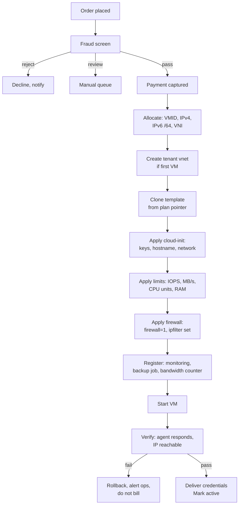
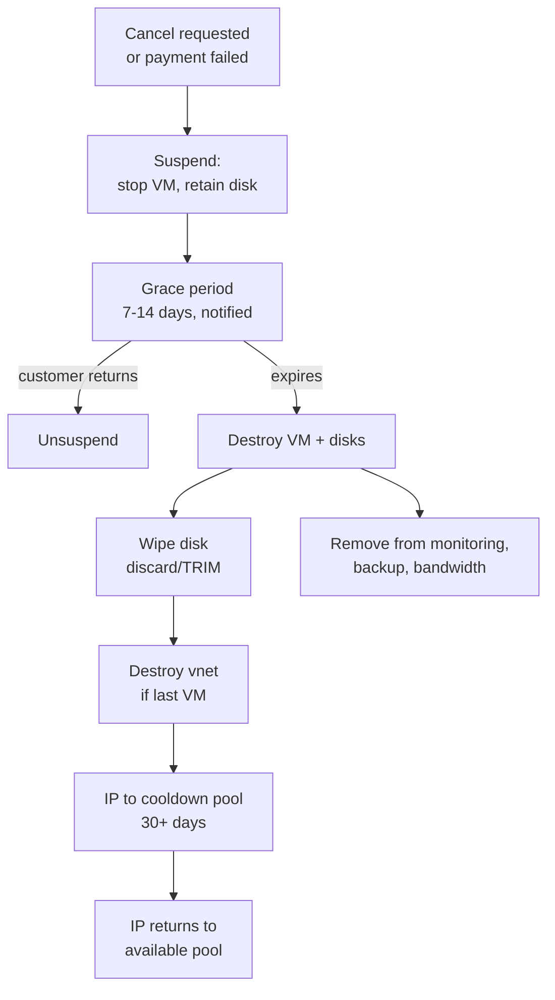

# 05 — Phase 5: Control Plane and Billing

**Duration:** 2–4 weeks (buy) or 3–6 months (build)
**Depends on:** Phase 3 cluster, Phase 0 tax determination
**Blocks:** any paying customer

This is the phase where the technically-minded founder is most likely to make an expensive mistake, because building a control panel is more enjoyable than configuring one, and the true cost of building is invisible at the start.

---

## 5.0 What the control plane actually has to do

Before comparing products, enumerate the surface. This list is why "I'll just build it" takes six months.

### Customer-facing
- Signup with fraud screening
- Order, configure, and pay for a VPS
- **Console access (VNC and serial)** — the single highest-value support-cost reducer
- Power control: start, stop, reboot, hard reset
- Reinstall / rebuild from a template
- Resize (grow disk, change RAM/CPU) with a clear position on what is reversible
- Snapshot and restore, if you sell it
- **Reverse DNS (PTR) self-service** — mail-server customers require it
- IP management, additional IPs
- Bandwidth usage view against the plan allowance
- Firewall management, if offered
- Password / SSH key reset
- Backup management and restore requests
- Invoices, payment methods, receipts
- Support tickets
- Cancellation

### Billing and finance
- Recurring invoicing, proration on upgrades and downgrades
- **Multi-jurisdiction tax: location determination, business tax ID validation, correct rates, compliant invoices** — from the Phase 0 tax determination
- Dunning: retry schedule, notification sequence, suspension, termination
- Credit notes, refunds, SLA credits
- Multiple currencies if you sell internationally
- Multiple payment methods, including a fallback processor
- Usage-based billing for bandwidth overage, if you charge it
- Revenue recognition and deferred revenue for annual prepayments

### Provisioning and lifecycle
- Create VM: clone template, apply cloud-init, allocate IP, create/attach tenant vnet, apply I/O and CPU limits, apply firewall with `ipfilter`, register in monitoring and backup
- Suspend (stop VM, retain disk), unsuspend
- Terminate: destroy VM, wipe disk, **release IP to pool with a cooldown**, destroy vnet
- Reconcile continuously: panel database vs actual Proxmox state, alert on divergence

### Operational
- Abuse case management with state machine and deadlines
- Automated suspension callable by the abuse detection system
- Admin views: capacity, per-node placement, oversell ratios
- Audit log of every privileged action
- Scoped API token usage — never `root@pam`

**Count the items.** That is a product, not a script.

---

## 5.1 The four options compared

Pricing figures below are indicative from my training data (cutoff May 2026) and change frequently — verify current pricing directly with each vendor. Licensing models in this space have shifted more than once.

### WHMCS

The industry default for hosting billing, with the largest ecosystem.

**Pros**
- Multi-jurisdiction tax handling, invoicing, dunning, proration all built and battle-tested
- The largest third-party module ecosystem. **Mature Proxmox VPS provisioning modules exist** — ModulesGarden's is the most established, and there are others
- Huge community; almost every problem you hit has been hit before and documented
- Support ticketing, client area, affiliate system, promotions included
- Fast to launch — weeks

**Cons**
- Recurring licence cost that scales with client count
- The Proxmox module is a **separate purchase**, and module quality varies. You are dependent on a third party for your core provisioning path
- Customising beyond hooks and templates gets awkward; the codebase is old PHP and opinionated
- Historically has had security advisories; you must keep it patched promptly and never expose the admin path publicly
- Console access quality depends on the module, not on WHMCS
- Feels like a hosting-reseller product because it is one; the customer experience will not feel like DigitalOcean

**Indicative cost:** monthly licence in the tens of dollars at small client counts, rising with tiers; plus the Proxmox module (one-time in the low hundreds, or monthly). Verify current pricing.

**Scalability:** proven to tens of thousands of clients. Performance tuning needed at scale, but the ceiling is not your problem at launch.

### HostBill

More capable out of the box for provisioning-heavy providers, more expensive.

**Pros**
- Stronger native virtualisation and cloud provisioning support; Proxmox support is more first-party than WHMCS's module ecosystem
- More modern admin UI
- Good automation and cloud-style features (hourly billing, resource-based pricing) if you want that model
- Includes much of what requires paid modules elsewhere

**Cons**
- Higher cost, and the licensing model bundles features into editions — you can end up paying for an edition to get one feature
- Smaller community than WHMCS, so fewer answers findable online
- Fewer third-party modules
- Vendor lock-in feels heavier

**Indicative cost:** one-time or recurring in the several-hundred-to-low-thousands range depending on edition and modules. Verify.

**Scalability:** good; designed for provisioning-heavy use.

### Blesta

The developer-friendly option.

**Pros**
- **Clean, readable, well-structured codebase** — genuinely the differentiator. Customising it is pleasant compared to the alternatives
- Source-available under its licence, so you can read and extend everything
- Lower cost than WHMCS and HostBill
- Good security track record
- Solid billing, tax, and invoicing fundamentals
- Proxmox modules exist

**Cons**
- **Smallest ecosystem of the three.** Fewer modules, and the Proxmox module options are fewer and less mature
- Smaller community means you will solve more problems yourself
- Some hosting-specific niceties are absent or need building
- You will likely end up writing custom provisioning code — which is a pro if you want that and a con if you do not

**Indicative cost:** owned licence in the low hundreds, or a low monthly fee. Cheapest of the three.

**Scalability:** good, and the clean codebase means scaling problems are debuggable.

### Custom development

**Pros**
- Exactly the product experience you want. This is the only way to get a DigitalOcean-quality UX
- No licence fees, no per-client cost
- No third-party dependency on your critical provisioning path
- Full control over the API, which matters if you want to offer a public API to customers
- The panel *is* your differentiation if you are competing on experience rather than price

**Cons — and these are underestimated systematically**
- **Multi-jurisdiction tax alone is a substantial project.** Location determination, business tax ID validation against government services, rate tables that change, compliant invoice layouts per jurisdiction, and the reporting your accountant needs. This is the single most underestimated component
- Dunning, proration, credit notes, and refund handling are fiddly, high-stakes, and boring
- **Console proxy (noVNC/xterm.js over the PVE API with correct auth)** is real work and a security-sensitive component
- PCI scope management, even with hosted fields
- You are now maintaining a payments-adjacent application, which means a security obligation forever
- **Time to market: 3–6 months minimum** for something you would trust with real money, by a competent developer working on it seriously
- Opportunity cost: those months are not spent on sales, abuse tooling, or operations

**Indicative cost:** your time, or a developer's. At any realistic contractor rate, the cost dwarfs several years of WHMCS licences.

**Scalability:** as good as you build it. Genuinely better than the alternatives at large scale, because you control the architecture.

---

## 5.2 Comparison table

| | WHMCS | HostBill | Blesta | Custom |
|---|---|---|---|---|
| Time to launch | 2–3 weeks | 3–4 weeks | 3–5 weeks | 3–6 months |
| Upfront cost | Low | Medium–High | Low | Very high (time) |
| Recurring cost | Medium, scales with clients | Medium | Low | Zero licence |
| Multi-jurisdiction tax | Built, mature | Built | Built | **You build it** |
| Dunning / proration | Built | Built | Built | You build it |
| Proxmox provisioning | Third-party module, mature | More native | Module, less mature | You build it |
| Console (VNC/serial) | Module-dependent | Better | Module-dependent | You build it, best result |
| Customisability | Limited, awkward | Moderate | **Good** | Total |
| Ecosystem / community | **Largest** | Small | Small | N/A |
| Security burden | Patch promptly | Patch promptly | Patch promptly | **Entirely yours** |
| Customer experience | Dated | Acceptable | Acceptable | As good as you make it |
| Vendor dependency | Module author + WHMCS | HostBill | Blesta | None |

---

## 5.3 Recommendation for a startup

**Launch on WHMCS with an established Proxmox module. Revisit at 200–300 customers.**

The reasoning, in order:

1. **Multi-jurisdiction tax and dunning are the hidden mass of this iceberg.** They are unglamorous, high-stakes, legally consequential, and completely solved by existing products. Rebuilding them is the worst possible use of a founder's first six months.

2. **Your first six months should be spent on abuse tooling, operations, and finding customers** — not on rebuilding invoicing. The Phase 0 risk table ranks abuse-driven reputation damage as the top killer of new providers. A custom panel with weak abuse tooling is a much worse position than a dated panel with strong abuse tooling.

3. **The largest ecosystem is worth real money when you are alone.** As a one-person operation you cannot afford to be the first person to hit a bug. WHMCS's community means most problems are already answered.

4. **The customer-experience argument for custom is real but premature.** UX matters when you are competing for customers who have choices — which is a month-12 problem, not a month-1 problem. Your month-1 problem is having a working, tax-compliant, abuse-controlled service at all.

5. **Migration later is feasible and normal.** Customer records, subscriptions, and VM mappings can be migrated. It is work, but it is bounded work you undertake with revenue and knowledge you do not have today.

**Choose Blesta instead if** you are a strong developer who intends to write custom provisioning anyway, and you value a clean codebase over ecosystem breadth. This is a defensible choice; you are trading community support for code quality.

**Choose HostBill instead if** you want hourly or resource-based billing from day one, or you want more native virtualisation support and are willing to pay for it.

**Choose custom only if** the panel experience *is* your differentiation strategy, you have already validated demand, and you have either a co-founder who will own it or the funding to hire. And even then, consider a hybrid.

### The hybrid worth serious consideration

**Established billing platform for money, custom code for provisioning.**

- WHMCS/Blesta owns: customers, subscriptions, invoices, tax, dunning, refunds
- Your own service owns: the Proxmox API calls, IP allocation, vnet lifecycle, I/O limits, firewall `ipfilter` population, monitoring and backup registration, console proxy, abuse suspension
- They talk over a small, well-defined internal API

This gets you the hard-won tax and billing correctness for free, and removes your dependency on a third-party module for the provisioning path you most need to control and extend. It also means the custom part you build is the part that genuinely differentiates you.

I would take this option in most circumstances.

---

## 5.4 Non-negotiable requirements whatever you choose

- [ ] **Panel authenticates to Proxmox with a scoped API token, never `root@pam`.** Verify the token cannot modify cluster, Ceph, or SDN config
- [ ] **Proxmox UI and API not reachable by customers.** Console access via a proxy only
- [ ] **Console (VNC and serial) available to customers.** Without it, every locked-out customer is a ticket
- [ ] **Reverse DNS self-service.** Mail customers require it
- [ ] **Per-VM I/O and CPU limits applied at provision time**, from the plan definition, automatically
- [ ] **Tenant vnet created per customer**, never shared
- [ ] **`ipfilter` ipset populated with the VM's actual addresses**, and `firewall=1` set on the NIC
- [ ] **IP release cooldown on termination** — reissuing an IP immediately inherits the previous tenant's blocklist entries and stale DNS
- [ ] **Disk wipe on termination**, and a documented retention window before it
- [ ] **Panel database is the source of truth** for IPs, VNIs, and plan limits; reconciled against Proxmox continuously with alerting on divergence
- [ ] **Suspension callable programmatically** by the abuse system
- [ ] **Audit log of every privileged action**
- [ ] **Admin interface not on a public, guessable path**, and behind MFA
- [ ] **Bandwidth accounting accurate and customer-visible**
- [ ] Test provisioning of 30 VMs through the panel, checking for orphaned resources and race conditions

That last item finds bugs reliably. Provision thirty, terminate thirty, and then look for leftover disks, unreleased IPs, orphaned vnets, and monitoring entries for VMs that no longer exist. There will be some.

---

## 5.5 The provisioning flow to implement

Two details that matter:

**Steps H and I must be part of provisioning, not a manual afterthought.** A VM created without I/O limits can starve the cluster; a VM created without `ipfilter` can spoof another customer's IP. If these are manual steps, they will eventually be skipped.

**Step L, verification, prevents the worst customer experience** — being billed for a VM that never booted. Roll back and alert rather than delivering a broken VM.

## 5.6 The termination flow

**The IP cooldown is the step people omit.** Reissue an address immediately and the new customer inherits the previous tenant's DNSBL entries, stale DNS records pointing at them, and any reputation damage. Thirty days minimum, and check the address against major blocklists before returning it to the pool.

---

## Phase 5 risk analysis

| Risk | Likelihood | Impact | Mitigation |
|---|---|---|---|
| Building custom, timeline slips 2–3× | **High** | Severe (no revenue) | Buy for launch; hybrid if you want control |
| Multi-jurisdiction tax implemented wrong | High if custom | Severe (legal, back-correction) | Use an established platform for billing |
| Third-party Proxmox module bugs or abandonment | Medium | Severe | Test against your actual cluster before committing; hybrid removes the dependency |
| Panel uses `root@pam` | Medium | **Severe** | Scoped token; verify scope limits |
| No console access | Medium | Moderate (ticket flood) | Non-negotiable requirement |
| I/O limits not applied automatically | Medium | Severe (cluster starvation) | Part of provisioning, verified in testing |
| `ipfilter` not populated | Medium | Severe (spoofing between customers) | Part of provisioning; continuous audit |
| IP reissued without cooldown | High | Moderate | Cooldown pool + blocklist check |
| Panel/Proxmox state divergence | High over time | Moderate | Continuous reconciliation with alerting |
| Orphaned resources after termination | High | Moderate (capacity leak) | 30-VM provision/terminate test |
| Panel admin exposed publicly | Medium | Severe | Non-public path, MFA, IP restriction |

---

## Phase 5 success criteria

A stranger can sign up, pay, receive a working VPS within a few minutes, break its firewall, recover via serial console without contacting you, set a PTR record, view their bandwidth, open a ticket, and cancel — with the IP correctly quarantined and the disk wiped afterwards. Your accountant confirms the invoices are compliant. And the panel cannot touch cluster configuration even if fully compromised.
