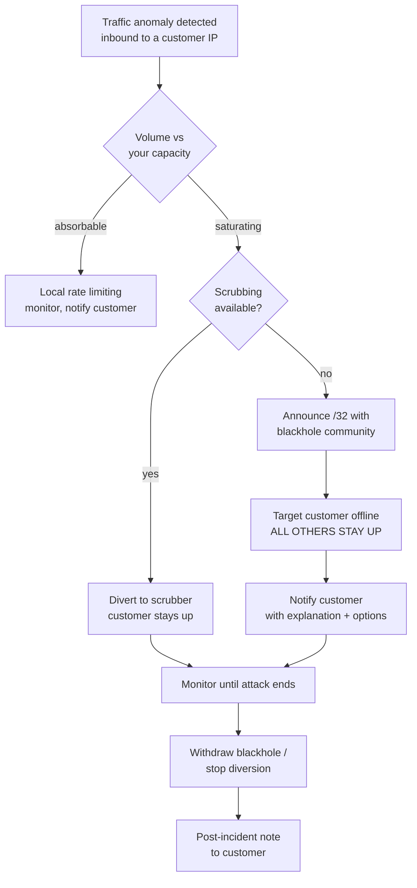
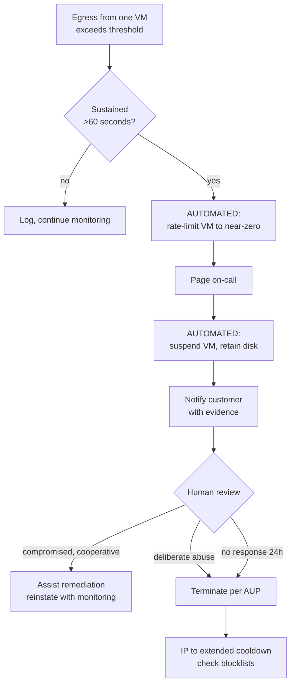
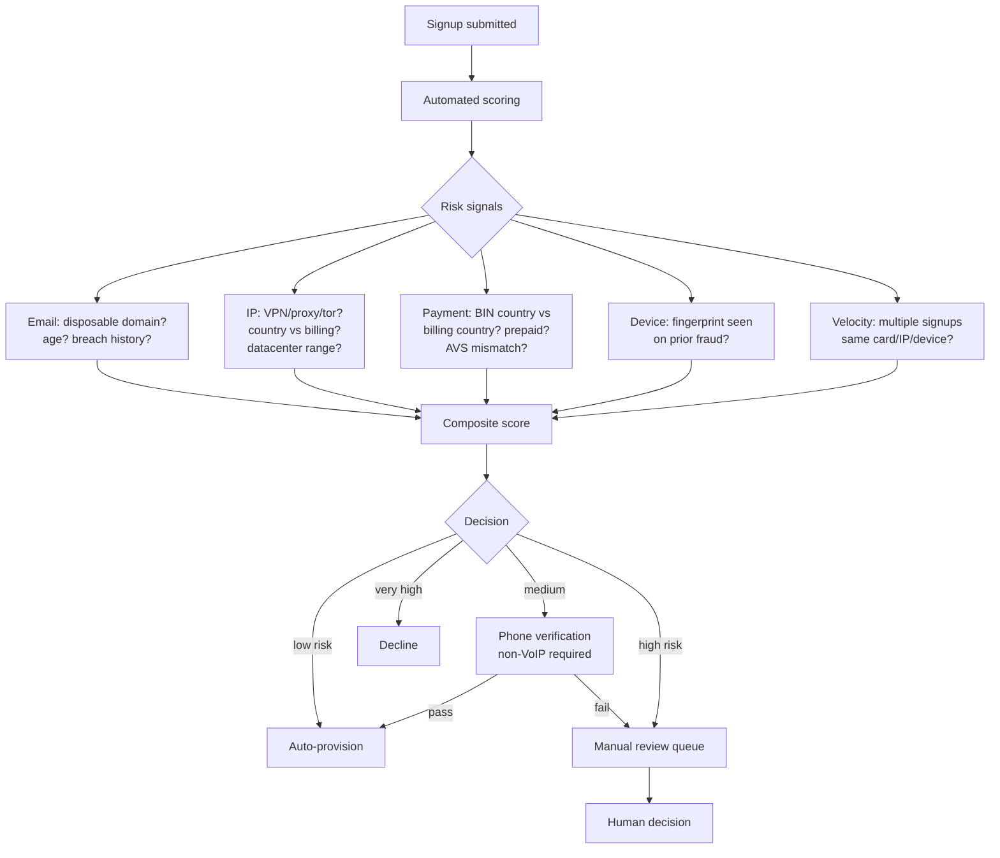
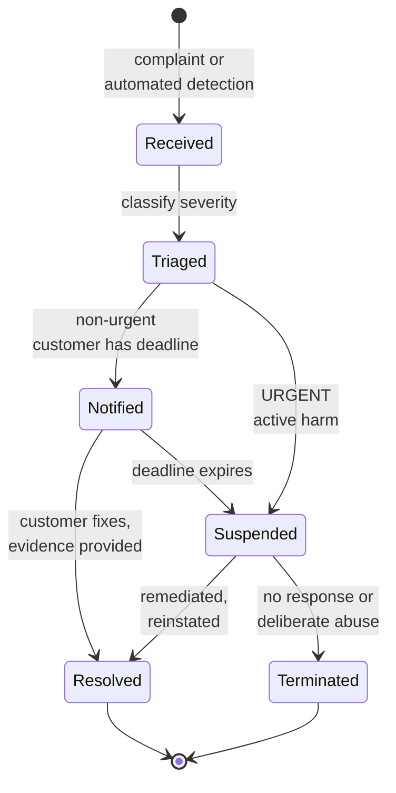

# 06 — Phase 6: Abuse, Fraud and Security

**Duration:** 2–3 weeks to build, then permanent
**Depends on:** Phase 1 (network controls), Phase 5 (programmatic suspension)
**Blocks:** launch — genuinely, not as a formality

This is the phase that determines whether you are still in business in eighteen months. From the risk ranking in Deliverable 1: abuse-driven IP reputation damage is the **most common** cause of failure for new VPS providers, ahead of cash flow and ahead of any infrastructure failure.

The mechanism is worth stating plainly. You sell cheap, anonymous, root-access compute with fast network connectivity. That is precisely the product spammers, botnet operators, credential stuffers, and DDoS-for-hire services want. You will attract them within days of launch, not months. Your `/24` will be evaluated by every major reputation system based on what your customers do with it, and once it is listed, delisting takes weeks to months while your legitimate customers suffer.

---

## 6.0 The strategic frame

Three principles that should shape every decision in this phase:

**1. Prevention at signup is worth ten times detection at runtime.** A fraudulent signup you decline costs nothing. The same account, active for six hours sending spam, costs you reputation you will spend months repairing.

**2. Automate suspension, not judgement.** The detection and the suspension must be machine-speed. The decision about whether to terminate or reinstate can be human. If a human must act before a compromised VM stops attacking, you will be nullrouted while they sleep.

**3. Your IP reputation is the asset.** Not your hardware, not your code. Hardware depreciates predictably and code can be rewritten; a burned `/24` is a slow, expensive, partially-irreversible loss. Every trade-off in this phase should be evaluated against that asset.

---

## 6.1 Anti-spam strategy

### The outbound email problem

An open VPS platform is an ideal spam cannon: cheap, disposable, with clean-ish IPs. If you allow unrestricted outbound SMTP, you will be listed within days.

### Controls, in order of importance

**1. Block outbound TCP/25 by default.**

This is the single highest-value control in this entire document. Implement it at both the host firewall and the network edge.

```
# Per-VM firewall, applied at provision time
# /etc/pve/firewall/<vmid>.fw
[RULES]
OUT REJECT -p tcp -dport 25 -log info
```

Reject rather than drop, so legitimate software fails fast with a clear error instead of hanging.

**2. Build an unlock workflow, not a blanket policy.**

Legitimate customers do run mail servers. Refusing all of them loses real business. The workflow:

| Step | Requirement |
|---|---|
| Account age | Minimum 7–30 days |
| Payment history | At least one successful non-disputed payment |
| Identity verification | Verified phone, and for higher volumes, business documentation |
| Stated use case | What they are sending, to whom, at what volume |
| Confirm opt-in practice | Ask directly how their lists are built |
| Rate limit on unlock | Start at a low messages-per-hour cap, raise on good behaviour |
| Revocation | Automatic on any complaint |

Charge nothing for it, but make it a deliberate human decision. The friction is the point.

**3. Rate-limit even after unlocking.**

An unlocked account with a compromised application can still send tens of thousands of messages. Cap messages per hour at the network level, alert on approach to the cap, and suspend on breach.

**4. Block reflection-amplification egress.**

Not spam, but the same category of "your network attacking others":

```
[RULES]
OUT DROP -p udp -dport 19    -log info   # chargen
OUT DROP -p udp -dport 111   -log info   # portmap
OUT DROP -p udp -dport 123   -log info   # NTP amplification
OUT DROP -p udp -dport 389   -log info   # CLDAP
OUT DROP -p udp -dport 1900  -log info   # SSDP
OUT DROP -p udp -dport 11211 -log info   # memcached
```

These block your VMs from *reaching* those ports elsewhere, preventing participation in reflection attacks. Note this is distinct from blocking them *serving* on those ports, which you should generally not do — customers legitimately run DNS and NTP servers. Rate-limit inbound to those services instead.

**5. Monitor your own reputation continuously.**

Register for and check regularly:
- Spamhaus (SBL, CSS, XBL, DROP) — your whole `/24`, not just individual IPs
- Google Postmaster Tools
- Microsoft SNDS
- Major commercial reputation feeds

**Alert on any new listing.** Discovering a listing from a customer complaint means you have already lost days.

**6. Publish and honour a feedback loop.**

Register with the major ISPs' feedback loop programmes where available so complaints reach you directly rather than only reaching blocklist operators.

---

## 6.2 Anti-DDoS strategy

Covered as a procurement decision in Phase 1 §1.9 because it is a transit and topology choice. Here is the operational side.

### Attack types and responses

| Attack type | Signature | Response |
|---|---|---|
| Volumetric (UDP flood, amplification) | Bandwidth saturation | Upstream scrubbing or blackhole; you cannot absorb it locally |
| Protocol (SYN flood) | Connection table exhaustion | SYN cookies, conntrack limits, scrubbing |
| Application layer (HTTP flood) | Normal-looking traffic, high volume | Customer-side; you can rate-limit and advise |
| Outbound (your customer attacking) | Egress spike from one VM | **Automated suspension** |

### The critical distinction

**Inbound attacks against a customer** are a service-availability problem. Your response is scrub or blackhole the target, keeping other customers up.

**Outbound attacks from a customer** are an existential reputation problem. Your response is automated suspension within minutes.

Both need to be built. The second is more urgent, because it is the one that gets your ASN a bad reputation and your upstream contract terminated.

### Inbound response flow



**The blackhole path is your minimum viable posture.** It sacrifices one customer to save the platform. This must be disclosed in your SLA exclusions and explained honestly in your AUP — customers deserve to know that a large attack against them means they go offline.

### Outbound response flow



**Note the ordering: rate-limit first, page second, suspend third.** Rate-limiting stops the harm in seconds without destroying evidence or the customer's data. Suspension follows. This ordering means a false positive is recoverable and a true positive is contained fast.

### Thresholds

Set these per plan tier and tune from real data:

| Signal | Starting threshold |
|---|---|
| Sustained outbound Mbps | 3–5× the plan's expected average |
| Outbound packets per second | Tuned; PPS floods can be low-bandwidth |
| Unique destination IPs per minute | High counts indicate scanning or DDoS |
| Outbound SMTP connection attempts | Any, if port 25 is blocked — indicates compromise |
| Outbound connections to known C2 / tor exit ranges | Any, as a signal not an auto-block |

Start conservative, expect false positives, and tune. A false positive that rate-limits a customer for two minutes is a much smaller problem than a real attack running for an hour.

---

## 6.3 Fraud prevention

### Why this comes before everything else

Every abuse case starts with a signup. Fraud screening is where you have the highest leverage and the lowest cost.

The typical fraudulent signup pattern: stolen card or a compromised payment account, disposable email, VPN or proxy IP, immediate provisioning of the largest plan they can, and abuse within hours. Then a chargeback, which costs you the fee, the resource consumption, the reputation damage, and counts against your processor's ratio.

### Screening at signup



### Specific controls

| Control | What it catches | Notes |
|---|---|---|
| Disposable email detection | Throwaway signups | Maintain a blocklist; many are published |
| **Non-VoIP phone verification** | Automated and cheap fraud | The single most effective friction. VoIP numbers are free and unlimited; real mobile numbers are not |
| IP reputation / proxy detection | Actors hiding origin | Do not auto-decline — many legitimate customers use VPNs. Use as a score input |
| BIN country vs billing country mismatch | Stolen cards | Strong signal |
| AVS / CVV failure | Stolen cards | Decline on failure |
| Prepaid card detection | Disposable payment | Score input; some legitimate customers use them |
| Device fingerprinting | Repeat offenders after termination | Effective against the same actor returning |
| Velocity checks | Bulk account creation | Same card, IP, device, or fingerprint across signups |
| **Manual review on first order** | Everything | For the first months, review every new customer's first order personally. Slow, and enormously informative |
| Industry fraud sharing (e.g. FraudRecord) | Actors known to other hosts | Worth participating in |

### The commercial tension, stated honestly

Every friction control costs you legitimate signups. A founder desperate for their first fifty customers is strongly tempted to remove friction. **Resist this specifically.** The cost of one bad customer in the first month — when your `/24` has no reputation history and a single listing defines it — is far higher than the cost of ten legitimate customers who found signup annoying and went elsewhere.

Be strict for the first three months. Loosen deliberately, with data, later.

### A concrete starting policy

- Crypto and prepaid-card signups: manual review always, for the first six months
- First order from any new account: manual review for the first three months of operation
- Phone verification required for all accounts, VoIP rejected
- Auto-decline on AVS/CVV failure
- Account age gate on port 25 unlock, large plans, and additional IPs

---

## 6.4 Abuse response workflow

### The case state machine



### Severity classification and SLAs

| Severity | Examples | Action | Timeline |
|---|---|---|---|
| **P0 — immediate** | Outbound DDoS, active spam run, CSAM, phishing site live | **Suspend first, ask questions after** | Minutes, automated where possible |
| **P1 — urgent** | Compromised host, malware C2, port scanning | Rate-limit, notify, suspend if no response | 4 hours |
| **P2 — standard** | Copyright complaint, single spam report, ToS breach | Notify with deadline | 24 hours to acknowledge, 48–72 to remediate |
| **P3 — informational** | Vague or unsubstantiated complaint | Log, investigate, respond to complainant | 72 hours |

**P0 exists because of the AUP clause on immediate suspension.** If your AUP requires notice before suspension, you cannot act on P0, and your upstream will act for you by nullrouting your prefix.

### Requirements

- **`abuse@yourdomain` live, monitored, and registered in your RIR object.** Complainants check whois. If your abuse contact bounces or is ignored, they escalate to your upstream — who will act against you rather than negotiate.
- **Acknowledge every complaint**, even ones you reject. Silence is what triggers escalation.
- **Log everything**: complaint, evidence, action taken, timestamps, communications. You will need this for upstream disputes and occasionally for legal process.
- **Templates for each state**, so responses are fast and consistent.
- **A defined authority** — who may terminate a customer. As a founder, you. Write it down for when you hire.

### Handling complaints you disagree with

Some complaints are wrong, automated, or malicious. Do not reflexively suspend. Investigate, respond to the complainant with your findings, and document. A provider who never pushes back has customers who cannot rely on them; a provider who never acts has an upstream who will act for them. Judgement, documented.

---

## 6.5 Security hardening

Layered by the surface being protected.

### Management plane

- Proxmox UI and API reachable **only via VPN or bastion**; verified from an external host
- MFA/TOTP required on all administrative access
- SSH keys only, no password authentication
- Scoped API tokens with expiry; **expiry monitored and alerted**, because an expired token breaks provisioning silently
- Audit logs shipped off-node
- Quarterly access review: who has access to what, and remove what is stale

### Hypervisor

- Datacenter firewall default-deny inbound
- `macfilter: 1` at datacenter level
- Enterprise repositories only; security patches promptly, major upgrades scheduled with tested rollback
- Kernel hardening sysctls
- No unnecessary services

### Tenant isolation

From Phase 3 (docs 05-08), restated because it is security-critical:

- **One vnet per tenant**, enforced in provisioning code, never shared
- **`ipfilter: 1` with a populated `ipfilter-net0` ipset per VM** — this is what prevents IP and ARP spoofing between customers
- **`firewall=1` on every customer NIC**, with a continuous audit job because a VM without it has no protections active
- **Tenant networks must have no route to the management VLAN.** Verify by port-scanning from inside a test guest
- uRPF and BCP38 at the network edge

### Control plane

- Panel admin not on a public guessable path; MFA; consider IP restriction
- Panel uses a scoped token that cannot modify cluster config
- Secrets in SOPS/age or a vault, never in code
- `gitleaks` in CI across full history
- Dedicated CI runner for infrastructure, never a shared runner

### The credential single-point-of-failure

If you are the only person with the age keys, the PVE root credentials, the registrar login, and the RIR portal access, your company has a non-technical single point of failure. Escrow: a sealed offline copy in a physical safe, and a documented process for a trusted second party to access it. This is a DR scenario, and it is the one founders never plan for.

---

## Phase 6 validation checklist

### Anti-spam
- [ ] Outbound TCP/25 blocked by default, verified from a test VM
- [ ] Unlock workflow documented with account age, payment history, and identity requirements
- [ ] Post-unlock rate limiting implemented
- [ ] Reflection-port egress blocked, verified
- [ ] Monitoring registered: Spamhaus, Google Postmaster, Microsoft SNDS
- [ ] **Alert configured on any new blocklist listing of your ranges**
- [ ] Feedback loop registrations submitted where available

### Anti-DDoS
- [ ] Blackhole community tested end to end with **both** transit providers
- [ ] Scrubbing arrangement in place, or blackhole-only posture documented in SLA exclusions
- [ ] Inbound anomaly detection with alerting
- [ ] **Outbound anomaly detection with automated rate-limiting**, threshold-tested with real traffic
- [ ] Automated suspension callable by the detection system
- [ ] Runbook for inbound attack; runbook for outbound attack
- [ ] Customer notification templates for both

### Fraud
- [ ] Automated risk scoring at signup
- [ ] Non-VoIP phone verification enforced
- [ ] AVS/CVV failure auto-declines
- [ ] Velocity checks on card, IP, and device
- [ ] Device fingerprinting active
- [ ] Manual review queue working, with a defined reviewer
- [ ] Policy: manual review of all first orders for the first 3 months
- [ ] Industry fraud-sharing participation considered

### Abuse response
- [ ] `abuse@` live, monitored, **registered in the RIR object**
- [ ] Severity classification P0–P3 documented with timelines
- [ ] **AUP grants immediate suspension right for P0**
- [ ] Case state machine implemented in the panel or ticketing system
- [ ] Response templates for each state
- [ ] Suspension retains disk and is reversible; tested
- [ ] Termination flow includes IP cooldown and blocklist check
- [ ] Full audit logging of abuse actions
- [ ] Termination authority documented

### Security
- [ ] Proxmox UI/API unreachable from the internet, verified externally
- [ ] MFA on all admin access
- [ ] Scoped tokens with expiry; expiry monitoring alerting
- [ ] One vnet per tenant, enforced in code
- [ ] `ipfilter` populated per VM; IP spoof attempt from a test guest confirmed blocked
- [ ] `firewall=1` audit job scheduled and alerting
- [ ] Tenant-to-management isolation verified by port scan from a guest
- [ ] uRPF verified: spoofed packet from a test VM dropped
- [ ] `gitleaks` clean across full repository history
- [ ] Audit logs shipped off-node
- [ ] **Credential escrow in place** — offline copy, documented access process for a second party

---

## Phase 6 success criteria

You can demonstrate: a spoofed packet from a test VM is dropped; a test VM cannot reach the management network; port 25 is blocked; a simulated outbound traffic spike triggers automated rate-limiting within 60 seconds and suspension shortly after; an abuse complaint to `abuse@` creates a tracked case; a new blocklist listing would alert you within hours; and a fraudulent-looking signup lands in a manual review queue rather than provisioning automatically.

And critically: your AUP gives you the legal authority to do all of it.
