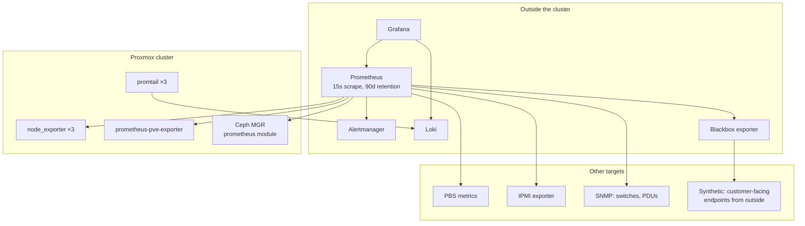
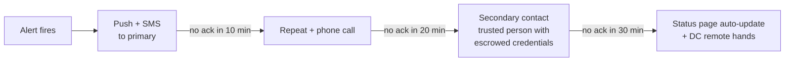
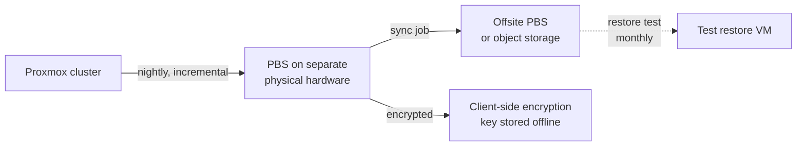

# 07 — Phase 7: Monitoring, Logging and Backup

**Duration:** 2–3 weeks
**Depends on:** Phase 3 cluster
**Blocks:** launch

The governing principle: **monitoring must survive the thing it monitors.** A Prometheus instance running inside the Proxmox cluster tells you nothing during a cluster outage, which is precisely when you need it.

---

## 7.1 Prometheus architecture

### Placement

Run the entire observability stack **outside** the production cluster — on the PBS host, a separate small server, or a VM at a different provider. This is non-negotiable and it is the most common mistake in small deployments.



### Exporters and what each gives you

| Exporter | Target | Key metrics |
|---|---|---|
| `node_exporter` | All nodes, PBS, monitoring host | **CPU steal time**, load, memory, disk, NIC errors, filesystem |
| `prometheus-pve-exporter` | One instance, reads PVE API | Guest state, node status, storage usage, cluster quorum |
| Ceph MGR prometheus module | Active MGR | PG states, OSD latency, pool usage, recovery progress |
| PBS metrics | Backup server | Job success, datastore usage, deduplication ratio |
| IPMI exporter | BMCs on VLAN 99 | Fan speed, PSU status, inlet temperature |
| SNMP exporter | Switches, PDUs | Port errors, discards, buffer drops, power draw |
| Blackbox exporter | **From outside your network** | Customer-facing reachability, TLS expiry, HTTP status |

Three of these are commonly missed and each has bitten real operators:

**CPU steal time** is your overcommit health signal and the earliest warning that customers are feeling contention. Alert on it.

**Switch buffer drops via SNMP** is how you diagnose the Ceph incast problem described in Phase 2. Without it, incast looks like a mysterious disk latency issue.

**Blackbox from outside** is the only check that tells you what a customer experiences. Internal checks pass happily while your BGP session is down.

### The MGR failover trap

Ceph's prometheus module runs on the **active** MGR. When the MGR fails over, the endpoint moves. If Prometheus is configured with a single static target, **your Ceph metrics silently stop** at exactly the moment something is going wrong.

Fix: scrape all MGR nodes and let the standbys return nothing, or use service discovery. Then **test it** by failing over the MGR and confirming metrics continue.

### Retention and sizing

| Data | Retention | Notes |
|---|---|---|
| Raw metrics, 15s scrape | 30–90 days | Sufficient for incident investigation |
| Downsampled | 1–2 years | Needed for capacity planning trends |
| Logs (Loki) | 30 days hot, longer in object storage | Legal/abuse investigation may need more |
| Audit logs | 12+ months | Compliance and abuse disputes |

Prometheus storage is roughly 1–2 bytes per sample after compression. A few thousand series at 15s intervals for 90 days is modest — tens of gigabytes.

---

## 7.2 Grafana architecture

Four dashboards, not forty. Dashboard sprawl means nobody looks at any of them.

| Dashboard | Audience | Contents |
|---|---|---|
| **Platform overview** | The one on the wall | Quorum, Ceph health, node up/down, capacity gauges, active alerts, total VMs |
| **Ceph detail** | Incident response | PG states, OSD latency distribution, recovery/backfill progress, per-pool usage, scrub status |
| **Node detail** | Capacity and troubleshooting | Per-node CPU/steal/RAM/network, VM count, thermal, disk SMART |
| **Business** | Weekly review | VMs by plan, capacity utilisation vs triggers, bandwidth 95th percentile, IPv4 pool remaining |

The **business dashboard** is the one engineers skip and founders need. Put the Phase 2 growth triggers on it as gauges with threshold markers so the "order the next node" decision is visible rather than remembered.

---

## 7.3 Loki architecture

```
promtail on each node → Loki (outside cluster) → Grafana
```

Ship:

| Source | Why |
|---|---|
| `journald` (all units) | General diagnosis |
| Ceph logs (`/var/log/ceph/`) | OSD flapping, scrub errors, slow ops |
| Corosync logs | Ring failures, retransmits, membership changes |
| `pve-firewall` logs | **Abuse investigation and spoofing attempts** |
| PVE task logs | Audit trail of who did what |
| Panel and provisioning logs | Provisioning failures, reconciliation divergence |

**Label discipline matters more than anything else in Loki.** Labels create index streams; high-cardinality labels (VMID, IP address, customer ID) will destroy performance. Label on `host`, `unit`, `severity`, `environment`. Put VMID and IP in the **log line**, and search them with grep-style filters at query time.

This is the mistake that makes people abandon Loki. Get it right at the start.

---

## 7.4 Alerting strategy

### The two-tier model

| Tier | Definition | Route |
|---|---|---|
| **Page** | Customer impact now, or data at risk now | Phone: SMS, push, or call. Wakes someone |
| **Ticket** | Needs action within a business day | Email or chat channel |

If everything pages, nothing pages effectively. If nothing pages, you find out from customers.

### Page-worthy alerts

| Alert | Threshold | Why it pages |
|---|---|---|
| Corosync quorum lost | Immediate | Cluster unmanageable; HA may fence |
| Ceph health ERR | Immediate | Data at risk |
| Ceph health WARN | Sustained 15 min | Filters transient states during normal operations |
| PG not `active+clean` | Sustained 30 min | Recovery stalled |
| OSD down | Sustained 5 min | Redundancy reduced |
| Node unreachable | 2 min | Capacity and customer impact |
| Pool above 80% | Immediate | Approaching the point where rebalance cannot complete |
| Blackbox check failing from outside | 2 min | Customers cannot reach you |
| BGP session down | Immediate | Connectivity at risk |
| **Outbound traffic anomaly from a VM** | Sustained 60s | Abuse — reputation at risk |
| **New blocklist listing of your ranges** | Immediate | Reputation damage in progress |
| PBS: no successful backup in 36h | Immediate | Recovery capability lost |

### Ticket-worthy alerts

CPU steal above 5% sustained · pool above 70% · SMART pre-fail · certificate or API token expiring within 14 days · single OSD slow ops · switch port errors increasing · deep scrub overdue · capacity growth triggers reached · monitoring target down.

### Two rules that keep alerting useful

**Every alert carries a runbook link in its annotation.** An alert without a documented response is a notification, not an alert.

**Alert fatigue audit, monthly.** Count alerts that fired and required no action. More than about five per week means you are training yourself to ignore the system — fix the thresholds.

### Escalation

For a one-person operation, escalation is mostly about not missing things:



The secondary contact matters. Configure it before you need it. This is the same person who holds the credential escrow from Phase 6.

---

## 7.5 Backup architecture

### Design



### Requirements

| Requirement | Why |
|---|---|
| **Separate physical hardware** | A backup in the cluster dies with the cluster |
| **Offsite replica** | Protects against site loss, fire, and seizure |
| **Client-side encryption** | Protects backup contents; key stored offline, not on PBS |
| Deduplication | PBS does this natively; VPS backups dedupe extremely well |
| Retention policy, documented | Customers need to know what they can recover |
| Bandwidth throttling on backup jobs | Otherwise backups compete with customer I/O |
| Backup window off-peak | Same reason |

### The 3-2-1 principle applied

Three copies (production + PBS + offsite), two media types or locations, one offsite. Straightforward, and routinely violated by keeping only a PBS in the same rack.

### Retention example

| Tier | Schedule | Retention | RPO |
|---|---|---|---|
| Included (all customers) | Nightly | 7 daily | 24 hours |
| Paid add-on | Nightly + weekly | 7 daily, 4 weekly, 3 monthly | 24 hours |
| Infrastructure VMs | Nightly | 14 daily, 8 weekly, 12 monthly | 24 hours |

**State the RPO explicitly to customers.** Nightly backups mean up to 24 hours of data loss in a restore scenario. Customers who need better need their own application-level replication, and they should be told so rather than discovering it.

### Encryption key handling

PBS client-side encryption means **the key is required to restore**. Consequences:

- Store it offline, in a physical safe, and in your credential escrow
- **Do not store it only on the PBS host** — a compromised or lost PBS then takes your restore capability with it
- Test a restore using only the escrowed copy of the key. This is the test nobody runs and it is the one that matters

### Restore testing — the part that actually matters

An untested backup is not a backup. Schedule these as recurring calendar items with a named owner:

| Test | Frequency | What it proves |
|---|---|---|
| Full VM restore, verify data against a pre-taken checksum | **Monthly** | The basic capability works |
| Restore to a different node | Quarterly | No hidden node affinity |
| Restore while the cluster is degraded | Quarterly | Works when you actually need it |
| Single-file restore | Quarterly | Common customer request |
| Restore using only the escrowed encryption key | **Semi-annually** | You can recover without the primary key copy |
| Restore from the offsite replica | Semi-annually | Offsite is real, not theoretical |
| Full bare-metal DR: rebuild a node from Git and restore its VMs | Annually | End-to-end recovery |

Record the elapsed time for each. Those numbers are your RTO, and your RTO is what your SLA must be consistent with.

---

## 7.6 Disaster recovery

### Scenarios and targets

| Scenario | RTO target | RPO | Procedure |
|---|---|---|---|
| Single VM corrupted | 1 hour | 24 h | Restore from PBS |
| Single node lost | 15 min (HA restart) | 0 | HA restarts guests; rebuild node from Git |
| Two nodes lost | Hours | 0 if Ceph intact | Restore nodes; emergency degraded operation documented |
| Full cluster power loss | Measured in Phase 8 test T13 | 0 | Cold start procedure |
| Ceph unrecoverable | Days | 24 h | Rebuild cluster, restore all VMs from PBS |
| Datacenter lost | Days to weeks | 24 h | Restore from offsite to new hardware or a rented cluster |
| **Control plane lost** | Hours | Varies | Panel database restore. Practise this |
| **Credentials lost** | Hours | 0 | Credential escrow retrieval |

The last two are the ones that get omitted from DR plans.

**Control plane loss is worse than it sounds:** your panel database is the source of truth for IP allocations, VNI assignments, and plan limits. Losing it while the cluster runs fine means you have hundreds of VMs and no record of who owns them. Back the panel database up separately, frequently, and test restoring it.

**Credential loss** is a real scenario if one person holds everything. Covered in Phase 6.

### DR documentation requirements

- A cold-start procedure with explicit ordering
- Contact list: DC remote hands, both transit providers, hardware vendor, Proxmox support, registrar
- Where the escrowed credentials and backup encryption key are, and who may retrieve them
- The decision authority for invoking emergency measures (`pvecm expected 1`, `min_size 1`)
- A communication plan: status page, customer email templates

---

## Phase 7 validation checklist

- [ ] Entire observability stack runs **outside** the production cluster
- [ ] All exporters scraping: node, PVE, Ceph MGR, PBS, IPMI, SNMP
- [ ] **Blackbox checks running from outside your network**
- [ ] **MGR failover tested; Ceph metrics continue**
- [ ] Four dashboards built, including the business dashboard with growth triggers
- [ ] Loki ingesting journald, Ceph, Corosync, pve-firewall, PVE tasks, panel logs
- [ ] **Loki label cardinality reviewed** — no VMID or IP in labels
- [ ] Alertmanager routes pages to a phone; **test alert received and acknowledged**
- [ ] Every page-tier alert configured per the table above
- [ ] Every alert has a runbook link in its annotation
- [ ] Escalation chain configured including a secondary contact
- [ ] PBS on separate physical hardware
- [ ] Offsite replication running and verified
- [ ] Client-side encryption enabled; **key stored offline and in escrow**
- [ ] Backup jobs cover all VMs; retention policy documented and published
- [ ] Backup bandwidth throttled; window off-peak
- [ ] **Full restore tested with checksum verification**
- [ ] Restore to a different node tested
- [ ] Restore during degraded cluster tested
- [ ] **Restore using only the escrowed key tested**
- [ ] Panel database backed up separately; **restore tested**
- [ ] All restore times recorded; SLA checked for consistency
- [ ] Monthly restore test scheduled with a named owner
- [ ] DR runbooks written for every scenario in the table
- [ ] Status page live; incident templates written

## Phase 7 success criteria

An alert about a real problem reaches your phone within two minutes and links to a runbook. You have restored a VM from backup and verified its data byte-for-byte. You have restored using only the escrowed encryption key. Your monitoring keeps working when a node dies, and when the MGR fails over. And your published SLA is consistent with the restore and recovery times you actually measured.
