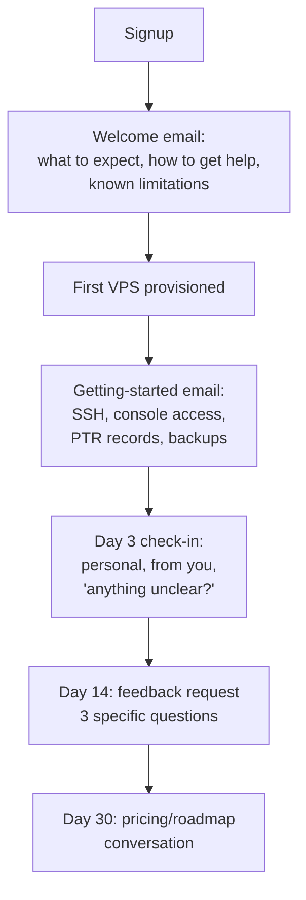

# 09 — Phase 9 (Soft Launch) and Phase 10 (Production Growth)

---

# Phase 9 — Soft Launch

**Duration:** 4–8 weeks
**Depends on:** Phase 8 go/no-go passed
**Goal:** find the product's real problems with 20 forgiving customers rather than 200 unforgiving ones

## 9.1 Why a soft launch, specifically

Three things you cannot learn from testing:

1. **Real ticket volume per customer.** This number determines whether your business is operable by one person, and you cannot estimate it.
2. **What confuses people.** Your panel is obvious to you because you configured it.
3. **Your real abuse rate.** What fraction of signups are fraudulent, and what your screening actually catches.

A soft launch is a measurement exercise disguised as a sales exercise.

## 9.2 Early adopter strategy

**Cap signups deliberately.** Growing faster than your operational capacity is how young providers acquire a permanently bad reputation. A hard cap of 20–30 accounts, enforced in the panel, framed as "early access."

Where these customers come from, roughly in order of quality:

| Source | Quality | Notes |
|---|---|---|
| Your own network — people who know you | Highest | Forgiving, honest feedback, will tell you the truth |
| Niche technical communities in your target market | High | Engaged, articulate, will find bugs |
| Local/regional developer groups | High | If you are selling geographic proximity, these are your market |
| LowEndTalk / hosting forums | Mixed | Knowledgeable and vocal, but price-focused and demanding. Good for testing, hard as a customer base |
| Paid advertising | Lowest | Do not. You will attract volume before you can serve it |

**Frame it honestly.** "Early access, discounted, some rough edges, direct line to the founder, help us shape it." Under-promise. Early adopters who know they are early adopters are extraordinarily tolerant; customers who thought they were buying a mature product are not.

**Discount, but not to zero.** Free customers give unreliable feedback and do not test your billing. A 30–50% early-adopter discount with a commitment that they keep it for 12 months is a good trade.

## 9.3 Customer onboarding

The onboarding sequence, which doubles as your ticket-reduction programme:



**Be explicit about limitations up front.** Port 25 blocked by default. Nightly backups with a 24-hour RPO. Your DDoS posture. Maintenance windows. Telling people before they discover it converts a complaint into an informed choice.

**The day-3 personal check-in is the highest-value thing in this phase.** It is also the thing you will feel too busy to do. Do it anyway — it surfaces problems people would not open a ticket about.

## 9.4 Support model during soft launch

- **You are support.** Do not hire yet; you need to feel the ticket volume yourself to know what to build and who to hire.
- **Email/ticket only.** No live chat, no phone. Offering and failing them is worse than not offering.
- **Publish conservative response targets and beat them.** Under-promise here too.
- **Every ticket gets logged with a category.** This is your product roadmap.

### The metric that decides your future

**Tickets per customer per month.**

| Value | Interpretation |
|---|---|
| Under 0.2 | Healthy. Product is self-service. You can scale |
| 0.2–0.5 | Acceptable. Watch the categories |
| 0.5–1.0 | **Fix the product before adding customers.** You are on a path to being consumed by support |
| Over 1.0 | Something is fundamentally confusing or broken |

When it is high, look at the categories. The usual culprits, each with a product fix:

| Frequent ticket | Product fix |
|---|---|
| "I'm locked out" | Serial console, and make it discoverable |
| "How do I set a PTR?" | Self-service PTR, and mention it in onboarding |
| "My email won't send" | Explain port 25 in onboarding, before they try |
| "How much bandwidth have I used?" | Usage display in the panel |
| "My disk is smaller than I ordered" | Fix growpart in the template |
| "How do I reinstall?" | Make the button obvious |
| "Is my data backed up?" | State the backup policy in onboarding and the panel |

## 9.5 Feedback collection

Ask three specific questions, not "any feedback?":

1. What did you expect to be able to do that you could not?
2. What made you hesitate before buying?
3. If you had to leave tomorrow, what would be the reason?

The third question is the one that predicts churn. It gets more honest answers than "are you satisfied?"

Also track behavioural signals, which are more reliable than stated opinion: how many provisioned a second VM · how many touched the console · how many are still active at day 30 · how many upgraded.

## 9.6 Soft launch exit criteria

- [ ] 20+ customers active for 30+ days
- [ ] Tickets per customer per month **below 0.5**, and trending down
- [ ] Every recurring ticket category has a product fix shipped or scheduled
- [ ] At least one real incident handled, with a written post-incident review
- [ ] Abuse rate measured; at least one abuse case handled end to end
- [ ] Fraud screening catch rate and false-positive rate known
- [ ] Billing has run a full monthly cycle including at least one failed payment and one refund
- [ ] Churn at 30 days understood
- [ ] Restore performed for a real customer request
- [ ] SLA held, or the miss understood and the SLA revised

**The gate on opening publicly is the ticket metric, not the customer count.** If it is above 0.5, more customers makes everything worse.

---

# Phase 10 — Production Growth

**Duration:** ongoing
**Goal:** scale capacity, operations, and team without degrading service

## 10.1 Scaling Ceph

### The step that matters most

**3 → 4 nodes is a qualitative change, not a quantitative one.** With three nodes and `size=3`, Ceph cannot rebuild a lost replica because there is no fourth host to put it on. The fourth node introduces self-healing. Node 5 gives comfortable headroom for rolling maintenance.

If you take one thing from this phase: **the fourth node is your highest-return infrastructure purchase**, and it should be ordered at 55% raw utilisation, not when you are full.

### Adding a node

```
1. Rack, cable, verify all VLANs and jumbo frames BEFORE joining
2. Ansible converge (identical package state)
3. pvecm add — verify quorum and both Corosync rings
4. pveceph osd create per device
5. Watch the rebalance. Throttle it:
     ceph config set osd osd_max_backfills 1
     ceph config set osd osd_recovery_op_priority 1
   Rebalancing after adding 6 OSDs moves a lot of data. Untuned, it will
   degrade customer I/O for hours.
6. Verify HEALTH_OK and even distribution: ceph osd df tree
7. Raise the safety factor: 0.60 → 0.70 once at 5 nodes
```

### Scaling thresholds

| Nodes | Safety factor | Self-heals | Rolling maintenance | Notes |
|---|---|---|---|---|
| 3 | 0.60 | No | Degraded during | Launch only |
| 4 | 0.65 | Yes | Degraded during | Order at 55% of 3-node capacity |
| 5 | 0.70 | Yes | **Yes, clean** | The comfortable minimum |
| 7 | 0.72 | Yes | Yes | |
| 10 | 0.75 | Yes | Yes | Introduce rack failure domains if spanning racks |
| 12–15 | 0.75 | Yes | Yes | **Consider a second cluster** |

### When to split into a second cluster

At 12–15 nodes, a single cluster becomes a blast-radius and upgrade-risk problem: a bad Ceph upgrade or a CRUSH mistake affects everything. Two clusters of eight are operationally safer than one of sixteen, at the cost of stranded capacity and more management surface.

Also consider a second cluster for: a second site, a second availability zone offering, or a distinct tier (e.g. an erasure-coded archive tier).

### Rack failure domains

Once you span racks:

```bash
ceph osd crush add-bucket rack-a rack
ceph osd crush add-bucket rack-b rack
ceph osd crush add-bucket rack-c rack
ceph osd crush move rack-a root=default
ceph osd crush move pve-01 rack=rack-a
# then a rule with: step chooseleaf firstn 0 type rack
```

**You need at least three racks to do this with `size=3`.** With two racks you cannot place three replicas across racks while keeping host-level distribution. Do not attempt it on two.

## 10.2 Scaling Proxmox

- **Corosync scales comfortably to ~15–20 nodes** with good networking. Beyond that, latency sensitivity grows and you should be splitting clusters anyway.
- **Keep node hardware homogeneous within a cluster.** Mixed CPU generations break live migration unless you set a lowest-common-denominator CPU type, which forfeits newer instruction sets. Better: new generations go into a new cluster or a new plan tier.
- **Upgrade discipline:** snapshot the ZFS root before `pveupgrade`, upgrade one node, run it for a week, then proceed. Never upgrade all nodes in one window.
- **Keep Ceph and PVE major upgrades separate.** Two variables at once makes diagnosis impossible.

## 10.3 Scaling the network

| Trigger | Action |
|---|---|
| 95th percentile above 60% of transit commit | Renegotiate commit, or add a third transit |
| Consistent traffic to networks present at a local IXP | Join the IXP; peering is cheaper than transit |
| Any single-link saturation | Add LACP members or upgrade port speed |
| Router FIB approaching capacity | Upgrade routers, or move to default-route-only from upstreams |
| Repeated DDoS causing customer impact | Upgrade from blackhole-only to real scrubbing |
| IPv4 pool below 20% | Acquire more — long lead time |
| Second site | Requires an inter-site plan: separate clusters, separate announcements or anycast |

**Joining an IXP is usually the highest-return network optimisation** once you have enough traffic to justify the port fee. It reduces cost per bit and latency simultaneously.

## 10.4 Scaling operations

Operations scale by removing work, not by adding people. In priority order:

1. **Automate the top ticket categories out of existence.** Every self-service feature is permanent leverage.
2. **Runbook everything that happens twice.** The second occurrence is the signal to write it down.
3. **Automate abuse response.** This is the workload that grows superlinearly with customer count.
4. **Reconciliation jobs** — panel vs Proxmox, `firewall=1` audit, orphan detection, IP pool integrity. These catch drift before customers do.
5. **Then hire**, and hire for the categories automation cannot remove.

### Capacity planning model

Track weekly, with triggers on the business dashboard:

| Metric | Formula | Trigger |
|---|---|---|
| Ceph raw utilisation | `used_raw / total_raw` | 55% (3 nodes), 65% (5+) |
| RAM committed | `sum(vm_ram) / sum(sellable_ram)` | 75% |
| CPU steal | 95th percentile across nodes | 5% sustained |
| IPv4 free | `free / total` | 20% remaining |
| Transit | 95th percentile / commit | 60% |
| Tickets per customer/month | `tickets / customers` | 0.4 rising |
| Node months-to-full | `(trigger − current) / monthly_growth_rate` | Under 3 months → order now |

That last row is the useful one. It converts a utilisation percentage into a purchasing decision with lead time built in.

### Forecasting

```
monthly_vm_growth      = trailing 3-month average net new VMs
months_to_trigger      = (trigger_utilisation − current) / (growth × per_vm_consumption)
order_when             = months_to_trigger − hardware_lead_time − rebalance_time
```

If `order_when` is less than or equal to zero, order today.

## 10.5 Scaling the support team

Hire when **two** of these are true, not one:

- Tickets per customer/month is above 0.4 and cannot be automated away further
- You are spending over 50% of your time on support
- Response times are slipping against published targets
- You cannot take a day off without service degrading

### Hiring sequence

The reasoning behind this order is in `docs/18-org-and-hiring.md`. Summary: first hire is **support with technical depth**, because it buys back founder time in the largest block. Second is **infrastructure/SRE**, because it removes the single-person-dependency risk on the systems themselves. Third is **billing/finance operations**, because that work is high-volume, low-judgement, and delegable.

### Support scaling structure

| Stage | Structure |
|---|---|
| Under ~100 customers | Founder only |
| 100–400 | Founder + 1 technical support |
| 400–1,000 | 2–3 support, tiered (L1 triage, L2 technical), documented escalation |
| 1,000+ | Shift coverage, a support lead, formal knowledge base, dedicated abuse handling |

**Abuse handling becomes a specialised role earlier than people expect** — often around 300–500 customers. It requires judgement, consistency, and a tolerance for unpleasant content, and it does not mix well with general support.

## 10.6 Growth risks

| Risk | Trigger | Mitigation |
|---|---|---|
| Growing faster than operations | Public launch after a good soft launch | Keep signup caps; raise deliberately |
| Ticket volume consumes the founder | Ticket metric ignored | Automate before hiring |
| Capacity trigger missed | No business dashboard | Triggers as gauges with thresholds |
| Ceph oversell caught up with you | Thin provisioning unmonitored | Monitor actual vs sold; alert at 70% real |
| Abuse volume scales superlinearly | More customers | Automate detection and suspension |
| Hardware heterogeneity breaks migration | Buying whatever is cheap | New generations → new cluster or tier |
| Single-person dependency | Never hired, never documented | Runbooks, credential escrow, second hire |
| One customer becomes a large revenue share | Landing a big account | Cap any customer at a defined share of revenue |
| SLA credits exceed margin | Growth without reliability investment | Model credit exposure quarterly |
