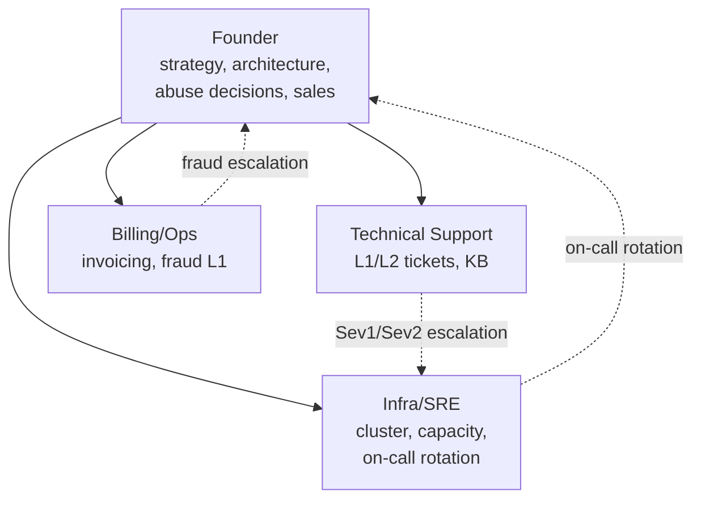
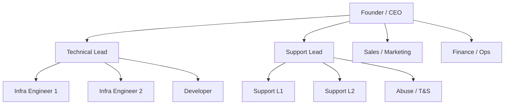

# 11 — Organizational Structure and Hiring

## The governing principle

**Automate before you hire.** Every self-service feature is permanent leverage; every hire is a permanent cost with management overhead. But there is a limit, and passing it has a specific symptom: **you cannot take a day off without service degrading.** At that point you are the single point of failure, and no amount of automation fixes it.

The second principle: **hire to remove the largest block of your own time first**, not to fill the most impressive-sounding role.

---

# Year 1 — Founder only

**Customers:** 0 → ~100 · **Team:** you

## What you actually are

Six roles in one person, with badly unequal time demands:

| Role | Time share | Nature |
|---|---|---|
| Infrastructure engineer | 30% | Front-loaded in months 1–4, then declines |
| Support | 25% | Grows continuously with customer count |
| Developer (panel, automation) | 20% | Steady |
| Sales and marketing | 10% | Neglected, and it shows |
| Finance and admin | 10% | Bursty around month-end |
| Abuse and security | 5% | Grows non-linearly; spikes unpredictably |

The distribution matters because it tells you what your first hire should absorb: **support is the block that grows without bound.**

## What to do yourself, deliberately

- **All of Phases 0–8.** You need to understand the system you will be operating at 3am.
- **All support during soft launch.** This is your product research. Outsourcing it means you never learn what confuses people.
- **All abuse handling initially.** The judgement calls are business-defining and you need to calibrate them.

## What to outsource in year 1

| Function | Why outsource |
|---|---|
| Accounting and tax filing | Specialised, legally consequential, low volume |
| Legal (policy drafting and review) | Specialised, one-time-ish |
| Occasional design work | Not your comparative advantage |
| Remote hands at the DC | Already a service you pay for; use it |

**Do not outsource:** support, abuse handling, or anything touching the provisioning path. These are where your product knowledge lives.

## Year 1 survival requirements

Three things that are not optional even as a solo founder:

1. **Runbooks for everything.** Written during failure testing, not during failures. These are your resilience against your own illness or absence.
2. **Credential escrow with a trusted second party.** Offline copy, documented retrieval process, tested. Without it, your company has a non-technical single point of failure.
3. **A secondary alerting contact** who can at least escalate to remote hands. Configured before you need it.

Item 2 and 3 are the same person, usually. Choose them and set it up in month 1.

## Year 1 boundaries you should set

- **Published response targets you can meet while sleeping.** "Next business day" for Sev3 is honest; "1 hour, 24/7" is a promise you will break.
- **A hard signup cap.** Raise it deliberately, in steps, when the ticket metric allows.
- **One maintenance window per month**, published, used or not.
- **A defined time each day you are not on call**, with the status page and auto-responders reflecting it. Burnout is a real failure mode for solo infrastructure founders.

---

# Year 2 — Small team

**Customers:** ~100 → ~500 · **Team:** 2–4

## Hire 1 — Technical Support Engineer

**When:** tickets per customer per month is above 0.4 after automation, **and** you are spending over 50% of your time on support.

**Why first:** it is the largest and fastest-growing block of your time, and it is the most delegable with clear runbooks. It also buys back the time you need to do hires 2 and 3 properly.

**Responsibilities:** L1/L2 tickets · guided VM troubleshooting · restore requests · billing queries · escalation to you for Sev1/Sev2 · maintaining the knowledge base.

**Profile:** Linux competent (can debug a customer's SSH, firewall, and DNS problems), genuinely patient, writes clearly. **Does not need Ceph or BGP knowledge.** Hiring an over-qualified infrastructure person into a support role produces a bored employee who leaves.

**The onboarding test:** they can resolve the top 10 ticket categories from the runbooks alone within two weeks. If they cannot, your runbooks are the problem, not the hire.

## Hire 2 — Infrastructure / SRE Engineer

**When:** you cannot take a week off, or you are deferring infrastructure work you know matters.

**Why second:** this removes the single-person dependency on the systems themselves — the risk that most threatens business continuity.

**Responsibilities:** Proxmox and Ceph operations · capacity planning execution · on-call rotation with you (this is the point) · IaC maintenance · upgrades · failure testing · monitoring.

**Profile:** hands-on Linux and virtualisation, Ceph experience strongly preferred (it is hard to learn on a production cluster with paying customers), comfortable with Ansible/OpenTofu, calm in incidents.

**This is your hardest and most important hire.** Pay for real Ceph experience. The cost of learning Ceph on your production cluster is measured in customer trust.

## Hire 3 — Billing / Operations Administrator

**When:** finance and admin exceeds ~15 hours a week.

**Why third:** high-volume, low-judgement, highly delegable — but only after the two above, because it does not reduce technical risk.

**Responsibilities:** invoicing and dunning · payment reconciliation · refunds and credits · **first-line fraud review** · vendor invoices · basic reporting.

**Profile:** detail-oriented, trustworthy, comfortable with spreadsheets and a billing system. Fraud review is teachable to a careful person with a checklist.

## Year 2 structure

## What the founder does in year 2

Strategy · architecture decisions · **abuse and termination decisions** (keep this until you have a documented policy someone else can apply consistently) · sales and partnerships · pricing · vendor relationships · on-call rotation with the SRE.

## Year 2 process requirements

The moment you have a second person, these become necessary rather than nice:

- **On-call rotation with real handover.** Two people, one week each, with a written handover.
- **Documented escalation matrix.** Who is woken for what.
- **Change management with review.** Merge requests, plan review, manual apply gate.
- **Access control per person**, not shared credentials. And offboarding procedure written before you need it.
- **Weekly ops review**: incidents, capacity triggers, ticket categories, abuse cases.

---

# Year 3 — Growth stage

**Customers:** ~500 → ~2,000+ · **Team:** 6–12

## Hires 4–8, in likely order

**4. Second Support Engineer** — enables shift coverage and tiering. L1 triage / L2 technical split.

**5. Abuse and Trust & Safety Specialist**
Around 300–500 customers, abuse handling becomes a role rather than a task. It needs consistency, judgement, tolerance for unpleasant content, and a documented policy. **It mixes badly with general support** — the mindset required is different, and context-switching between helping customers and investigating them is corrosive.

**6. Second Infrastructure Engineer** — proper 3-person on-call rotation instead of 2. This is a quality-of-life and retention investment as much as a capacity one.

**7. Developer (panel and automation)**
By now the panel is your differentiation. If you took the hybrid approach from Phase 5, this person owns the provisioning service, the customer API, and self-service features. Every feature they ship reduces support load permanently.

**8. Sales / Partnerships / Marketing**
The role founders defer longest and most regret deferring. If you are competing on support quality, geography, or a niche rather than price, someone has to communicate that. A technical founder is usually a poor and reluctant marketer.

## Year 3 structure

## Year 3 organisational requirements

- **A real on-call rotation** of at least 3 people with compensation and escalation
- **Formal incident management**: severity definitions, incident commander role, post-incident reviews with tracked actions
- **Documented decision authority**: who may terminate a customer, approve a refund above a threshold, authorise emergency measures like `min_size 1`
- **Quarterly access review**
- **Quarterly full failure-test re-run**, owned by the Technical Lead
- **Annual DR drill**, full rebuild from Git and backups

## Roles to resist hiring too early

| Role | Why it is premature |
|---|---|
| Dedicated manager | At under 10 people you do not need a layer |
| Dedicated DBA | Your panel database does not warrant one |
| Network engineer | Your network is static; you need this at multi-site or IXP-heavy scale |
| Dedicated security engineer | Outsource pentesting; distribute security responsibility |
| Product manager | The founder is the product manager at this stage |

---

## Responsibility matrix (RACI-lite)

**A** = accountable · **R** = responsible · **C** = consulted

| Function | Y1 | Y2 | Y3 |
|---|---|---|---|
| Architecture | Founder A/R | Founder A/R | Founder A, Tech Lead R |
| Cluster operations | Founder A/R | SRE R, Founder A | Tech Lead A, Infra R |
| Capacity planning | Founder A/R | SRE R, Founder A | Tech Lead A/R |
| On-call | Founder A/R | Founder + SRE R | Rotation R, Tech Lead A |
| L1/L2 support | Founder A/R | Support R, Founder A | Support Lead A, Support R |
| **Abuse decisions** | Founder A/R | **Founder A/R** | T&S R, Founder A |
| Fraud review | Founder A/R | Billing R, Founder A | Billing/T&S R |
| Billing operations | Founder A/R | Billing R | Finance A/R |
| Panel development | Founder A/R | Founder A/R | Developer R, Tech Lead A |
| Security | Founder A/R | Founder A, SRE R | Tech Lead A, all R |
| Sales / marketing | Founder A/R | Founder A/R | Sales R, Founder A |
| Vendor relationships | Founder A/R | Founder A/R | Founder A/R |
| Pricing | Founder A/R | Founder A/R | Founder A/R |

**Note what the founder never delegates through year 3:** pricing, vendor relationships, and final accountability for abuse decisions. These are the levers that define the business.

---

## Hiring anti-patterns specific to this business

| Anti-pattern | Consequence |
|---|---|
| Hiring support before writing runbooks | They cannot work independently; you now have a trainee and no time saved |
| Hiring an SRE without Ceph experience | They learn Ceph on your production cluster with paying customers on it |
| Hiring a developer before the panel is the bottleneck | Expensive capacity building things nobody asked for |
| Overqualified person in a support role | Bored, leaves in six months, you re-hire |
| Sharing credentials instead of per-person access | No audit trail, painful offboarding, compliance failure |
| No offboarding procedure | A departed employee retains access to your hypervisors |
| Hiring before automating the top 3 ticket categories | Paying salary for work a feature would have eliminated |
| Deferring sales to year 3 | Great infrastructure, no customers |
| No credential escrow in year 1 | The company cannot function if you are unavailable |
