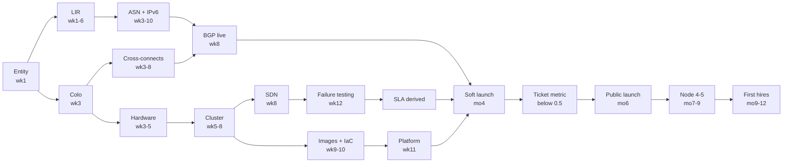

# 13 — Timeline: 30 / 90 Day, 6 and 12 Month Roadmaps

**Governing principle: start the slow external things first.** LIR membership, ASN allocation, IPv4 acquisition, colo contracts, and hardware delivery each take weeks to months and cannot be compressed by working harder. Software work takes days. Order matters more than effort.

The most common scheduling failure in this build is spending two months choosing hardware and then discovering the ASN takes six weeks.

---

# 30-Day Roadmap — Foundation and long-lead items

## Objectives
Get every slow external process started, and validate the business model before committing capital.

## Week 1 — Start the clock on everything slow

| Day | Task | Why now |
|---|---|---|
| 1–2 | Register the legal entity | Blocks LIR, banking, and every contract |
| 1–2 | **Verify whether local ISP/telecoms registration is required** | Can be a hard multi-month blocker on announcing prefixes. Discover it now, not in month three |
| 2–3 | Apply to 2–3 banks in parallel | Applications get declined without explanation; parallel applications save weeks |
| 3–5 | **Submit LIR membership application** | The single longest lead time in the build |
| 3–5 | Open colo conversations, request quotes, schedule site visits | 1–4 weeks to contract, then cross-connect lead time |
| 5 | **Build the financial model with real quote requests out** | If the numbers do not work you need to know now |

## Week 2 — Validate and procure

- Request quotes: hardware (2–3 vendors), transit (all carriers on site at your shortlisted colos), IPv4 (2–3 brokers)
- **IPv4 reputation due diligence on any block you are considering.** Check Spamhaus, DNSBLs, routing history, commercial reputation feeds. A cheap block is cheap for a reason
- Visit the shortlisted datacenters in person. Check the actual power feeds and the actual remote-hands desk
- Engage a lawyer with hosting or telecoms experience; brief them on the policy set
- Engage an accountant; get the cross-border indirect tax determination started
- Define your plan mix and pricing. Feed it into the model

## Week 3 — Decisions and commitments

- **Read the model's required-ARPU output and make the go/no-go pricing decision.** If required ARPU is far above market, change the plan now
- Sign the colo contract, including documented exit terms
- Contract two transit providers from topologically diverse networks. **Confirm DDoS handling in writing** — nullroute threshold and scrubbing availability
- Order cross-connects
- Request ASN and IPv6 allocation through your LIR
- Order hardware
- Apply to primary and secondary payment processors
- Set up Git repository, SOPS/age, and CI skeleton

## Week 4 — Preparation while waiting

- Policy drafting with the lawyer: AUP, ToS, SLA (number pending), Privacy, DPA, DMCA
- Tax registration and accounting system with the chart of accounts from Phase 0
- **Set up credential escrow and identify your secondary contact.** Do this in month 1, not month 12
- Design the network: VLAN plan, address plan, cable map. Commit to Git
- Begin Ansible role development against a local Proxmox VM

## 30-day deliverables
Entity registered · banking live · LIR application submitted · ASN and IPv6 requested · colo signed · two transits contracted · hardware ordered · IPv4 sourced with reputation verified · financial model built with real quotes · pricing decision made · policies in legal review · address plan and cable map in Git · credential escrow established

## 30-day risks
| Risk | Mitigation |
|---|---|
| Local ISP registration required and unknown | Verify day 1–2 |
| LIR application blocked on document mismatch | Ensure the address on the application matches incorporation exactly |
| Model shows the plan is unviable | **This is a success, not a failure.** Change pricing, density, or start on leased hardware |
| Banking declined | Parallel applications |
| IPv4 block has poor reputation | Due diligence before signing; contractual warranty |

---

# 90-Day Roadmap — Build and validate

## Objectives
Cluster built, tested to destruction, images automated, platform provisioning end to end. **No paying customers yet.**

## Month 2 — Cluster build (Phases 3 and 4)

| Weeks | Activity |
|---|---|
| 5 | Hardware arrives. Rack, cable, label. **Verify jumbo frames on every node pair on every jumbo VLAN.** Verify Corosync rings traverse different switches |
| 5 | Install Proxmox ×3, ZFS mirror, cap ZFS ARC, enterprise repos, subscriptions, initial hardening |
| 6 | Ansible roles complete; converge all nodes; second run reports `changed=0` |
| 6 | Create cluster with dual Corosync rings; test ring failover |
| 7 | Deploy Ceph: MONs, MGRs, 18 OSDs, pool at `size=3 min_size=2`, recovery tuning |
| 7 | Ceph performance baselines. **Single-queue write latency must be under 3 ms** |
| 8 | EVPN SDN, tenant vnets, isolation hardening. Prove isolation with `nmap` and `arpspoof`, not just ping |
| 8 | BGP live: announce prefixes, RPKI ROAs, IRR objects, uRPF. **Validate RPKI from 3+ external vantage points** |

## Month 3 — Platform and images

| Weeks | Activity |
|---|---|
| 9 | Monitoring stack outside the cluster. PBS on separate hardware. **First verified restore with checksum** |
| 9 | Packer templates: Ubuntu, Debian, Rocky. Boot-test each |
| 10 | Image CI/CD pipeline. OpenTofu platform modules. GitOps with manual apply gates |
| 10 | **Test the blackhole community with both transit providers** |
| 11 | Control plane: install the billing platform, wire provisioning, console proxy, rDNS self-service |
| 11 | Abuse and fraud: port 25 block, egress filters, outbound anomaly detection with automated rate-limiting, fraud screening, `abuse@` registered in the RIR object |
| 12 | **Failure test matrix T1–T16.** Do not compress this week |
| 12 | Fix findings, re-test. **Derive and publish the SLA from measured results** |

## 90-day deliverables
Cluster healthy and failure-tested · 16+ runbooks written · prefixes announced RPKI-valid · three OS templates built by CI · platform provisions end to end · monitoring alerting to a phone · verified restore · abuse controls live and tested · SLA derived from measurement · all policies published

## 90-day gate — do not pass without these
- [ ] T5 confirmed: fencing works, split-brain impossible
- [ ] T13 full power loss: self-recovers, RTO recorded
- [ ] Cross-tenant isolation proven with active attack tools
- [ ] Restore verified with checksum
- [ ] Credential escrow tested by the second person
- [ ] Outbound anomaly detection triggers rate-limiting within 60 s
- [ ] Both payment processors can take a live payment
- [ ] 30-VM provision/terminate cycle leaves zero orphans

## 90-day risks
| Risk | Mitigation |
|---|---|
| Jumbo frames broken on one path | Surfaces as strange Ceph latency in week 7 and costs two days. Test exhaustively in week 5 |
| Failure testing reveals a design flaw | Both Corosync rings on one switch, or fencing not working. Week 12 has slack for exactly this |
| Compressing week 12 | You find these problems with customers on the platform instead |
| Building a custom panel | Timeline slips 2–3×. Buy for launch |

---

# 6-Month Roadmap — Soft launch and product hardening

## Objectives
20–30 real customers, ticket volume measured and reduced, first incidents survived, product fixed based on evidence.

## Month 4 — Soft launch

- Open to 20–30 invited early adopters at a 30–50% discount held for 12 months
- **Hard signup cap enforced in the panel**
- Manual review of every first order
- Day-3 personal check-in with every customer. This is the highest-value activity in the phase
- Handle the first real incident; write the post-incident review

## Month 5 — Measure and fix

- **Track tickets per customer per month.** This number decides your future
- Categorise every ticket; ship a product fix for each recurring category
- Handle the first abuse case end to end; refine the workflow
- Measure fraud catch rate and false-positive rate
- Run the first full monthly billing cycle including a failed payment and a refund
- Perform the first monthly restore test

## Month 6 — Open up, carefully

- Gate on the ticket metric, not the customer count. **Below 0.5 tickets/customer/month or do not open**
- Raise the signup cap in steps
- Order node 4 if raw utilisation is approaching 55%
- Review pricing against the model with real cost data
- Consider IXP peering if traffic justifies the port

## 6-month deliverables
20+ customers active 30+ days · tickets/customer below 0.5 and falling · every recurring ticket category has a shipped fix · first incident and first abuse case handled with written reviews · full billing cycle completed · monthly restore test running · churn understood · pricing validated against real costs

## 6-month risks
| Risk | Mitigation |
|---|---|
| Growing faster than operations | Keep the cap; raise deliberately |
| Ticket volume consuming the founder | Automate the top categories before hiring |
| First abuse case mishandled | Runbook RB-06 written in advance |
| Discovering pricing is unviable with real customers | The model in month 1 should have caught this |

---

# 12-Month Roadmap — Sustainable operation

## Objectives
Profitable or clearly trending there, not solely dependent on you, capacity ahead of demand.

## Months 7–9 — Scale capacity and remove yourself from the critical path

- **Add node 4, then node 5.** The 3→4 step introduces Ceph self-healing; 5 gives clean rolling maintenance. Raise the Ceph safety factor as you go
- Revise the SLA upward if measurements now support it
- **First hire: technical support**, when tickets/customer exceeds 0.4 after automation and you are spending over half your time on support
- Write runbooks for everything that has happened twice
- Build reconciliation jobs: panel vs Proxmox, `firewall=1` audit, orphan detection, IP pool integrity
- Quarterly failure-test re-run

## Months 10–12 — Operational maturity

- **Second hire: infrastructure/SRE with real Ceph experience.** This removes the single-person dependency on the systems
- Establish a genuine on-call rotation with written handover
- Annual DR drill: rebuild a node from Git and restore its VMs
- Review the financial model against 12 months of actuals; correct the assumptions
- Assess: second site, managed services tier, or deeper niche specialisation
- Consider IPv4 purchase if you have been leasing and revenue is proven

## 12-month deliverables
5 nodes with self-healing Ceph · 2–3 person team with real on-call rotation · SLA supported by 12 months of measurement · positive or clearly-trending unit economics · quarterly failure testing and annual DR drill established · model reconciled against actuals · a written 24-month plan

## 12-month success criteria

Four tests, and the last is the real one:

1. Fully-loaded break-even below 60% of sellable capacity
2. Tickets per customer per month below 0.3
3. Ceph self-healing (4+ nodes) with a defensible 99.9%+ SLA
4. **You can take a two-week holiday without service degrading**

## 12-month risks
| Risk | Mitigation |
|---|---|
| Never hiring, remaining the single point of failure | Runbooks, escrow, and hire when the criteria are met |
| Capacity trigger missed | Growth triggers as gauges on the business dashboard |
| Deferring sales indefinitely | Great infrastructure, no customers. Allocate time explicitly |
| Abuse volume scaling superlinearly | Automate detection and suspension before it becomes the job |
| Hiring an SRE without Ceph experience | They learn on your production cluster. Pay for real experience |

---

## Critical path summary

**The critical path runs: entity → LIR → ASN → BGP, in parallel with colo → hardware → cluster → SDN → failure testing → SLA → launch.** The addressing chain and the hardware chain both feed launch, and neither can be compressed by working harder.

Everything else — images, IaC, platform, monitoring — hangs off the cluster and can be parallelised by a second person.
