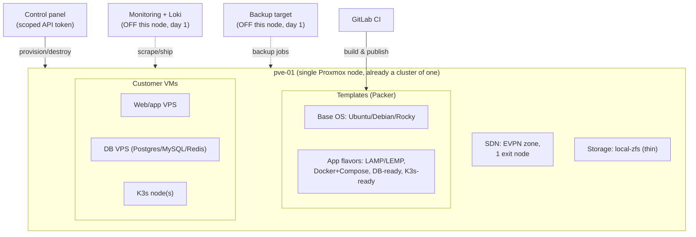

# 15 — Platform Expansion: Single Node to Multi-Node HA VPS Platform

This doc extends docs 01–21 (pure IaaS VPS hosting) to cover the wider product
set requested for this build: VPS + templates + virtual networking + web/DB
hosting + object storage + K3s + monitoring + backup + access management,
starting on **one Proxmox node** and growing to the multi-node HA cluster the
rest of this repo already designs for.

It assumes you have read doc 01 (architecture) and doc 09 (IaC design) —
this doc does not repeat the reasoning behind the OpenTofu/Ansible/Packer
boundaries, it extends them.

---

## 0. The scope decision this roadmap assumes

"Web application hosting," "database hosting," and "object storage" can mean
two very different businesses:

| | **Marketplace model (assumed below)** | Managed PaaS/DBaaS model |
|---|---|---|
| What you sell | VMs, with one-click app/DB/K3s templates | Shared, multi-tenant managed services |
| Who operates the app/DB | The customer, on their own VM | You, across tenants |
| Engineering cost | Low — templates + cloud-init + Ansible roles | High — multi-tenancy, quotas, upgrades, per-tenant backup/restore, a second support surface |
| Liability | Same as any VPS (customer's data, customer's problem) | You are now responsible for customer data availability and integrity directly |

**This roadmap assumes the marketplace model**: customers get a VPS (or a
small fleet of VPSs for K3s) pre-loaded with the software they picked via
Packer templates + cloud-init + an Ansible role that runs once at first boot.
You are not operating a shared MySQL cluster or a shared S3 service on their
behalf. This is the standard model for VPS providers (DigitalOcean/Vultr/
Hetzner marketplace images) and avoids building a second, harder business
(managed DBaaS/PaaS) before the first one is even funded.

**If you actually want the managed-PaaS model**, say so — it changes the
storage design (§5), the IaC boundary rule in doc 09, the support/ops
headcount in doc 18, and most of the "now vs. later" table in §9. Nothing
below assumes it.

Object storage is the one item worth a special note: a real S3-compatible
service is best built on Ceph RGW, which only makes sense once Ceph exists
(Phase 3, §7). For Phase 1, either skip it or run a single-node MinIO
instance as an explicit beta with no SLA.

---

## 1. Recommended architecture — Phase 1 (single node)



Key placement decisions and why:

- **Form the cluster of one from day 1.** Run `pvecm create <clustername>`
  on pve-01 even with a single member. Growing to 3 nodes later is `pvecm
  add` per node — a converge, not a migration. Converting a standalone node
  into a cluster member later is possible but is exactly the kind of rework
  this whole request is trying to avoid.
- **SDN: create an EVPN zone now, not a "Simple" zone**, even with one exit
  node and no real HA yet. Moving from a Simple zone to EVPN later means
  re-creating every vnet; adding exit nodes 2 and 3 to an existing EVPN zone
  is just editing a list (`sdn_exit_nodes` in `tofu/envs/prod/variables.tf`
  is already shaped as a list for this reason).
- **Storage: local-zfs (thin), not Ceph.** Ceph on one node teaches you
  nothing about real replica/failure-domain behaviour and just burns disk
  on parity you don't need yet. See §5 for the migration path.
- **Monitoring and backups live off this node from day one** — a cheap VPS,
  an old laptop, anything. Doc 21 §8/§9 mark "stack runs outside the
  production cluster" and "PBS on separate physical hardware" as
  **[BLOCKER]**s; you cannot satisfy either on a literal single node, and
  retrofitting off-node monitoring later means re-pointing every exporter
  and Loki client. Satisfy it cheaply now instead of rebuilding later.
- **Web/DB/K3s are templates, not platform services** (§0). They're Packer
  images plus an Ansible role that runs once against the customer's own VM.

## 2. Recommended architecture — Phase 2 (automation)

Nothing new architecturally — Phase 2 is "everything in §1 is provisioned
and converged by pipelines, not by hand." Concretely, on top of what this
repo already has:

- **OpenTofu** already models a variable-length node list
  (`cluster_nodes`, `vxlan_underlay_peers`, `sdn_exit_nodes` in
  `tofu/envs/prod/variables.tf` all default to 3 entries) — for Phase 1,
  set them to a single entry. Scaling later is editing the list and
  re-running `tofu plan`, not rewriting modules.
- **Ansible** already separates one-shot bootstrap (`pvecm create`,
  `pveceph init`, SDN zone creation — deliberately manual, gated by
  `allow_*_bootstrap` flags, see docs 06/07) from ongoing convergence
  (`common`, `ntp`, `ssh_hardening`, `pve_base`, `monitoring` roles,
  already implemented). **What's missing today**: `pve_cluster`,
  `pve_ceph`, and `pve_sdn` are placeholder roles (see
  `ansible/roles/*/tasks/main.yml`) — the convergence tasks for those three
  still need writing. None of the new product roles (`docker`, `k3s`,
  `db_*`, `object_storage`, `backup_pbs`) exist yet either — see §3.
- **Packer + CI**: the lint→build→validate→publish→prune pipeline in doc 09
  already handles base OS templates. Extend it with an "app flavor" build
  matrix (§3) using the same validate-stage discipline — an app template
  that fails to boot should fail CI exactly like a broken base image does.

## 3. Infrastructure-as-Code structure

Extending the existing tree (new items marked `+`):

```text
├── ansible/
│   ├── inventories/
│   │   ├── prod/                    # existing
│   │   └── lab/                     # added this session, single-node/nested lab
│   └── roles/
│       ├── common/ ntp/ ssh_hardening/ pve_base/ monitoring/   # existing, implemented
│       ├── pve_cluster/ pve_ceph/ pve_sdn/                     # existing, PLACEHOLDER — fill in
│       ├── docker/                + container runtime for app/K3s flavors
│       ├── k3s/                    + single-node & multi-node k3s bootstrap, join tokens via SOPS
│       ├── db_postgres/            + one-shot install + hardening, run once at first boot
│       ├── db_mysql/               +
│       ├── db_redis/               +
│       ├── object_storage_minio/   + Phase 1 optional beta; retire in favour of Ceph RGW later
│       └── backup_client/          + PBS agent config pointed at the OFF-NODE PBS target
├── packer/
│   ├── ubuntu-2404/ debian-13/ rocky-10/         # existing base templates
│   └── app-images/                + new build matrix
│       ├── lamp/ lemp/ docker-compose/ k3s-node/ postgres/ mysql/ redis/
├── tofu/
│   ├── envs/prod/                  # existing — set cluster_nodes to 1 entry for Phase 1
│   └── modules/
│       ├── pve_pool/ pve_api_user/ pve_storage/ pve_sdn/   # existing, already list-shaped
│       └── pve_object_storage/    + only if/when MinIO or RGW config belongs in OpenTofu
├── ci/.gitlab-ci.yml               # existing — add lint/build/validate stages per new role & flavor
└── docs/22-platform-expansion-roadmap.md   # this doc
```

Example: filling in the `k3s` role skeleton (single-node bootstrap, joins
later nodes the same way the physical cluster does — one gate, one pattern):

```yaml
# ansible/roles/k3s/tasks/main.yml
---
- name: Install k3s server (first node)
  ansible.builtin.shell: |
    curl -sfL https://get.k3s.io | \
      INSTALL_K3S_EXEC="--tls-san {{ k3s_public_endpoint }}" sh -
  args:
    creates: /usr/local/bin/k3s
  when: k3s_role == "server" and k3s_is_first_node | bool

- name: Fetch join token from first node
  ansible.builtin.slurp:
    src: /var/lib/rancher/k3s/server/node-token
  register: k3s_token_raw
  delegate_to: "{{ k3s_first_node }}"
  when: not (k3s_is_first_node | bool)

- name: Join additional server/agent
  ansible.builtin.shell: |
    curl -sfL https://get.k3s.io | \
      K3S_URL="https://{{ k3s_first_node }}:6443" \
      K3S_TOKEN="{{ k3s_token_raw.content | b64decode | trim }}" sh -
  args:
    creates: /usr/local/bin/k3s
  when: not (k3s_is_first_node | bool)
```

This is deliberately the same shape as the "Packer → OpenTofu → Ansible →
K3s" home-lab pattern — the difference is it's now triggered per-customer
order instead of run once for your own lab.

## 4. Networking design

Reuse doc 05's VLAN/address plan as-is; it is already node-count-agnostic
(mgmt, Corosync ring0/ring1, Ceph public/cluster, VXLAN underlay, tenant
overlay). The only Phase-1-specific decisions:

- **SDN zone type: EVPN from day 1** (§1) — one exit node (`pve-01`), no
  failover yet. `sdn_exit_nodes = ["pve-01"]` today, append `"pve-02"`,
  `"pve-03"` later.
- **IPAM**: Proxmox SDN's built-in IPAM plugin is enough at this scale.
  Don't stand up NetBox or similar until customer/VM count makes manual
  tracking genuinely painful — that's a "later" item (§9), not a "now" one.
- **Per-tenant vnets remain the panel's responsibility**, not OpenTofu's
  (doc 09's boundary rule, unchanged by any of this) — a customer signing
  up creates a vnet, so it lives outside the state-locked, reviewed IaC.

## 5. Storage design

| Phase | VM disks | Object storage | Backup target |
|---|---|---|---|
| **1 (1 node)** | local-zfs (thin) | Skip, or single-node MinIO (beta, no SLA) | PBS on **separate** hardware — a cheap box, day 1 |
| **3 (3+ nodes)** | Ceph RBD, `size=3 min_size=2` (doc 07) | Ceph RGW (S3 API), once RGW is stable on your cluster | PBS on separate hardware, offsite replica (doc 21 §9) |

**Migration path, node-1 → cluster (this is the part you actually asked
about — "easily migrated... in the future"):** once nodes 2 and 3 join the
cluster and Ceph is healthy, move each VM's disk from `local-zfs` to the new
Ceph pool with `qm move-disk <vmid> <disk> <ceph-pool> --format raw`, live,
one VM at a time, no backup/restore round-trip needed. This is the reason
Phase 1 storage should be local-zfs and not, say, NFS from an external box —
`move-disk` between local and Ceph storages is a first-class Proxmox
operation; migrating off an ad hoc NFS mount is not.

## 6. Monitoring, logging, and backup strategy

Doc 14 already specifies the stack (Prometheus, Grafana, Loki, PBS,
Alertmanager) and the placement rule (outside the production cluster). The
only Phase-1 addition: **stand up that off-node box in week 1, not "later
when I have real infrastructure to monitor."** Concretely:

- A $5–10/mo VPS or a spare machine, running Prometheus + Grafana + Loki +
  Alertmanager, scraping pve-01's `node_exporter`/PVE/Ceph exporters and
  ingesting its journald over the mgmt network.
- The same box (or another cheap one) as the PBS target from day 1.
- This satisfies doc 21's two monitoring/backup `[BLOCKER]`s immediately,
  and nothing changes about their configuration when nodes 2 and 3 appear —
  you just add scrape targets and backup jobs for them.

## 7. Step-by-step roadmap

Builds on doc 20's 30/90-day roadmap; this fills in where the new product
surface (§0–§3) slots in.

**Weeks 1–2 — Foundation (parallel with the business-track items your
company is already running):**
- Form the single-node cluster (`pvecm create`), local-zfs storage, EVPN
  zone with one exit node
- Off-node monitoring + PBS target stood up
- Base OS templates (already built) validated on real hardware

**Weeks 3–5 — Automation core:**
- Fill in `pve_cluster`/`pve_ceph`/`pve_sdn` convergence tasks (currently
  placeholders)
- Build `docker`, `k3s`, `db_postgres`, `db_mysql`, `db_redis` roles
- Extend Packer with the app-image build matrix; wire into existing CI
  lint→build→validate→publish pipeline

**Weeks 6–8 — Product surface:**
- Panel/CI flow to provision a K3s cluster (N VMs, k3s role, join tokens
  from SOPS)
- Cloud-init personalization per app flavor
- Decide MinIO-beta vs. skip object storage for launch

**Once nodes 2–3 are funded and racked (Phase 3, aligns with doc 10's
Week 3 cluster/Ceph build):**
- `pvecm add` both nodes into the existing cluster of one
- `pveceph init`, OSDs, pool `size=3 min_size=2` (doc 07)
- `qm move-disk` every VM off local-zfs onto the new Ceph pool
- Append the new node names to `sdn_exit_nodes`/`cluster_nodes` in OpenTofu,
  `tofu apply`
- Run the T1–T16 failure test matrix (doc 08) — this is the point where HA,
  fencing, and real redundancy claims become meaningful for the first time

## 8. Repository and CI/CD recommendations

Keep one repository (doc 09 already argues this and it still holds at this
scope). CI additions to `ci/.gitlab-ci.yml`, same stage model as today:

```yaml
# lint stage additions
k3s:lint:        { image: python:3.12-slim, script: ["ansible-lint ansible/roles/k3s"] }
app-images:lint: { image: hashicorp/packer:latest, script: ["packer fmt -check -recursive packer/app-images"] }

# build stage: one job per flavor, same pattern as build:ubuntu-2404 etc.
build:lamp:
  <<: *packer_build
  variables: { OS_DIR: app-images/lamp }
```

Validate stage gets flavor-specific assertions in addition to the existing
boot/cloud-init/SSH checks — e.g. for `db_postgres`: service is active,
listening only on the expected interface, default credentials rotated.

## 9. Now vs. later

| Component | Now (Phase 1) | Later (Phase 3+) | Why |
|---|---|---|---|
| Cluster-of-one (`pvecm create`) | ✅ | — | Free now; converting standalone→cluster later is avoidable rework |
| EVPN SDN zone (1 exit node) | ✅ | Add exit nodes 2–3 | Zone-type migration is the expensive part, not exit-node count |
| OpenTofu node lists (`cluster_nodes` etc.) | ✅ (populate with 1 entry) | Append entries | Already shaped as lists — no module rewrite needed |
| Off-node monitoring + backup target | ✅ | Add scrape targets/jobs per new node | Cheap now; a `[BLOCKER]` you can't satisfy on-node at all |
| `pve_cluster`/`pve_ceph`/`pve_sdn` convergence tasks | ✅ (write them) | Reuse unchanged | Needed regardless of node count |
| App templates (LAMP/DB/K3s flavors) | ✅ | More flavors as demand shows | Core to the requested product surface |
| Ceph | ❌ | ✅ | Meaningless below 3 nodes; local-zfs + documented `move-disk` path is the correct interim |
| Object storage as a real S3 service (Ceph RGW) | ❌ (MinIO beta optional) | ✅ | Needs Ceph to be worth building properly |
| Multi-tenant managed DB/PaaS | ❌ | Reassess only if customers ask | Different, harder business than VPS hosting (§0) |
| HA/fencing/watchdog config, T1–T16 tests | ❌ | ✅ | Requires ≥3 real nodes to test or mean anything |
| Custom billing/control panel build | ❌ (use doc 12's buy-vs-build framework) | Revisit if bought platform doesn't scale | Don't block launch on building your own panel |
| NetBox/formal IPAM | ❌ | If manual tracking becomes painful | Proxmox's built-in IPAM is enough at Phase 1 scale |
